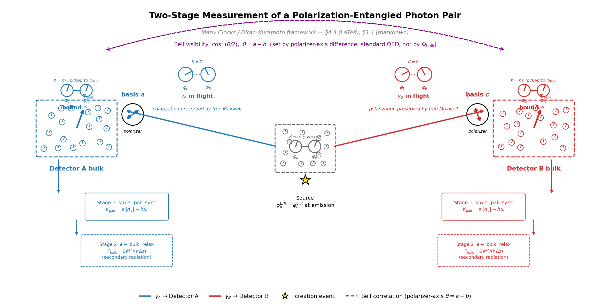

# Many Clocks Interpretation of Quantum Mechanics
## Mass as Chiral Coupling, Re-synchronization in the Bulk as Measurement

**John Bramble, MD¹**
¹ Independent Research

*Correspondence: rayolddog (GitHub)*
*Preprint — not yet peer reviewed*

*AI Disclosure: This work was developed in collaboration with Claude Opus 4.6
(Anthropic), as described in the Author Contributions section. Per current
journal guidelines, LLMs do not satisfy authorship criteria; the human author
bears full responsibility for all content.*

---

## Abstract

We show that in the chiral (Weyl) basis the Dirac mass term is a purely
off-diagonal coupling between the left- and right-handed sectors, with coupling
strength equal to the mass: K = m (in SI units the Compton frequency mc²/ℏ).
Diagonalizing this coupling reproduces the relativistic dispersion
E = √(p²+m²); its two normal modes are the de Broglie carrier and the
Zitterbewegung beat — the latter the empirical signature that the coupling is
real. For massless particles (K = 0) the chiral sectors decouple entirely and
the particle has definite chirality. The Higgs-Yukawa interaction is the
mechanism that sets K: K = y_f · ⟨φ⟩ = m. Phase-locking proper — a
Kuramoto/Adler synchronization with a genuine attractor — is a dissipative,
open-system phenomenon, and in this framework it is what measurement is: a
small system re-phasing to a macroscopic coherent bulk.

This identification has several consequences. Quantum measurement is re-interpreted
as a *two-stage* Kuramoto re-synchronization process. At **Stage 1 (pair-sync)**
the incoming particle phase-couples locally to a single bulk-bound partner at the
interaction vertex, with coupling strength K_pair = g_int·⟨V_int⟩ set by the
relevant gauge interaction; this is the basis-projection step and carries no
gravitational dependence. At **Stage 2 (bulk relaxation)** the perturbed partner
re-locks to the macroscopic detector's collective phase Φ_bulk, shedding its
mismatch as secondary radiation; this is where gravitational potential and
detector mass enter. Decoherence is not merely loss of phase coherence with the
entangled partner — it is the positive process of gaining coherence with the
bulk, mediated by the detector's overwhelmingly greater Kuramoto inertia
(M_detector >> m_particle). The localization of gravity to Stage 2 is a
falsifiable prediction: Earth-bound and space-based Bell tests should agree on
cos²(θ/2) visibility but differ in Stage-2 relaxation time. For outcome
channels carrying equal energy per quantum (spin, polarization, fixed-frequency
detector clicks), the Born rule P = |ψ|² is reframed as the long-run frequency of
quantum-number partition: |ψ|² is the energy density of the real ψ field, and the
apparent stochasticity of measurement outcomes arises from unbiased zero-point +
thermal background fluctuations at the synchronization event, rather than from an
independent probability axiom; the reading does not extend to channels of unequal
energy, and does not by itself fix the squared functional form (§4).
The Heisenberg uncertainty principle appears as a bandwidth limitation of the
particle's internal phase clock.

We present this framework — which we call the **Many Clocks Interpretation of
Quantum Mechanics (MCI)** — as an interpretive reframing of standard quantum
mechanics, not a modification of its predictions. The name is a deliberate
echo of, and contrast to, Many-Worlds: where MWI preserves unitarity by
branching the universe at each measurement, MCI preserves a single world by
treating each particle as carrying its own physical phase clock, with
measurement as local synchronization between clocks. No conscious observer
is required; no branching occurs. The Dirac equation is unchanged; Bell's
theorem is not challenged. What is new is the identification of mass as the
off-diagonal chiral coupling, measurement as dissipative re-synchronization
dynamics, and decoherence as a Kuramoto process with a specific physical
mechanism.

---

## 1. Introduction

### 1.1 The Measurement Problem

The quantum measurement problem remains the most consequential unsolved problem in
the foundations of physics. The Schrödinger equation is linear and deterministic,
yet measurements have definite outcomes. A system in superposition
ψ = α|0⟩ + β|1⟩, entangled with a detector, produces

$$|\Psi\rangle = \alpha|0\rangle|D_0\rangle + \beta|1\rangle|D_1\rangle$$

The equation has no mechanism to select one outcome. The Born rule —
P(0) = |α|² — is postulated, not derived.

The three mainstream responses each carry significant costs. Copenhagen introduces
a mysterious collapse with no physical mechanism. Everett's many-worlds [16] preserves
unitarity at the cost of infinite unobservable branches. Bohmian mechanics [15, 34] accepts
explicit nonlocality through a physically inert pilot wave.

### 1.2 What Is Missing: A Dynamical Mechanism for Decoherence

Environmental decoherence [4] has become the standard framework for
understanding how quantum superpositions become effectively classical. It
successfully explains the emergence of preferred "pointer states" and the
suppression of off-diagonal density matrix elements through interaction with
environmental degrees of freedom.

Yet decoherence theory describes *what happens* without specifying the dynamical
mechanism by which it happens. The environment is treated as an abstract bath
with many degrees of freedom. This paper proposes that dissipative Adler/Kuramoto
phase-synchronization — a small system re-locking its intrinsic phase clock to a
macroscopic coherent bulk — provides this missing mechanism. The clocks are not
added by hand: they are the chiral phase sectors already present in the Dirac
equation (Section 2), whose closed, unitary coupling is the mass; the
synchronization that drives decoherence is the separate, open-system coupling of
those clocks to the bulk (Section 3).

### 1.3 The Proposal in Brief

We make three claims, in decreasing order of mathematical rigor:

1. **The Dirac mass term is the off-diagonal chiral coupling** (Section 2).
   This is a mathematical identification: in the Weyl basis the mass is the sole
   off-diagonal entry of the Dirac Hamiltonian, with strength K = m, and
   diagonalizing it reproduces E = √(p²+m²) with the de Broglie carrier and the
   Zitterbewegung beat as its normal modes. The closed-system dynamics are
   unitary normal-mode precession, not Kuramoto phase-locking; the Kuramoto/Adler
   attractor enters only as the dissipative measurement coupling of claim 2.
   This identification is the strongest claim and is verifiable by inspection.

2. **Measurement is re-synchronization** (Section 3). When a particle interacts
   with a macroscopic detector, the Kuramoto dynamics drive the particle's phase
   from coherence with its entangled partner to coherence with the detector bulk.
   This provides a physical picture of decoherence. This is an interpretive claim.

3. **The Born rule is reframed as quantum-number partition** (Section 4). Reading
   |ψ|² as wave energy density and the apparent stochasticity as unbiased
   background-field fluctuation at the synchronization event, P = |α|²
   appears as the long-run frequency of channel partition rather than
   as an independent probability axiom. This reading holds only for outcome
   channels of equal energy per quantum; for unequal-energy channels the energy
   fraction diverges from |α|², and even within the equal-energy regime it does
   not by itself fix the squared functional form. This is an interpretive claim
   with physical motivation, not a complete derivation.

### 1.4 On the Structure of the Argument

The breadth of this paper is deliberate, and the argumentative strategy
warrants explicit naming. The Many Clocks Interpretation is not a single
calculation or a single derivation. It is a *structural reading* of
quantum mechanics, and the case for it rests on the convergence of many
independent prior results onto a common reading in which the wave
function is a real oscillating cochain-valued field and measurement is
local Kuramoto re-synchronization. The convergent results include:

- the Dirac equation's chiral decomposition into two coupled sectors
  that go free in the massless limit (§2.1);
- Kuramoto synchronization theory in classical and quantum settings,
  derived from semiclassical limits of quantum master equations in
  coupled-oscillator systems (as cited in §2.2);
- the discrete Hodge–Dirac operator on simplicial complexes [45],
  satisfying $\mathcal{D}^2 = \Delta$ as the algebraic root of the
  Laplacian (Appendix E);
- Penrose's objective reduction proposal [6], whose characteristic
  timescale $\tau \sim \hbar/E_G$ coincides with the gravitational
  re-synchronization rate $\Gamma_{\mathrm{grav}}$ under the framework's
  $K = E/\hbar$ identification (§3.6);
- Nelson stochastic mechanics [26], whose background-field diffusion
  $\nu = \hbar/2m$ is identified with the zero-point chiral-phase
  fluctuation amplitude (§4.5);
- Hestenes' Zitterbewegung interpretation [35], in which the complex
  phase factor in the Dirac wave function is a physical internal
  rotation, here identified with the chiral clock pair (§7.7);
- the Fourier bandwidth theorem applied to real wave fields, recovering
  the Heisenberg uncertainty principle and the zero-point phase floor
  as the same statement in conjugate variables (§4.6).

Each of these results is established in its own literature; the paper
does not claim originality for any of them individually. The claim is
that they fit together — under the structural reading proposed here —
in a way that the standard interpretive packages (Copenhagen,
Many-Worlds, Bohm, environmental decoherence) do not anticipate. **The
convergence is the argument.**

We are aware of the failure mode this style of argument can produce.
Frameworks that "feel right" because many disparate pieces appear to
fit can be either genuine structural insight — Maxwell's unification of
electricity, magnetism, and optics; Penrose's path from twistors
through spin networks to objective reduction — or post-hoc construction
flexible enough to accommodate anything. The discipline that
distinguishes the two is the willingness to specify limitations and
falsification conditions honestly. We have tried to maintain that
discipline throughout the manuscript through subsections that
explicitly bound scope and acknowledge open questions: §1.5 (What This
Paper Does Not Claim), §3.4 (limitations of the two-stage picture),
§3.8 (Stage-2 emission spectra as an open question), §3.9 (what §3
does not claim), §4.7 (what the Born-rule reframing requires), §5.7
(what remains open for the photon extension), §6.3 (honest assessment
of the qualitative predictions), and §E.7 (four limitations of the
cochain ontology). These limitation subsections are not decoration;
they are the intended internal discipline of the argument.

Reviewers may reasonably ask whether any single connection could be
sharpened or removed. We have erred on the side of including
connections rather than omitting them, because the convergence is the
case and removing connections weakens that case asymmetrically. We
welcome targeted criticism of specific connections — "the Nelson
identification needs more development," "the Hestenes correspondence
is suggestive but not rigorous" — as the kind of feedback that would
improve the manuscript. What we would resist is the request to
compress by category, which would strengthen the prose at the cost of
weakening the structural argument.

### 1.5 What This Paper Does Not Claim

We state clearly at the outset:

- We do not challenge Bell's theorem [9]. The quantum correlations E(a,b) = −cos(a−b)
  arise from the entangled singlet state and the full Dirac spinor structure —
  standard quantum mechanics.
- We do not modify the Dirac equation or any of its predictions.
- We do not propose new physics. We propose a new *mechanism* for known physics.
- We do not claim a rigorous derivation of the Born rule. Section 4
  offers a wave-realist *reading* — |ψ|² as the energy density of a real
  oscillating field, outcome statistics as quantum-number partition under
  background-fluctuation stochasticity — but it holds only for outcome
  channels of equal energy per quantum, and even there the convergence of
  long-run frequencies to exactly |amplitude|² requires an unbiased-background
  assumption (and a separate argument for the squared form) that we
  explicitly flag as unproven (§4.7, §8.3 item 3). Section 4
  is interpretive corollary, not a load-bearing pillar of the framework.
- The framework proposes several distinguishable predictions (§5.5
  linewidth-dependent gravitational Bell; §6.2 P5 gravitationally-weighted
  secondary emission; P2 trapped-ion Zitterbewegung), but they are either below
  current experimental sensitivity or qualitative scaling arguments without
  computed coefficients. Whether MCI is a genuinely distinguishable theory or
  an interpretive overlay on standard decoherence is an open question we are
  honest about throughout.

### 1.6 Relational Structure: The Many Clocks Interpretation

We name this framework the **Many Clocks Interpretation of Quantum Mechanics
(MCI)**. The name is a deliberate echo of Many-Worlds, with a sharp contrast:
Many Worlds preserves unitarity by branching the universe at each measurement
and accepting an exponentially proliferating multiverse; the Many Clocks
Interpretation preserves a single world by treating each particle as carrying
its own internal phase clock, with measurement as local synchronization
between clocks. The interpretation is *relational* — there is no global
preferred reference frame and no observer required — and it operates by the
following structural commitments:

1. **Every particle carries one or more intrinsic phase clocks.** For massive
   Dirac fermions, two chiral clocks (L and R), coupled by the off-diagonal
   mass term K = m (Section 2). For photons, polarization clocks
   coupled to detectors via K_γ ~ ω (Section 5). The clocks are physical
   oscillators, not bookkeeping devices.

2. **There is no global preferred frame.** Each interaction happens in the
   local frame jointly defined by the interacting parties. Each particle's
   clocks are intrinsic — defined in its own rest frame — and a particle's
   clock structure is described differently in different observer frames,
   but the physics of each interaction is invariant.

3. **Synchronization is a local, objective, physical event.** When two
   clock-carrying systems interact dissipatively (coupling one of them to a
   bulk), their clocks synchronize via Kuramoto coupling at the interaction
   event; a closed, unitary interaction instead gives coherent normal-mode
   exchange with no attractor (§2.2). The synchronization is objective:
   distant observers in other frames may disagree about the ordering of
   spacelike-separated events elsewhere, but the two parties to a specific
   interaction always agree on what happened locally between them. This is
   ordinary special-relativistic causality, not novel — but worth stating
   because it removes the appearance of observer-dependence.

4. **No conscious observer is required. No branching is required.** A single
   objective physical world contains many clocks; interactions synchronize
   them locally; measurement is a special case of synchronization in which
   one party is a macroscopic detector with overwhelming Kuramoto inertia
   (Section 3).

5. **Past phase history is overwritten at each sync event.** After a small
   number of interactions, a particle's pre-interaction phase is effectively
   unrecoverable. This is the framework's specific dynamical mechanism for
   decoherence and thermalization: not just loss of off-diagonal coherence,
   but active phase-overwriting at each interaction event.

6. **All physically meaningful quantities are gauge- and Lorentz-invariant.**
   The individual chiral phases φ_L, φ_R shift uniformly under U(1) gauge
   transformation; only the gauge-invariant difference φ_L − φ_R enters the
   chiral coupling. The L/R block decomposition of the spin operator
   is frame-relative under Lorentz boosts, but the sum
   E_LL + E_SS + E_LS = −cos(a−b) is Lorentz-invariant. The framework's
   *predictions* live in invariant content; the interpretive language about
   "which clock dominates" is a frame-relative description of an invariant
   structure.

**Many clocks, not many times.** The clocks invoked here are *internal phase
oscillators* — dynamical degrees of freedom with a definite rate (the rest-frame
Compton/Zitterbewegung frequency ω_C = mc²/ℏ = 2K; Appendix B) — and should not
be conflated with the per-particle *coordinate times* of Dirac's many-time
formalism [52, 53]. There, each particle carries its own time *argument* t_i in
the N-body wavefunction ψ(x₁, t₁; …; x_N, t_N) purely to keep the theory
manifestly Lorentz-covariant: the t_i are kinematic labels with no rate, carry no
internal degree of freedom, and collapse to ordinary single-time quantum
mechanics on the diagonal t₁ = … = t_N. The Many Clocks of MCI are the converse
object — each is a physical oscillator that *ticks* at the Compton rate,
precesses, dissipates, and phase-locks, and whose synchronization is the
measurement event. The lineage of the internal clock is de Broglie's 1924
"periodic phenomenon" (mc²/h) [54] — the rest-frame clock probed by the
electron-channeling experiments [55] and developed in Hestenes' Zitterbewegung
program (§7.7) — not Dirac's many-time. The Lorentz-covariance role that Dirac's
many times played is taken over in MCI not by multiplying time arguments but by
the *foliation-independence* of the synchronization condition (Appendix G).

The Many Clocks Interpretation has affinities with Hestenes' Zitterbewegung
interpretation (Section 7.7) — both treat the complex phase factor in the
Dirac wave function as a physical clock — and with Rovelli's relational
quantum mechanics [24], in the sense that no global preferred frame or
observer is needed. It differs from both in its explicit dynamical mechanism
(Kuramoto re-synchronization), and from Rovelli's RQM in keeping ψ ontic
rather than relational: the wavefunction is a real oscillating field, not a
relational state.

---

## 2. The Chiral Structure of the Dirac Equation

### 2.1 Chiral Decomposition

In the Weyl (chiral) basis, the Dirac spinor decomposes into two two-component
Weyl spinors:

$$\psi = \begin{pmatrix} \psi_L \\ \psi_R \end{pmatrix}$$

The Dirac equation [1] separates into two coupled equations:

$$i\bar{\sigma}^\mu \partial_\mu \psi_L = m \psi_R \qquad (1a)$$

$$i\sigma^\mu \partial_\mu \psi_R = m \psi_L \qquad (1b)$$

where σ^μ = (I, σ) and σ̄^μ = (I, −σ) are the Weyl matrices.

**For m = 0 (massless):** Equations (1a) and (1b) decouple entirely. ψ_L and ψ_R
satisfy independent equations. The particle has definite chirality and no rest
frame. Photons and massless-limit neutrinos are in this category.

**For m ≠ 0 (massive):** The equations couple ψ_L to ψ_R and vice versa. Neither
chirality state is stable alone; the physical particle is a superposition of both.
The coupling strength is exactly *m*.

### 2.1.1 Two Bases, One Spinor

The same 4-component Dirac spinor admits two natural decompositions, which the
framework uses for different purposes. We flag them explicitly because the
two bases serve different purposes in the framework and are easily conflated.

- **Weyl (chiral) basis:** ψ = (ψ_L, ψ_R)ᵀ, splitting the spinor by chirality.
  The mass term is purely off-diagonal — m·(ψ̄_L ψ_R + ψ̄_R ψ_L) — the chiral
  coupling K = m between two chiral clocks, whose normal modes are the de Broglie
  carrier [13] and the Zitterbewegung beat (§§2.2–2.3). Used in §§2.2–2.6, the
  Higgs-Yukawa identification (§6 of the
  equations reference), and the spin-statistics analysis of Appendix D.

- **Dirac (standard) basis:** ψ = (ψ_upper, ψ_lower)ᵀ, splitting the spinor
  into a *large* component (the Pauli 2-spinor at rest) and a *small* component
  that vanishes at rest and grows with momentum as r = p/(E+m) = tan(θ_rel/2).
  The block decomposition E_LL + E_SS + E_LS of the Bell correlation
  (Appendix A; `tests/dirac_extension.py`) is naturally written here, because the
  standard relativistic spinor u(p,↑) = N(1, 0, r, 0)ᵀ lives in this basis.

The two bases are related by a constant unitary 4×4 change of basis and
describe the same physical object. They agree at the two limits the framework
cares about most:

| Regime | Weyl picture | Dirac picture |
|---|---|---|
| Rest (θ_rel = 0) | ψ_L = ψ_R (equal weight; symmetric rest mode) | small component = 0; only large |
| Massless (θ_rel = π/2) | ψ_L, ψ_R decoupled | large and small blocks decouple by helicity |

At intermediate momenta the two decompositions differ: the temporal-phase
content is a θ_rel-dependent linear combination of upper and lower blocks in
the Dirac basis, and a different θ_rel-dependent combination of ψ_L and ψ_R in
the Weyl basis. The interpretive language "temporal clock" and "spatial clock"
is most cleanly anchored in the Weyl basis — temporal ↔ ψ_L, spatial ↔ ψ_R —
and translates to the Dirac basis only via the basis change. The mixing angle
θ_rel = 2·arctan(p/(E+m)), defined operationally by the Dirac-basis large/small
ratio, is the framework's single quantitative handle on this rotation; its
geometric reading depends on which basis is in use.

We use whichever basis makes the physics of a given section most transparent
and flag the choice locally.

### 2.2 Mass as the Chiral Coupling

The mass term couples the two chiral sectors: in Equations (1a, 1b), m·ψ_R
sources the equation for ψ_L and vice versa. This coupling is *linear* at the
operator level — it is the single off-diagonal entry of the Dirac Hamiltonian
in the chiral basis,

$$H = \begin{pmatrix} \vec{\sigma}\cdot\vec{k} & m \\ m & -\,\vec{\sigma}\cdot\vec{k} \end{pmatrix}$$

and it vanishes identically for a massless fermion, leaving ψ_L and ψ_R to
free-stream independently. We take this off-diagonal coupling strength as the
framework's fundamental quantity,

$$\boxed{K = y_f \cdot |\langle\phi\rangle| = y_f \cdot \frac{v}{\sqrt{2}} = m} \qquad (3)$$

the Yukawa coupling to the Higgs condensate [11, 12]. In SI units K = mc²/ℏ,
the Compton frequency. Before electroweak symmetry breaking (⟨φ⟩ = v/√2 → 0),
K → 0: every fermion is massless and its chiral sectors are decoupled. After
symmetry breaking, K = m couples them. This is the central identification of
the paper — **mass is the strength of the chiral L ↔ R coupling, fixed by the
Higgs vacuum**. Everything below follows from a single structural fact that we
take as the organizing principle of the framework: *the same phase degrees of
freedom evolve in two sharply different regimes depending on their boundary
conditions.* While the chiral pair is closed, the coupling is unitary and the
phases precess as coherent normal modes — superposition is preserved and nothing
locks. When the pair is opened to a dissipative macroscopic bulk, the same
coupling acquires an attractor and the phases lock — and that is measurement.
The boundary between these two regimes is the Heisenberg cut, and the content of
the framework is that the cut has a physical criterion: the onset of dissipative
coupling to a bulk of overwhelming inertia (§3). The rest of this section
establishes the closed-system half; §3 establishes the open-system half.

**The closed-system regime: unitary precession is why superposition survives.**
While the chiral pair evolves unitarily — no bulk, no dissipation — the coupling
*cannot* lock the two phases, and this is precisely why a free particle stays in
superposition rather than collapsing on its own. It is worth being exact about
the mechanism. Applying the polar decomposition
ψ_X = ρ_X^{1/2} e^{iφ_X} χ_X and separating real and imaginary parts of
(1a, 1b) (Appendix F) gives, in the rest frame,

$$\frac{d\phi_L}{dt} = -\,m\sqrt{\rho_R/\rho_L}\,\cos(\phi_R - \phi_L), \qquad \frac{d\rho_L}{dt} = +\,2m\sqrt{\rho_L\rho_R}\,\sin(\phi_R - \phi_L) \qquad (2a)$$

and the mirror equations for R. The coupling appears as a **cosine in the
phase equation and a sine in the amplitude equation** — the reverse of the
Kuramoto model [2], whose sine sits in the phase equation. The phase-difference
dynamics

$$\frac{d\Delta}{dt} = -\,m\cos\Delta\;\frac{\rho_L - \rho_R}{\sqrt{\rho_L\rho_R}}, \qquad \Delta \equiv \phi_R - \phi_L \qquad (2b)$$

vanish on the symmetric manifold ρ_L = ρ_R for *every* Δ: there is no
restoring force and no attractor, as must be the case for closed unitary
evolution, which admits no Lyapunov function for an order parameter to climb.
The motion is instead the coherent normal-mode precession of the pair.
Diagonalizing H on a helicity block yields eigenfrequencies ±√(k² + m²) = ±E —
the relativistic dispersion — with the chiral mismatch ω_R − ω_L = 2|k| set by
momentum and the coupling set by mass. The symmetric and antisymmetric modes
are the de Broglie carrier and the Zitterbewegung beat of §2.3; the rest-frame
splitting is 2m = 2mc²/ℏ. The absence of an attractor is not a missing feature
of the picture; in this regime it *is* the picture. A closed system admits no
Lyapunov function for an order parameter to climb, so the chiral phases can only
precess, never settle — which is the dynamical reason an isolated superposition
neither decoheres nor selects an outcome.

**The open-system regime: dissipation supplies the attractor, and locates the
cut.** Genuine phase-locking requires
dissipation. When the chiral pair (or a composite particle) is coupled to the
bulk and the bulk is traced out, the reduced phase obeys an Adler equation [51],

$$\frac{d\phi}{dt} = \omega + K_{\text{eff}}\,\sin(\Phi_{\text{bulk}} - \phi)$$

the single-oscillator Kuramoto/Adler form, which *does* possess an attractor
because the bulk now carries away the phase difference. This — not the closed
mass term — is the framework's synchronization step, developed as measurement
in §3.4, and it places the framework within the broader literature on **quantum
synchronization** [36, 37, 38, 39], where Kuramoto-form phase dynamics are
derived from the semiclassical limit of quantum master equations. The two
regimes are not two different couplings — they are the *same* off-diagonal
coupling under two boundary conditions. Closed and unitary, it gives normal-mode
precession and protects superposition; opened to a bulk that carries the phase
difference away, it gives an Adler attractor and locks. The transition from the
first to the second is the physical content of measurement, and the criterion
for that transition — contact with a dissipative bulk of sufficient inertia — is
the framework's candidate for a physical Heisenberg cut. We therefore use
"synchronization" throughout in its strict dissipative sense (§3), never for the
closed mass term.

**Capture range of the bulk lock.** The Arnold-tongue or capture-range
condition |Δω| ≲ K_eff of the synchronization literature [36, 37] is a
statement about the *dissipative* Adler coupling, and so applies at Stage 2
(§3.4): the pair-sync vertex coupling K_pair sets the bandwidth between
particle and bulk, and phase mismatches large compared to K_pair are not
pulled into the bulk lock — they are instead shed through secondary radiation
via the §3.4 hierarchy. The intuition that "the amount a phase can be pulled
into synchronization is bounded" is therefore not a soft heuristic but the
standard Kuramoto capture-range condition, evaluated for the system–bulk
coupling rather than the internal chiral one.

### 2.3 The Chiral Pair as a Lorentz-Coupled Whole

The central physical picture is:

> A massive Dirac particle carries two internal oscillators: a **temporal phase
> clock** oscillating at ω_t = E/ℏ, and a **spatial phase clock** oscillating at
> ω_s = p·v/ℏ. The mass term couples them — it is the off-diagonal chiral
> coupling whose normal modes are the de Broglie carrier and the Zitterbewegung beat.

This interpretation does not modify the Dirac equation. It provides an ontological
reading of its mathematical structure.

**Normal-mode picture.** Because the mass term K = m couples the two clocks, the
natural observables are not the individual chiral phases but the *normal modes*
of the coupled pair: a symmetric (sum) mode that propagates as the de Broglie
carrier at ω_dB = E/ℏ — Feynman's "little arrow" — and an antisymmetric mode
that manifests as the Zitterbewegung beat at ω_Z = 2mc²/ℏ when both positive-
and negative-energy amplitudes are populated (Appendix B). The "two clocks" are
the underlying chiral oscillators; the familiar single de Broglie carrier is
their symmetric mode. Counting both together as three independent clocks would
overcount: the carrier is not a third clock but the sum mode of the chiral pair,
and the Zitterbewegung beat is the framework's empirical signature that the
coupling is real — without K = m, ψ_L and ψ_R would free-stream independently
and no beat could form.

**A structural parallel with special relativity.** This failure of additive
clock counting has the same algebraic origin as the failure of additive
coordinate counting in Minkowski spacetime. Just as spacetime is not a sum
(3 space) + (1 time) but a Lorentzian whole whose normal modes (timelike /
null / spacelike) carry the physical content, the chiral pair (ψ_L, ψ_R) is
not a sum of two independent clocks but a Lorentz-coupled whole whose normal
modes (de Broglie carrier, Zitterbewegung beat) carry the physical content.
The (½, 0) ⊕ (0, ½) representation that carries the Dirac spinor is itself a
representation of the Lorentz group, and the L ↔ R coupling K = m is the
Lorentz-covariant mass term. The chiral-clock reading is therefore not an
additive metaphor pasted on top of two oscillators — it is what Lorentz
invariance forces the structural count to look like.

### 2.4 The Mass Eigenstate

In a mass eigenstate — the symmetric normal mode of the chiral pair (§2.3) —
the two chiral phases are aligned up to a fixed offset:

$$\phi_L - \phi_R = \delta_{CP} \quad \text{(particles)} \qquad (4a)$$

$$\phi_L - \phi_R = -\delta_{CP} \quad \text{(antiparticles)} \qquad (4b)$$

The phase δ_CP entering (4a, 4b) is a phenomenological parameter, not derived.
For a single Standard Model fermion with real Higgs–Yukawa mass, an axial U(1)
redefinition rotates the chiral phase away — the same redundancy that underlies
the strong-CP problem — so δ_CP carries no content in the single-particle
sector. Physical CP violation in the Standard Model arises only in the
*multi-flavor* sector, through the CKM phase for quarks (and the analogous PMNS
phase for neutrinos), where mass matrices for different fermion species cannot
be simultaneously diagonalized. We retain δ_CP in (4a, 4b) only as a slot for
whatever residual phase survives that multi-flavor reduction. With δ_CP = 0 the
aligned eigenstate φ_L = φ_R is the same for particles and antiparticles,
consistent with CPT; Appendix C.2 reads any nonzero δ_CP qualitatively as a
particle/antiparticle asymmetry, but the framework does not predict its value.

The normal-mode beat frequency is set by K = m: the chiral clocks of a heavy
particle beat faster than those of a light particle. In the rest frame the
Zitterbewegung beat is 2m (§2.3), so an electron (m_e = 0.511 MeV) beats more
slowly than a top quark (m_t = 173 GeV) by a factor of ~3.4 × 10⁵.

### 2.5 Gamma Matrices as Synchronization Operators

In the Weyl basis, the mass term in the Lagrangian is:

$$\mathcal{L}_{mass} = -m\bar{\psi}\psi = -m(\bar{\psi}_L\psi_R + \bar{\psi}_R\psi_L)$$

This is off-diagonal in chirality: it connects left to right and right to left.
It is the off-diagonal coupling between the two chiral oscillators;
diagonalizing it yields the de Broglie and Zitterbewegung normal modes
(§§2.2–2.3), while phase-locking proper occurs only under the dissipative
measurement coupling of §3.

The matrix γ^0 swaps the two chiral sectors:

$$\gamma^0 \begin{pmatrix} \psi_L \\ \psi_R \end{pmatrix} = \begin{pmatrix} \psi_R \\ \psi_L \end{pmatrix}$$

The Dirac Hamiltonian H = α·p + βm is therefore the generator of coherent
(unitary) phase evolution across both clock sectors.

### 2.6 Summary of Established vs. New Claims

| Claim | Status |
|---|---|
| Dirac mass term couples ψ_L ↔ ψ_R | Standard QFT; textbook |
| m = 0 → chiral sectors decouple | Standard QFT; textbook |
| Higgs-Yukawa sets fermion mass via ⟨φ⟩ | Standard Model; established |
| Negative-energy Dirac solutions = reversed temporal phase | Standard (Feynman-Stückelberg [21, 22]) |
| **Mass term is the off-diagonal chiral coupling; its normal modes give E = √(p²+m²) and the ZBW beat** | **New interpretation (this work)** |
| **K = m identification (chiral coupling strength = Compton frequency)** | **New (this work)** |
| **Measurement = dissipative Adler/Kuramoto re-sync to the bulk** | **New (this work)** |

---

## 3. Measurement as Re-Synchronization

### 3.1 The Physical Picture

This section develops the interpretive core of the framework. We propose that
quantum measurement is a specific type of Kuramoto synchronization event:

> **A particle initially phase-synchronized with its entangled partner
> re-synchronizes to the macroscopic detector bulk.**

The detector is a macroscopic system with overwhelmingly greater Kuramoto inertia
(M_detector >> m_particle). The measurement interaction forces the particle to
conform its phase to the detector's collective phase Φ_bulk, just as a small
oscillator entrained by a massive one must adopt the massive oscillator's
frequency.

### 3.2 Decoherence Is Half the Story

In the standard decoherence program, measurement causes the particle to lose
coherence with its entangled partner. This is correct but incomplete.

In the Kuramoto picture, the particle does not merely *lose* coherence with its
partner. It *gains* coherence with the detector bulk. The process has two
simultaneous aspects:

1. **De-coherence** from the entangled partner (the phase lock φ_A = φ_B
   established at creation is broken)
2. **Co-herence** with the detector bulk (a new phase lock φ_A = Φ_bulk is
   established)

Standard decoherence theory tracks only aspect (1). The Kuramoto framework makes
aspect (2) explicit: the particle's phase is not randomized — it is redirected.
The final state is not "unknown phase" but "phase locked to the bulk." This is
a definite classical state, not a mixed state that merely appears classical.

### 3.3 The Mass Asymmetry

The detector's macroscopic mass provides the asymmetry that ensures definite
outcomes. In Kuramoto dynamics, when a small oscillator (mass m) couples to a
large oscillator (mass M >> m), the small oscillator always conforms to the
large one. The reverse — the detector conforming to the particle — is
dynamically suppressed by a factor of m/M.

This is the physical content of "wavefunction collapse": the mass asymmetry
between particle and detector makes the lock dynamically inevitable — a small
oscillator surrenders its phase to a massive one — so the outcome is definite by
dynamics, not by a postulated projection.

**One realization, one outcome — and what that does and does not claim.** Two
questions must be kept apart: *which* outcome occurs in a given run, and *how
often* each occurs over an ensemble. The single-world content of this framework
answers only the first. The open-system dynamics of §2.2 are a dissipative flow
with several attracting basins, one per pointer channel; a single experimental
run carries one actual configuration of the background field (§4), and that
configuration flows into exactly one basin. There is then one ψ, one background,
one outcome, one world — no branching, no projection postulate, no observer. The
stochasticity is dynamical and epistemic (the background is not under the
experimenter's control), not an ontological proliferation of worlds. What this
does *not* settle is the second question: why the long-run frequency of each
basin is |α|². That is the Born measure, isolated as an open problem in §4. We
are deliberate about not counting the two as one result: the attractor explains
why there is exactly one outcome per run; it does not by itself explain the
weights.

### 3.4 The Two-Stage Process: Pair-Sync and Bulk Relaxation

Sections 3.1–3.3 treated measurement as a single direct lock between the
incoming particle and the detector bulk. A more faithful picture, consistent
with the locality of fundamental interactions, separates this into two stages:

- **Stage 1 (Pair-Sync).** The incoming particle phase-couples to a single
  bulk-bound partner (e.g. a photon to an atomic electron) at the local
  interaction vertex.
- **Stage 2 (Bulk Relaxation).** The perturbed partner re-locks to the bulk's
  collective phase Φ_bulk, shedding its phase mismatch as secondary radiation.

**Relation to Smolin & Verde's "quantum mechanics of the present".** This
two-stage picture has a precursor in Smolin & Verde [48], who identify the
measurement event with the *transition between indefinite and definite* and
locate the present moment in that transition itself, rather than in an
external observer or in a branching of worlds. Their proposal stays at the
phenomenological level: an event is defined as an instance of indefinite-to-
definite transition, but the microphysics of how that transition is realized
in matter is left open. The Kuramoto framework supplies a candidate
mechanism. The indefinite-to-definite arrow is the Kuramoto synchronization
arrow, realized at Stage 1 by K_pair (the incoming particle locking to a
single bulk-bound partner) and at Stage 2 by Γ_bulk (the partner re-locking
to Φ_bulk). Where standard environmental-decoherence accounts have the
wavefunction's information propagating outward through entanglement with the
environment, here the phase mismatch is dissipated locally — partly as
secondary radiation (see below) and partly as fine-scale phase choppiness in
the bulk's coherence manifold, which settles into Φ_bulk on the timescale
set by Γ_bulk (§3.5).

**Yukawa-style identification of the pair coupling.** Equation (3) identified
the intra-spinor sync coupling as a Higgs-mediated mass, K = y_f ⟨φ⟩ = m. The
pair-sync coupling at an interaction vertex follows the same structure — a
dimensionless gauge coupling times the local amplitude of the mediating field:

$$\boxed{K_{\text{pair}}^{ab} = g_{\text{int}} \cdot \langle V_{\text{int}} \rangle_{\text{local}}} \qquad (3')$$

where g_int is the relevant gauge coupling (e for EM, g_w for weak, etc.) and
⟨V_int⟩_local is the gauge-field amplitude evaluated at the partner's
worldline. For the photon–electron interaction,

$$K_{\text{pair}}^{\gamma e} = e \cdot |A_\gamma|_{e} \;\sim\; \hbar\omega$$

when the photon is normalized to one excitation in the electron's Compton-scale
volume. Higher-energy photons couple more strongly to the electron's chiral
clocks, with sync timescale τ₁ = ℏ/K_pair ~ 1/ω — the photon's own period.

**Hierarchy of couplings.** The framework carries three distinct chiral/phase
couplings. The first is unitary and is *not* a measurement stage; only the
latter two are dissipative re-sync couplings that enter the measurement chain:

| Coupling | Origin | Role |
|---|---|---|
| K = m | Higgs–Yukawa | intra-spinor L–R unitary coupling (Section 2; not a measurement stage) |
| K_pair = g_int ⟨V_int⟩ | gauge interaction | pair-sync at vertex (Stage 1) |
| Γ_bulk = Γ_env(T) + Γ_grav(M) | environmental + gravitational | bulk re-equilibration (Stage 2); see §3.5 |

**Figure 1.** Schematic of the two-stage measurement of a polarization-
entangled photon pair (not to scale). All three bulks (Source, Detector A
bulk, Detector B bulk) contain mini-clocks locked to a universal
time-phase Φ_bulk (~70° in the figure, with σ ≈ 7° jitter), reflecting
environmental thermalization across matter sharing a common gravitational
potential. The entangled photons γ_A, γ_B carry matched chiral-clock
phases at emission but with K = 0 (dotted L–R link) and propagate freely
between source and detector. Each polarizer (black aperture with
double-headed transmission-axis arrow) defines an independently-set basis
(a, b) on the polarization Hilbert space — a separate degree of freedom
from Φ_bulk. At each detector, Stage 1 (solid box) is the polarization
projection onto the polarizer's transmitted-channel eigenstate via
pair-sync K_pair^{γe} to a bound electron; Stage 2 (dashed box)
dissipates the projected state into the bulk's Φ_bulk via Γ_bulk,
releasing secondary radiation. The cos²(θ/2) Bell visibility is set by
the polarizer-axis difference θ = a − b (standard QED), not by Φ_bulk;
the framework provides the physical mechanism for the projection, not the
statistics. *Diagram generated by Anthropic Claude Opus 4.6 with input from
J. Bramble.*

**Stage 1 as polarization projection.** The cos²(θ/2) Bell visibility for
photons is set by the polarizer-axis difference θ = a − b acting on the
photon's polarization Hilbert space — standard QED, not a framework
prediction (see §5.3). The framework's contribution at Stage 1 is the
*physical mechanism* of projection: the photon couples to a bulk-bound
electron via K_pair^{γe}, and the polarizer's macroscopic mechanical
orientation determines which transmitted-channel eigenstate the photon ends
up in. Φ_bulk, the bulk's collective time-phase, is a separate quantity —
approximately universal across the source and both detectors when they
share a similar gravitational environment, set by environmental
thermalization rather than by the polarizer geometry. The basis lives in
the polarizer's mechanical configuration; the time-phase lives in Φ_bulk.
Stage 1 connects the photon to the polarizer's chosen basis; Stage 2
dissipates the resulting state's energy and phase into Φ_bulk.

**Why Stage 2 is automatic.** After the photon perturbs the electron, φ_e is
offset from Φ_bulk by some Δφ_e. The mass-asymmetry argument of Section 3.3
applies directly: the relaxation rate scales as Γ_bulk · (M_bulk/m_e),
overwhelmingly fast for any macroscopic bulk. The energy released during this
relaxation appears as secondary radiation, partitioned by the size of the
mismatch ℏ φ̇_e Δφ_e:

- below optical scale: virtual photon (Coulomb recoil) or phonon
- optical to 2m_e c²: real photon (fluorescence, bremsstrahlung)
- ≥ 2m_e c²: $e^+ e^-$ pair

**Gravitational dependence of the two stages.** Because the Bell correlation
is set by the polarizer-axis difference (standard QED) and polarizer geometry
is gravitationally invariant at leading order, the visibility cos²(θ/2) is
itself gravitationally invariant — consistent with the agreement between
Earth-bound and space-based Bell tests. Gravity enters only at Stage 2,
through Γ_bulk, with two subleading consequences. First, two detectors at
gravitational potentials Φ_A ≠ Φ_B have Stage-2 relaxation times that differ by
ΔΦ/c², producing a correlated timing offset between detection events that
scales with the altitude split. Second, if the gravitational potential
difference along the photon paths becomes large enough that the local bulk
phases drift relative to each other on the Stage-1 timescale τ₁ ~ 1/ω, a
visibility floor appears at order ΔΦ/c² per optical period — currently far
below experimental sensitivity but a clean target for satellite-to-ground
configurations. This locates the Penrose–Diósi mechanism unambiguously at
Stage 2: gravitational collapse acts on bulk relaxation, never on the pair-sync
that builds cos²(θ/2).

**Empirical anchor: catching the jump mid-flight (Minev et al.).** A direct
experimental signature of the two-stage decomposition appears in Minev et
al. [49], who track a quantum jump in a three-level superconducting transmon
(ground |G⟩, dark |D⟩, bright |B⟩) by *indirectly* monitoring it through
fluorescence on the G↔B transition. During a "no-click" window, when
bright-channel fluorescence has paused, the wavefunction's slide from |G⟩
toward |D⟩ is found to be continuous, coherent, and deterministic — and
reversible by a unitary pulse applied mid-flight, with fidelity ~82%. In
framework language, the dark transition has no pair-sync coupling to any
bulk-bound partner during this window (K_pair ≈ 0 on the G↔D channel; the
cavity is engineered to be non-resolving for |D⟩, with χ_D ≈ −0.33 MHz
against a cavity linewidth κ/2π ≈ 3.62 MHz [49]), so no Stage-1 event has
fired on that channel and no Stage-2 relaxation has occurred. The slide is
therefore Stage-1-free unitary evolution. Stage 1 fires only when the dark
state actually decays back to |G⟩ by spontaneous emission — a real photon
at a real time — at which point the jump becomes irreversible. The bright
channel, meanwhile, runs continuous Stage-1+Stage-2 events at ~ns timescale
and supplies the indirect record. Minev et al. thus exhibit the two-stage
structure in a setting where Stage 1 has been deliberately suppressed on
one transition: the result is exactly the continuous, reversible, coherent
jump dynamics the two-stage picture predicts, with irreversibility arriving
precisely when the first real pair-sync event occurs.

**What this section does not yet pin down.**

1. The precise normalization of ⟨V_int⟩_local (single-photon plane-wave vs.
   Compton-volume coherent state).
2. Whether the Stage 1 / Stage 2 timing offset (τ₁ ~ 1/ω vs.
   τ₂ ~ ℏ/E_binding) is empirically distinguishable from a single-event
   detection model.
3. Extension of K_pair = g_int ⟨V_int⟩ to weak and gluon-mediated pair
   interactions, where confinement and short-range structure complicate the
   local-amplitude reading.

#### Stern-Gerlach as a single-particle two-stage measurement

The two-stage architecture is most often illustrated with photon-detector
coupling, but the cleanest single-particle case is the Stern-Gerlach
experiment. A silver atom boiled off a hot filament carries an unpaired
outer-shell electron whose spin phase has been thermally randomized
relative to the filament's bulk. Its chiral-pair phase relationship to
any external reference axis is unconstrained — the textbook "unpolarized"
state.

**Stage 1 (gradient interaction).** The atom traverses a magnetic field
gradient ∇B. The gradient couples the chiral-pair phase to translation:
a uniform B would only precess the phase coherently (Larmor precession),
producing no spatial sorting; the *gradient* introduces a position-
dependent rephasing rate that translates the internal phase difference
into a transverse force F = ∇(μ·B). The atom's trajectory becomes
correlated with its chiral-pair configuration. This stage is unitary and
in principle reversible: the Humpty-Dumpty / SG-recombination experiments
demonstrate that carefully recombined paths recover the original
superposition. The gradient creates the *correlation*, not the *outcome*.

**Stage 2 (detector).** When the atom arrives at the screen, the mass
term couples its full chiral structure to the detector bulk. This is the
irreversible event — the rephasing to the local Φ_bulk overwrites the
atom's prior phase and produces the recorded position. Born statistics
for the spin-axis projection cos²(θ/2) emerge here, not at the gradient.

**Why the gradient is the operator the framework needs.** A uniform B
rotates the chiral-pair phase uniformly relative to a fixed axis but
generates no observable. A gradient is the operator that converts
*internal* chiral-phase dynamics into *external* spatial trajectory.
This is a stronger reading of the textbook "you need a gradient to get
a force": the gradient is what couples the framework's internal
chiral-clock dynamics to the translational degrees of freedom of the
detector apparatus.

**Sequential SG (z then x).** A spin-up atom selected by SG_z, then sent
through SG_x rotated by π/2, splits 50/50. In framework terms, the
chiral-pair phase that was locked to the z-axis bulk reference at the
first detector is now asked to rephase to a reference rotated by π/2.
The π/2 split is the symmetric case: neither chirality of the pair is
preferred relative to the new reference, so the trajectory split is
even. The general angle cos²(θ/2) is not derived here — its origin
remains the SU(2) double-cover structure of the spinor representation
(Appendix D); the framework's contribution is the physical mechanism of
basis-projection via pair-sync, not a new derivation of the Born
coefficients.

The synchronization dynamics of this section are written with a single global
time. Their manifestly covariant, foliation-independent restatement — in which
the role played in Dirac's many-time theory by per-particle coordinate times is
taken over by the choice of spacelike hypersurface on which Φ_bulk is read — is
given in Appendix G.

### 3.5 Gravitational Coherence of the Bulk

What maintains the coherence of the detector bulk itself? We propose that gravity
provides this role. The gravitational interaction between the ~10²⁶ atoms in a
macroscopic detector provides a collective Kuramoto coupling that maintains a
common phase Φ_bulk across the detector. This is analogous to the well-known
classical synchronization of metronomes on a shared massive platform.

**Two senses of "mass."** A clarification is in order before writing Γ_grav.
The mass m appearing in the chiral coupling K = m of Section 2 is the
Dirac mass of an *elementary* fermion, generated by the Higgs–Yukawa coupling
K = y_f v/√2. The mass M entering the gravitational bulk coupling below is the
*total* gravitating mass-energy of a composite body — for ordinary matter, ~99%
of which is QCD binding and gluon-field energy in the nucleons, not Higgs-derived
quark mass. The two are different quantities entering at different scales:
K = m_Higgs sets the internal L–R chiral coupling of a single spinor, while
Γ_grav ∝ M_total² governs the pairwise gravitational synchronization across the
~N²/2 constituents of a macroscopic detector. The bridge is the equivalence
principle: all forms of energy gravitate, so QCD binding contributes to Γ_grav
even though it does not contribute to the per-particle Kuramoto coupling K.

The collective rate is obtained by pair-counting the gravitational Kuramoto
coupling. Consider a bulk of total mass M composed of N atoms, each of mass
m_atom = M/N. The gravitational potential energy between any pair (i, j) at
separation r_{ij} is U_pair = G·m_atom²/r_{ij}, which by the framework's
general K = E/ℏ identification yields a pairwise Kuramoto rate

$$K_{aa} \sim \frac{G\, m_{\text{atom}}^2}{\hbar\, r_{ij}}$$

(Distinct from the vertex pair-sync $K_{\text{pair}}^{ab}$ of §3.4: $K_{aa}$ is
the per-pair gravitational rate between two bulk atoms, summed below to give
the bulk's collective coherence rate.)

The bulk contains N(N − 1)/2 ≈ N²/2 such pairs. Approximating all pair
separations by a characteristic internal scale Δz, the aggregate gravitational
synchronization rate is

$$\Gamma_{\text{grav}} \sim \frac{N^2}{2} \cdot \frac{G\, m_{\text{atom}}^2}{\hbar\, \Delta z} = \frac{N^2}{2} \cdot \frac{G\,(M/N)^2}{\hbar\, \Delta z} = \frac{1}{2}\,\frac{G M^2}{\hbar\, \Delta z}$$

Dropping the order-unity factor of ½ to obtain the characteristic rate:

$$\boxed{\Gamma_{\text{grav}} \sim \frac{G M^2}{\hbar\, \Delta z}} \qquad (\text{characteristic, pair-counted})$$

The M² scaling is therefore not a numerological coincidence but a consequence
of pair counting in a many-body sync: each pair contributes ~K_aa, there
are ~N² pairs, and the atomic mass m_atom = M/N enters quadratically per pair,
so the total aggregate rate scales as N² · (M/N)² = M².

For macroscopic objects (M ~ 1 kg, Δz ~ 1 m), Γ_grav ~ 6 × 10²³ rad/s — an
extremely fast rate, which is precisely why bulk coherence is maintained so
effectively for macroscopic masses. The gravitational synchronization coupling
grows as M², ensuring that macroscopic objects are locked into collective phase
coherence far more strongly than microscopic particles.

**Bulk coherence as a self-restoring reservoir.** A reader may reasonably
object: the detector sits in a noisy environment — thermal fluctuations,
acoustic vibrations, electromagnetic interference, cosmic rays — and is
constantly perturbed. How can Φ_bulk be maintained under such conditions?
The framework's answer is that the same Γ_grav that establishes bulk
coherence also restores it. A perturbation that displaces a bulk atom's
phase from Φ_bulk creates a phase mismatch that the gravitational Kuramoto
coupling damps back on a timescale of ~1/Γ_grav ~ 10⁻²³ s for a
kilogram-scale detector. Compared to typical environmental perturbation
rates — thermal phonons (~10¹³ Hz), seismic noise (~10² Hz), 60 Hz line
interference, even atomic transitions in the detector material (~10¹⁵ Hz)
— all are many orders of magnitude slower than the restoration rate. The
bulk is therefore not passively coherent but *actively self-restoring*:
perturbations decay back to the synchronized manifold faster than they can
accumulate. This is the structural asymmetry between bulk and small system
— a perturbed qubit decoheres one-way; a perturbed bulk atom rephases
back — and it is what makes detector coherence robust to ordinary
laboratory conditions.

Two caveats. First, the claim is specifically about quantum phase
coherence; classical mechanical vibrations in the detector body
(acoustic phonons, structural ringing) are damped by electromagnetic
material properties (viscoelasticity, phonon-phonon scattering), not by
gravitational coupling. Second, the 1/Γ_grav restoration time is a
characteristic rate from the pair-counting derivation above; a
first-principles restoration calculation for specific perturbation
modes (a propagating phonon, a coherent EM pulse) would refine this
bound and is left for future work.

**The non-gravitational floor: Γ_env(T) as the dominant Stage-2 rate in
ordinary matter.** The Γ_grav derived above is the bulk's *internal*
coherence rate — the rate at which an already-bulk-bound atom re-locks
to Φ_bulk after a perturbation. The rate that controls Stage-2 in §3.4,
by contrast, is the rate at which an *external* perturbed partner (the
kicked electron, the absorbing photodetector dipole, the qubit) re-
equilibrates *to* the bulk. That rate is set by the partner's coupling
channel into the bulk — overwhelmingly electromagnetic and phononic for
ordinary matter — not by direct gravitational pair-attraction to each
of the bulk's constituent atoms. The two contributions are therefore
additive,

$$\boxed{\;\Gamma_{\text{Stage 2}}^{\text{total}} \;=\; \Gamma_{\text{env}}(T,\, J(\omega)) \;+\; \Gamma_{\text{grav}}(M,\,\Delta z)\;} \qquad (3.5')$$

with Γ_grav as the irreducible gravitational floor and Γ_env as the
temperature- and design-dependent dominant term. The standard quantum-
optics form for the latter is

$$\Gamma_{\text{env}}(\omega,\, T) \;\sim\; J(\omega)\bigl[\,1 + 2\, n_{\text{th}}(\omega,\, T)\bigr], \qquad n_{\text{th}}(\omega,\, T) = \frac{1}{e^{\hbar\omega/k_B T} - 1}$$

where J(ω) is the bath spectral density at the partner's transition
frequency. At high temperature (k_B T ≫ ℏω) the thermal occupation is
large and Γ_env ∼ J(ω)·2k_B T/(ℏω) is linear in T — the room-temperature
photodetector regime, where phonon and EM relaxation channels make Stage 2
effectively instantaneous. At low temperature (k_B T ≪ ℏω) the thermal
occupation falls exponentially and Γ_env saturates at the spontaneous-
emission floor J(ω), set by the residual vacuum coupling of the partner.
In ordinary matter at room T, Γ_env is ~10¹² – 10¹⁵ Hz on phononic-to-
optical channels — orders of magnitude faster than the partner-to-bulk
component of Γ_grav, so the Penrose-Diósi gravitational contribution is
empirically inert except in carefully engineered systems.

**The engineered-suppression regime.** Modern cavity-QED and super-
conducting-qubit experiments deliberately push Γ_env(T) down on selected
channels by orders of magnitude. The Minev et al. catch-and-reverse
experiment [49] (§3.4) is the cleanest example: a transmon's dark
transition is engineered to be non-resolving on the readout cavity (the
dispersive shift χ_D is smaller than the cavity linewidth κ), and the
cryostat at 15 mK satisfies k_B T ≪ ℏω at the qubit frequency, so the
thermal photon occupation there is ~10⁻⁷. The result is that on the
protected channel Γ_env collapses to its J(ω)-suppressed vacuum floor,
while the partner's mass is microscopic, so Γ_grav is also negligible.
The window of unitary, reversible evolution before *any* Stage-2 event
fires opens to ~μs — exactly the regime where the continuous coherent
jump dynamics observed in [49] become visible. The two-stage picture is
consistent in both extremes — fast irreversible Stage 2 in room-temperature
matter (Γ_env-dominated) and engineered-reversible Stage 2 in cryogenic
protected channels (Γ_env suppressed below experimentally resolvable
rates) — without any change in the underlying mechanism.

**Two senses of bulk: thermal vs. condensed.** The discussion above
implicitly treats the bulk as a *thermalized* macroscopic body — atoms
gravitationally locked into Φ_bulk with a residual thermal jitter
σ_φ(T) (EQUATIONS.md §9). This is the appropriate picture for a lattice
photodetector, a cryogenic mass, or a polarizer: bulks whose collective
phase is a statistical equilibrium maintained by Γ_grav against thermal
disorder. A second class of bulks behaves differently. Superconducting
condensates, Bose–Einstein condensates, and other macroscopically
coherent reservoirs carry a single broken-U(1) order parameter — a real
macroscopic quantum phase, not a statistical average. The condensate's
"Φ_bulk" is its order-parameter phase, established by symmetry breaking
rather than by Γ_grav-mediated pair coupling across N² atomic
constituents. The framework's bulk concept covers both, but the two
behave differently under Stage 2.

**Why this matters for the Minev case.** When a perturbed partner
re-equilibrates to a *thermalized* bulk, it sheds its phase mismatch
into the bulk's thermal-noise channels — the standard Stage-2 picture
of §3.4, with secondary radiation as the energy receipt. When the
partner lives *inside* a condensed quantum bulk — as the transmon's
qubit excitation lives inside the Cooper-pair condensate — Stage 2 has
no entropic destination: the condensate has no thermal-noise floor to
classicalize into, because the condensate is itself a coherent
macroscopic quantum state. The Minev experiment is in this regime. The
qubit excitation is dispersed across the condensate as a collective
phase mode of the broken-U(1) order parameter, with no localized
atomic orbital to collapse onto and no thermal environment mode
available for pair-sync (those are engineered away by the cavity
detuning and the cryogenic temperature). Stage 1 therefore cannot fire
on the protected dark channel: there is nothing for the excitation to
pair-sync *to*. The reversibility window observed in [49] reflects not
just the engineered smallness of Γ_env(T) but also that the natural
bulk for a superconducting qubit is itself quantum-coherent rather
than thermal. The framework's "bulk" concept therefore admits two
empirically distinct realizations — thermal-statistical and
condensate-coherent — with qualitatively different Stage-2
phenomenology in each.

**The regime crossover and Penrose–Diósi.** The intermediate regime
where Γ_env(T) and Γ_grav are comparable is where gravitational-collapse
experiments must operate. To resolve a gravitationally-driven Stage-2
event one needs Γ_env(T) engineered below Γ_grav at the target mass
scale — massive enough that GM²/(ℏΔz) is non-negligible, cold and
isolated enough that thermal and EM relaxation channels do not overwrite
the gravitational signal. This is the design principle behind mesoscopic
optomechanical Penrose–Diósi tests (§3.6): increase M into the
~10⁻¹¹ – 10⁻⁹ kg range while pushing T into the mK range and the cavity
Q-factor into the millions, until the Γ_env(T)-suppressed floor falls
below the predicted Γ_grav. The framework's prediction is that the
experimentally observed Stage-2 rate in such systems is the *sum* of the
two terms, with Γ_grav being the new contribution that the engineering
is designed to expose.

The relation to Penrose's objective-reduction rate (Section 3.6) is one of
counting: Penrose's E_G = Gm²/Δx is the gravitational self-energy of a
*single* mass configuration in superposition with itself displaced; Γ_grav
here is the aggregate Kuramoto rate over all N²/2 atomic pairs in the
unsuperposed bulk, larger by precisely the pair-counting factor. The two
quantities answer different questions — Penrose asks how fast a superposition
collapses, Γ_grav asks how fast the unsuperposed bulk maintains internal
phase coherence — but both follow from the same K = E/ℏ identification
applied to gravitational pair interactions.

### 3.6 Connection to Penrose-Diósi

This picture has a natural connection to Penrose's proposal [6] that
gravity causes quantum state reduction. Penrose argues that a superposition of
two mass configurations with different spacetime geometries is unstable, with
collapse timescale τ ~ ℏ/E_g where E_g is the gravitational self-energy of the
superposition.

In the Kuramoto framework, this translates to: the gravitational bulk provides
a phase reference, and any quantum superposition that would require the particle
to maintain coherence against the gravitational synchronization pressure will
decohere on a timescale set by the gravitational coupling strength. The Penrose
energy E_g maps onto the Kuramoto coupling rate Γ_grav. Both E_g and Γ_grav are
sourced by total gravitating mass-energy (per the equivalence principle), so the
correspondence is between physically commensurable quantities rather than an
artifact of notation. The two frameworks predict the same qualitative behavior
— heavier objects decohere faster — from different dynamical starting points.

The structural parallel deserves emphasis: both frameworks independently
identify mass as the bridge between quantum and classical regimes, but through
different mechanisms — Penrose through the gravitational self-energy instability
of superposed spacetime geometries, this work through Kuramoto synchronization
driven by the Dirac mass term K = m originating in the Higgs-Yukawa interaction.
In Penrose's picture, a sufficiently massive superposition collapses on its own
because the two branches curve spacetime differently; in the Kuramoto picture,
a particle transitions to classical behavior by re-synchronizing its phase to
the gravitationally coherent detector bulk, driven by the mass asymmetry
M_detector >> m_particle. That two independent starting points — one from
general relativity and quantum gravity, the other from the internal structure
of the Dirac equation — converge on mass as the agent of classicalization is
suggestive that both may be pointing at the same underlying physics, even if
the full unification is not yet available.

The two-stage architecture of §3.4 sharpens this convergence by localizing
*where* the transition occurs. The quantum-to-classical transition that
Penrose's objective-reduction proposal is meant to describe corresponds,
in framework terms, to Stage 2 specifically: the irreversible relaxation
of the perturbed bulk-bound partner to its local Φ_bulk. Stage 1 (pair-
sync at the gauge vertex) is unitary on the relevant Hilbert space and
preserves quantum coherence; both the Born-rule click and the apparent
"collapse" originate at Stage 2, where the rejected channel's amplitude
is dissipated into bulk degrees of freedom (§3.8) and the system
irreversibly joins the macroscopic phase manifold. Penrose's gravitational
self-energy instability and the framework's gravitationally-set Γ_bulk
then identify the same physical event from different sides: the moment a
system loses its quantum independence and becomes bulk-coherent. Whether
one reads this event as "gravitationally driven self-collapse" (Penrose)
or as "gravitationally maintained Kuramoto re-locking" (this work),
**Stage 2 — the bulk re-establishment of coherence — is the candidate
locus of the quantum-to-classical transition**. §5.5 develops the
linewidth-dependent observable signature this localization implies for
photonic Bell tests; here the claim is more general — for any field type
in §3.8's taxonomy where the two-stage picture applies, Stage 2 is the
event that Penrose's OR proposal aims to describe, and the two
frameworks differ in dynamical reading rather than in what physical step
they single out.

The structural agreement masks a difference in form worth flagging. Penrose's
objective reduction posits a *threshold*: superposition is unstable when the
gravitational self-energy of the displaced mass configuration exceeds ℏ/τ,
and collapse is then a discrete event. The Kuramoto-bulk picture is
*continuous*: bulk re-equilibration via the mass term has no critical
threshold but a relaxation rate Γ_bulk that scales smoothly with mass
coupling and with the bulk's gravitational coherence rate. What appears as
a sharp collapse in Penrose's reading is, in framework terms, a continuous
rephasing whose timescale becomes effectively instantaneous once Γ_bulk
exceeds any experimentally relevant inverse time. The two proposals
converge on *where* the quantum-classical transition occurs (mass coupling
to bulk) but differ on *how* it occurs (threshold instability vs.
continuous rephasing). The framework's continuous reading is what permits
the §5.5 linewidth-dependent observable — a threshold model has nothing to
say about sub-threshold gravitational sensitivity.

### 3.7 Geometric Picture: The Coherence Sub-Manifold

The synchronization, interference, and measurement processes described above
admit a unified geometric reading. Each Kuramoto phase oscillator carries a
phase φ ∈ S¹, so the joint state of N oscillators lives on the N-torus
T^N = (S¹)^N. There are not separate manifolds for separate systems; there is
one product space whose factors index the oscillators.

Within this product space, every lock condition picks out a lower-dimensional
sub-manifold:

- For a single Dirac spinor, the mass-eigenstate alignment φ_L − φ_R = δ_CP
  (§2.4) defines a 1-dimensional curve inside T²_spinor.
- For the detector bulk, the alignment condition
  φ_1 = φ_2 = ⋯ = φ_N = Φ_bulk defines a 1-dimensional diagonal circle inside
  T^N_bulk.
- For a measured particle, the coupling condition φ_A = Φ_bulk defines a
  sub-manifold inside the joint particle–detector space
  T²_particle × T^N_bulk.

The post-measurement state lies in the *intersection* of these sub-manifolds.
The dimensional collapse is dramatic: from ~10²⁶ free phase coordinates down to
effectively one global locked phase.

We refer to this intersection as the **coherence sub-manifold**, because it
plays two complementary roles simultaneously:

1. **Dynamical role (attractor).** It is the locus toward which Kuramoto
   trajectories asymptote. Off the coherence sub-manifold, oscillator phases
   drift relative to one another; on it, the lock relations are stationary.
2. **Observational role (interference locus).** It is the locus on which
   coherent phase relations are well-defined. Off the sub-manifold, relative
   phases Δφ wander ergodically over S¹ and any interference term cos(Δφ)
   averages to zero; on it, Δφ is pinned and interference is sharp and
   observable. The Bell correlation cos(2θ) of Section 2 is, geometrically, a
   function evaluated on the locked sub-manifold of the two-particle phase
   space — it is well-defined only there.

This dual role yields a useful re-statement of measurement in geometric terms:
*the measurement event is not the destruction of interference but the re-routing
of the joint trajectory from one coherence sub-manifold to another.* The
particle leaves the entanglement sub-manifold (where it shared coherence with
its partner) and joins the bulk sub-manifold (where it shares coherence with the
detector). What standard accounts call "decoherence" is, in this picture, a
change of which sub-manifold the joint state lives on, not a loss of coherent
structure as such.

**Physical visualization: the rotating transverse projection.** The
sub-manifold geometry above is abstract; it has a concrete physical
realization that the radiologist or NMR spectroscopist will recognize.
In the bulk's frame, an unmeasured spin appears as a transverse
projection precessing around the bulk's measurement axis at the energy-
splitting frequency — exactly the transverse magnetization in MRI
after a 90° pulse, sweeping around the longitudinal B₀ axis at the
Larmor rate. The two basis components (|↑⟩ and |↓⟩ along the apparatus
axis) carry definite energies; their relative phase rotates in time,
and the spin's projection onto the bulk's axis oscillates between
+cos²(θ/2) and −cos²(θ/2) at that rate. This is what a wave-realist
ψ in superposition *is*, in the bulk's frame: a real oscillating
amplitude whose projection onto the measurement axis is genuinely
rotating, not a static abstract Hilbert-space ray. The bulk's axis is
geometric — set by the apparatus configuration — and defines which
basis Stage 1 will lock into. The Born-rule weights cos²(θ/2) and
sin²(θ/2) are the time-averaged squared projections of this rotating
amplitude onto the axis's two eigenstates.

The bulk's *temporal* phase Φ_bulk is a separate quantity, engaged
only after Stage 1 has selected an eigenstate. Stage 2 then re-locks
the partner's chiral clock to Φ_bulk on the timescale 1/Γ_bulk of §3.5
(thermalized-bulk or condensed-bulk regime as applicable), shedding
the phase mismatch as secondary radiation. The two pieces of
"bulk-ness" — geometric axis at Stage 1, temporal phase at Stage 2 —
enter the measurement at different points and should not be conflated;
the basis lives in the polarizer's mechanical configuration, the
time-phase lives in Φ_bulk. What is real in this picture is the
amplitude's phase relationship to the bulk's axis, not a hidden
classical spin orientation between measurements. The "rotating
projection" is the geometry of the wavefunction's transverse
component, not a hidden 3-vector with a definite-but-unknown direction
— the framework's commitment is to the chiral phase as real, not to a
complete classical state for the spin axis (cf. §7.2 on PBR and §7.6
on superdeterminism, both of which the framework remains distinct
from).

### 3.8 Energy Accounting and Scope of the Two-Stage Picture

The two-stage architecture of §3.4 makes the energy accounting transparent
by separating where each piece of the bookkeeping lives. We record three
consequences: the Stage 1 / Stage 2 division of labor for energy
dissipation, how the picture varies across interaction types, and what
happens when neither party is bulk-bound.

**Stage 1 is energy-conserving; Stage 2 dissipates.** The pair-sync at
the vertex is a coherent projection onto the polarizer/detector
eigenbasis. For an incoming photon of energy ℏω at polarization θ
relative to a polarizer with axis a, both the transmitted and rejected
amplitudes — cos(θ − a)·√(ℏω) and sin(θ − a)·√(ℏω) — are physical at the
end of Stage 1; the photon's full ℏω is still loaded into the polarizer's
basis, just split between channels. Stage 1 is roughly unitary on the
relevant Hilbert space and sheds no energy as secondary radiation by
itself.

Irreversibility enters only at Stage 2. The phase mismatch Δφ between
the partner and its local Φ_bulk is shed as phonons, fluorescence
photons, virtual-photon Coulomb recoil, or — at sufficient mismatch —
real photons or e⁺e⁻ pairs (the hierarchy already tabulated in §3.4).
This is the only stage at which excess wave energy leaves the projected
state as broadband residue. Single-world energy accounting in this
framework is therefore Stage-2 dissipation specifically; any concern
about a "residual amplitude with no resonant absorber" is an artifact
of single-step framing, not a real bookkeeping crisis. In any
well-defined detection setup, the channel rejected by Stage 1 has a
physical destination — a calcite polarizer absorbs the rejected
polarization in its own bulk, a polarizing beam splitter routes it to
a second port, an incomplete absorber lets it continue downstream — and
Stage 2 dissipates each channel into its local bulk independently. What
remains speculative is the *spectral shape* of the Stage-2 emission,
not whether energy is conserved: whether some fraction of the
phase-mismatch energy fails to find a resonant atomic mode and emerges
as broadband low-frequency radiation extending below standard
relaxation lines is a question about Stage-2 spectra that we do not at
present derive.

**Scope across field types.** The Stage 1 / Stage 2 separation is
cleanest for photonic detection and gets progressively fuzzier for other
interaction classes:

- *Photons (electromagnetic).* Cleanest case. Stage 1 is polarization
  projection via dipole coupling, K_pair ~ ω; Stage 2 is atomic and
  lattice relaxation in the polarizer/detector body. The hierarchy of
  §3.4 (virtual photon → real photon → e⁺e⁻ pair) sits naturally in
  Stage 2.
- *Charged Dirac fermions (electrons, muons).* Stage 1 carries two
  pieces simultaneously: pair-sync to the bulk via QED *and* the
  intra-spinor K = m sync between ψ_L and ψ_R, which runs throughout the
  trajectory rather than only at the vertex. The Stage 1 / Stage 2
  boundary is less sharp than for photons. Stage 2 dissipation takes
  different forms depending on detector architecture — a single
  electronic avalanche from one Stage 1 vertex in a discrete-event
  detector, or a chain of separate thermodynamic nucleation events along
  the trajectory in a track-recording medium; see "Scope across detector
  architectures" below.
- *Weak interactions (neutrino capture, β decay).* The vertex itself is
  a discrete final-state event with definite outgoing particles
  (e.g., ν_e + n → p + e⁻). Stage 1 and Stage 2 barely separate: the
  pair-sync and the secondary-radiation channels both emerge from the
  same W-exchange vertex. The local-amplitude reading ⟨V_int⟩ that
  Equation (3') invokes is not as transparent here, because the W boson
  is a virtual, short-range mediator without a clean classical local
  field amplitude in the same sense as the photon's A_γ.
- *Strong/hadronic interactions.* Confinement and the absence of a
  single-quanta gluon amplitude in the low-energy regime mean that
  ⟨V_int⟩_local is not well-defined for Stage 1. Hadronic measurement
  chains involve QCD cascades the two-stage picture has not yet been
  adapted to handle. We do not attempt the extension here and flag this
  as an open boundary of the framework's applicability.

**Scope across detector architectures.** A complementary axis to the
field-type breakdown above is the *architecture* of the detector
itself. The two-stage postulate covers both major families, but Stage 2
takes qualitatively different forms in each:

- *Discrete-event detectors* (photomultipliers, CCD/SPAD pixels,
  transmon readout chains, scintillators with light-pulse extraction).
  A single Stage 1 vertex fires, then a single Stage 2 amplification
  produces one localized macroscopic record. The amplification is
  **electronic** — photoelectron emission, charge avalanche, transmon
  cavity ringdown — internal to one detector element. The
  photon-on-polarizer worked example of §3.4 generalizes to this family
  unchanged: one quantum, one Stage 1, one Stage 2, one click.
- *Track-recording media* (cloud chambers, bubble chambers, nuclear
  emulsions, gas-filled time-projection chambers). The charged particle
  traverses a metastable medium and triggers a *sequence* of Stage 1
  vertices along its trajectory, surviving each (losing ~10s of eV per
  ionization while continuing). Each Stage 1 ion seeds a local Stage 2
  amplification, but the amplification is **thermodynamic**, not
  electronic: a phase transition of supersaturated vapor (cloud) or
  superheated liquid (bubble) nucleating around the ion. One quantum
  produces many records, distributed along a line. The collinearity of
  the records is the Mott (1929) correlation: after the first Stage 1
  vertex partially localizes position, the spinor's momentum direction
  is Fourier-sharpened along the line of flight, so subsequent Stage 1
  vertices fire preferentially on that line. The track is an
  *autocorrelation* of Stage 1 events, not a single localization.

In both families the two-stage decomposition is intact; what changes is
the Stage 2 physics — electronic gain at one site versus distributed
thermodynamic nucleation at many. This is why the same incoming
charged fermion can leave a single click in a silicon pixel and a
millimeter-long droplet trail in a chamber: the difference is
architectural, not in the underlying field-theoretic vertex.

**Partial entanglement as a defining feature of track-recording media.**
The track-recording architecture is not merely *compatible with* partial
entanglement at each Stage 1 vertex — it *requires* it. If each
ionization fully entangled the incoming particle with the ionized atom
(i.e., fully localized the particle's position at that atom), the
position–momentum uncertainty bound would maximally re-randomize the
particle's momentum direction after the first event, and subsequent
ionizations would be isotropic — there would be no track. The observed
collinearity (Mott 1929 [50]) is therefore a direct measurement of the
per-event entanglement budget: each Stage 1 fires with a K_pair in the
small-relative-to-capture-window regime, transferring ~10s of eV out of
the particle's MeV–GeV kinetic energy and partially sharpening — but not
fully localizing — its momentum direction. The cumulative effect of
many such partial events on one common line of flight produces the
observed thin straight track. In Schmidt-decomposition language, each
event leaves the joint (particle + atom) state at low entanglement
entropy, far from the maximally entangled Bell-like regime; in the
framework's language, each Stage 1 is a partial pair-sync, with most
of the particle's chiral-phase information surviving into the next
vertex.

The Bethe–Bloch dE/dx scaling is the empirical handle on this per-event
budget. Heavier slow particles (low velocity, high charge, large dE/dx)
transfer more energy per ionization, entangle more strongly per event,
and leave fatter scattered tracks; faster light particles in the
minimum-ionizing regime leave thin straight tracks. The framework's
reading: dE/dx is the per-event Stage 1 coupling strength integrated
over the trajectory, and the track width is the cumulative residual
momentum spread after many partial entanglements.

This makes the track-recording-medium architecture an experimental
probe of the partial-entanglement regime in a way single-shot detectors
cannot match. A discrete-event detector fully entangles its quantum at
one Stage 1, by design; a cloud or bubble chamber, by contrast, can
only function *because* each Stage 1 is partial. The two architectures
are therefore complementary tests of the two-stage postulate — the
discrete-event detector exercises the full-projection limit of Stage 1,
the track-recording medium exercises the partial-projection subregime
where K_pair sits inside the Arnold-tongue capture window rather than
saturating it.

**Operating temperature and the visibility of Stage 1 dynamics.** A
natural worry about the track-recording case is that the medium's
temperature might be high enough for thermal relaxation (Stage 2) to
swamp the resync (Stage 1) signal. It does not, but the reasons are
worth making explicit because they refine the picture of when Stage 1
is *resolvable* versus merely *operative*. Cloud chambers run with their
active supersaturated layer at ~200–250 K (cold gradient near a dry-ice
or LN₂ baseplate); bubble chambers run colder still (~30 K for liquid
hydrogen). These temperatures are engineered not to suppress Stage 2
but to maintain the metastability of the supersaturation/superheating
without which there would be no thermodynamic amplification to see in
the first place. At ~200 K, the per-event ionization energy (~10 eV)
exceeds the thermal scale k_BT (~17 meV) by roughly three orders of
magnitude, so the per-vertex signal beats thermal noise cleanly; and
Stage 1 (~10⁻¹⁸ s) precedes Stage 2 phonon/atomic relaxation
(~10⁻¹²–10⁻⁹ s) by another six orders, with macroscopic bubble
nucleation (~10⁻⁶–10⁻³ s) lagging by yet three more. Thermalization
*follows* resync; it does not compete with it.

What warm-medium operation does sacrifice is direct *temporal*
resolution of the Stage 1 unitary slide: by the time anything is
imaged, Stage 2 has long since completed, and only the outcome (a
bubble, a click) is observable. Resolving the Stage 1 dynamics on its
own timescale requires cryogenic suppression of Γ_env(T) — the regime
of the Minev et al. catch-and-reverse experiment [49] at 15 mK (§3.5),
where the unitary precursor to a quantum jump is reversible on
microsecond timescales. The track-recording chamber and the
Minev-style cryogenic detector are therefore complementary tests of
Stage 1: the chamber probes its *partial-entanglement geometry* via
Mott collinearity and dE/dx-driven track width; the cryogenic detector
probes its *unitary dynamics* via direct time resolution. Neither
alone is sufficient. The framework's two-stage postulate predicts
both: a partial Stage 1 projection that imprints geometric structure
on a sequence of vertex events, *and* a coherent unitary precursor to
each individual Stage 1 event that becomes reversible when Stage 2 is
slowed enough to resolve it.

**Magnetic resonance as a clean Stage-2 instantiation.** Among the
classes above, the photonic and charged-fermion cases find an unusually
transparent realization in nuclear magnetic resonance and its imaging
variants (MRI). The mapping is direct: the static B₀ field defines a
preferred axis along which protons precess at the Larmor frequency
ω₀ = γB₀, and thermal equilibrium has the macroscopic magnetization
M_z locked along B₀ — the bulk-coherent state we have been calling
Φ_bulk. An RF B₁ pulse on resonance is a Stage-1 operation in framework
terms: a coherent, unitary, energy-conserving projection that tips M
into the transverse plane and creates a phase mismatch with the bulk.
The subsequent return to equilibrium is Stage 2 in two complementary
channels — longitudinal relaxation T₁ (spin–lattice coupling; energy
returns to the lattice at ω₀, the framework's secondary-radiation
channel) and transverse relaxation T₂ (spin–spin coupling; phase
coherence diffuses into the surrounding proton ensemble, the "joining
the macroscopic phase manifold" reading of §3.7). Both timescales are
macroscopically slow (T₁ ~ 10² ms to a few seconds, T₂ ~ tens of
milliseconds in soft tissue) and directly measurable.

What makes MRI an unusually clean Stage-2 instantiation is that the
perturbed party and the bulk are the same physical species: every
proton in the sample is a potential bulk partner, and Φ_bulk is the
unanimous Larmor precession of the surrounding spin population — free
of the different-species coupling complication that arises when a
photon meets a polarizer's atomic electron. More pointedly, the
detected MRI signal is literally the transverse magnetization decaying
as Stage 2 progresses: every free-induction decay and every spin-echo
readout is an in-vivo Stage-2-emission measurement, and decades of
relaxometry across tissue types are, in framework terms, Stage-2
spectroscopy. The framework's claim that bulk re-equilibration sheds
the phase-mismatch energy as secondary radiation is, in NMR and MRI,
not a claim but the imaging modality itself.

**Bulk-free interactions: pair-sync as entanglement generation.** A
case the two-stage picture handles cleanly is the interaction of two
particles neither of which is bulk-bound — Møller scattering, Compton
in flight, photon-photon scattering at high luminosity, cosmic-ray
collisions far from any apparatus. Stage 1 fires (the two parties
pair-sync at the gauge vertex via K_pair = g_int·⟨V_int⟩), but Stage 2
does not, because neither party has a local Φ_bulk to relax against.
The result is a coherent, phase-correlated two-particle state: the pair
is now entangled, and the correlations established by Stage 1 are
preserved indefinitely — until one party subsequently encounters a
bulk, at which point that party's two-stage measurement chain fires
and the pair correlation is read out via §4.

The two-stage architecture therefore does double duty. Applied to a
particle entering a detector it produces the Born-rule click; applied
to two free particles meeting at a gauge vertex it produces the
entangled state that a later measurement collapses. Pair-sync without
bulk relaxation is the framework's local-vertex mechanism for
entanglement generation: identical in dynamics to Stage 1 of measurement,
distinguished only by the absence of a bulk participant. This unifies
"making entanglement" and "measuring entanglement" under a single
local-vertex coupling.

The boundary between "bulk-bound" and "free" is not categorical.
Particles in sparse traps, a single ion in a weakly coupled Paul trap,
or an atom in a dilute BEC sit in intermediate territory where Stage 2
is slow but nonzero. The framework predicts that in such regimes
entanglement is gradually but not instantaneously degraded — and the
Stage-2 timescale τ₂ ~ ℏ/E_binding, becoming experimentally measurable
rather than effectively instantaneous, is one of the more accessible
probes of the two-stage architecture's distinctive content.

### 3.9 What This Section Does Not Claim

The re-synchronization picture is interpretive. It does not:

1. Derive decoherence rates quantitatively from Kuramoto parameters (this would
   require a full quantum treatment of many-body Kuramoto dynamics)
2. Explain *which* outcome occurs in a given individual measurement — only the
   probabilities (addressed in Section 4)
3. Provide a Lorentz-covariant formulation of the measurement process

---

## 4. A Wave-Realist Reading of the Born Rule

This section offers a wave-realist reading of the Born rule consistent
with the framework's ontology. Two claims should be distinguished:

- The **interpretive claim** — that |ψ|² is the energy density of a real
  oscillating field rather than a probability axiom of quantum theory —
  is what the rest of the paper relies on (§3.8 energy accounting, §6
  qualitative predictions, §7 comparison with PBR). It is argued for in
  §4.2–§4.3.
- The **technical claim** — that the long-run frequencies of measurement
  outcomes converge *exactly* to amplitudes-squared — holds only for outcome
  channels of **equal energy per quantum** (spin, polarization, fixed-frequency
  detector clicks), and even there requires the unbiased-background assumption
  of §4.7; it is not rigorously proven. For outcome channels of *unequal* energy
  (e.g. a non-degenerate energy measurement), energy fraction and
  amplitude-squared diverge and the reading does not reproduce the Born rule
  (§4.2). Closing both gaps is listed as an open direction in §8.3 item 3.

Removing the technical claim would leave the rest of the paper intact;
removing the interpretive claim would orphan §3.8, §6, and §7's
comparison with PBR. The section as a whole is interpretive corollary,
not load-bearing pillar.

### 4.1 The Problem and the Reframing

The Born rule — P = |ψ|² — is the bridge between the mathematical formalism and
experimental outcomes. In standard quantum mechanics it is postulated, not
derived. Copenhagen asserts it. Everett's many-worlds claims to derive it from
branch counting, but this remains contested [27, 28]. The measurement problem,
at its core, is the question of why probability equals the squared modulus of
a complex amplitude.

This framework proposes a different reading. If the wavefunction is a *real
physical oscillating field* (Section 2.3), then |ψ|² is not fundamentally a
probability — it is the **energy density** of that field, exactly as for any
classical wave. The probabilistic appearance of measurement outcomes arises
from a separate source: unpredictable interference with the zero-point + thermal
background field at the moment of synchronization with the detector. The Born
rule, in this reading, is the **long-run frequency of channel partition under
unbiased stochastic background driving** — for equal-energy channels, the
frequency of energy partition into the available detector channels (the
restriction is made precise below) — not a probability axiom of quantum theory.

The closest precedent for this view is Nelson's stochastic mechanics [26],
which derives the Schrödinger equation from a real diffusion process in a
background stochastic field. Our framework supplies a physical identity for
that field — the zero-point + thermal residual of the chiral phase clocks
already present in the Kuramoto/Dirac picture (Sections 9 and 11 of the
equations reference) — and reads the Born rule as the resulting energy-partition
statistics, rather than as an independent postulate.

### 4.2 |ψ|² as Wave Energy Density

For any real oscillating field, the time-averaged energy density is proportional
to the squared amplitude *at fixed frequency*. A complex wavefunction
ψ = α|0⟩ + β|1⟩ describes a superposed oscillator with amplitude α in channel
|0⟩ and amplitude β in channel |1⟩. When the two channels carry the **same
energy per quantum** — as for spin states in zero field, photon polarizations,
or the equal-frequency clicks of a position-resolving detector — the energy
carried by each channel is

$$E_0 \propto |\alpha|^2, \qquad E_1 \propto |\beta|^2 \qquad (5)$$

with total wave energy E_total = E_0 + E_1 = |α|² + |β|² = 1 in normalized
units. This is classical wave physics — no Born postulate is required to write
down |α|² and |β|² as the energy fractions of the field in each channel.

**The equal-energy restriction is essential.** If the channels are energy
eigenstates with *different* energies E_0 ≠ E_1, the energy held in each is
|α|²E_0 and |β|²E_1, so the energy fraction in channel 0 is

$$f_0 = \frac{|\alpha|^2 E_0}{|\alpha|^2 E_0 + |\beta|^2 E_1} \neq |\alpha|^2 .$$

The Born probability is the *quantum-number* (occupation) fraction |α|², not the
energy fraction; the two coincide only at degeneracy. For a non-degenerate
energy measurement — e.g. ψ = (|E_0⟩ + |E_1⟩)/√2 with E_1 = 100 E_0, where Born
and experiment give P = ½ each — the energy-fraction reading gives f_0 = 1/101,
in flat contradiction with observation. The reading of this section therefore
applies to **equal-energy outcome channels**, which is the regime of every
measurement the framework analyses (spin, polarization, detector clicks); it is
not a general derivation of the Born rule for arbitrary observables. We read
|α|², |β|² below as quantum-number partition fractions among equal-energy
channels, which equal the energy fractions in that regime.

### 4.3 Synchronization Deposits the Energy into One Channel

The detector channels available for synchronization are those eigenstates of
the detector whose internal phase clocks can match the particle's. The Kuramoto
re-synchronization event (Section 3) transfers wave energy from the particle
to the detector, exciting one channel to its registered ("clicked") state.

A discrete click — rather than a fractional excitation of multiple channels —
arises because each detector channel is itself a quantized resonator with a
discrete excitation threshold (the same threshold that defines the channel as
a single detector eigenstate). The synchronization event delivers either the
full quantum into one channel or none, determined by which channel "wins" the
competition for the available wave energy.

### 4.4 Stochasticity Comes from the Background Field

Why does any particular channel win in any particular event? And why do
long-run frequencies match |α|² rather than some other partition?

The answer rests on the zero-point + thermal background field always present
at the detector (Section 9 of the equations reference). At the instant of
contact, the relative phase between the particle's clock and the detector
bulk's clock is perturbed by unpredictable transient fluctuations of this
background. These fluctuations bias the synchronization event toward one
channel or another in any individual instance — but, being statistically
symmetric across the relevant phase space (zero-point fluctuations are
symmetric by construction; unbiased thermal noise is symmetric by the second
law), they do not favor any channel systematically.

Two consequences follow:

1. **Each individual outcome is not fundamentally random.** It is determined
   by the specific instantaneous configuration of background fluctuations at
   the moment of synchronization. We cannot, as observers, track this
   configuration; the outcome therefore *appears* random.
2. **Long-run frequencies converge to the channel weights.** Over many events,
   the unbiased background averages out, and the frequency with which each
   (equal-energy) channel is chosen converges to the quantum-number fraction
   the original wave carried in that channel:

$$P(|0\rangle) = |\alpha|^2, \qquad P(|1\rangle) = |\beta|^2 \qquad (6)$$

read here as long-run **frequencies of quantum-number partition among
equal-energy channels** rather than as an independent probability axiom (for
such channels these equal the energy fractions of §4.2; the restriction is
carried over from there).

The Born rule, on this reading, is the visible projection of a deterministic
redistribution in which the only stochastic input is the unobserved background
field. That the converged law is amplitude-*squared*, rather than some other
symmetric function of α and β, is an assumption of the channel-selection
competition, not yet derived from the background symmetry alone (§4.7) — the
same residual gap that contested branch-counting derivations of the Born rule
also face. It is, on this reading, not a separate probability postulate but the
partition law among equal-energy channels under unbiased background driving,
observed as frequency statistics because the background is unobserved.

**Environmental noise as a reducible third source.** Real laboratory
measurements contain a third stochastic input alongside vacuum and thermal:
environmental noise — electromagnetic interference, vibration, seismic
motion, cosmic-ray events. Unlike the first two, environmental noise is
*not* fundamentally unbiased; it reflects contingent features of the lab
(60 Hz line pickup, building sway, local geology, atmospheric activity).
Laboratory measurements behave well precisely because lab design suppresses
these biases — shielding, isolation, cooling, deep-underground siting — to
where they fall below the universal vacuum-plus-thermal floor. The
framework's prediction is correspondingly sharper: as environmental
shielding improves, observed outcome statistics should *converge to*
Born-rule frequencies, not deviate from them. The Born rule is the
asymptotic statistics of the irreducible part. Persistent systematic
deviation from |α|² that survived progressive shielding would put the
framework under pressure; the empirical record does the opposite.

### 4.5 Connection to Nelson's Stochastic Mechanics

Nelson [26] showed that a real particle undergoing stochastic motion in a
background field with diffusion coefficient ν = ℏ/(2m) satisfies the
Schrödinger equation. The framework presented here makes that background field
physically explicit (the zero-point + thermal residual of the chiral phase
clocks, equations reference Sections 9 and 11) and reads the Born rule as a
frequentist statement about energy partition under that background's
stochastic driving. Where Nelson postulates the diffusion coefficient, this
framework identifies its physical origin in the zero-point phase noise
σ_φ(0) = 1/√2 rad — itself a consequence of the Kuramoto coupling K = m and
the chiral clock structure.

This is structurally a hidden-variable theory, in which the hidden variable is
the instantaneous configuration of the background field at the detector. As
such, it must satisfy Bell's theorem — and it does, because the framework
does not use this story to explain Bell correlations. The correlations
themselves come from the full Dirac spinor structure (standard QM, Section 2
and Appendix A); only the *measurement statistics* of definite outcomes are
accounted for via the energy-partition reading. The two stories are
complementary, not competing.

### 4.6 The Heisenberg Uncertainty Principle as the Fourier Bandwidth Theorem

In MCI's wave-realist reading (Section 4.2), the wavefunction ψ(x) is a real
oscillating field. Position and momentum representations are related by Fourier
transform via the de Broglie relation p = ℏk:

$$\varphi(p) = \frac{1}{\sqrt{2\pi\hbar}} \int \psi(x)\, e^{-ipx/\hbar}\, dx$$

The **Fourier bandwidth theorem** of harmonic analysis — a rigorous mathematical
result independent of any quantum interpretation — states that for any function
f ∈ L²(ℝ) with Fourier transform f̂(k), the standard deviations of |f|² and
|f̂|² (treated as probability densities on x and k respectively) satisfy

$$\sigma_x \cdot \sigma_k \geq \frac{1}{2} \qquad (7)$$

with equality saturated by Gaussian wavepackets. Multiplying both sides by ℏ:

$$\boxed{\sigma_x \cdot \sigma_p \geq \frac{\hbar}{2}} \qquad (8)$$

This is the Heisenberg uncertainty relation, **factor of ½ exact**. The
rigorous Fourier-analytic derivation goes back to Kennard [41] and Weyl [42]
in 1927–28; see Folland & Sitaram [43] for a comprehensive survey of the
broader Fourier-uncertainty literature, and Białynicki-Birula & Mycielski [44]
for the entropic strengthening (which is strictly tighter than the
Robertson–Schrödinger form for many states).

The framework's contribution here is interpretive, not derivational. Standard
QM postulates ΔxΔp ≥ ℏ/2 as a separate axiom (or derives it from the operator
commutator [x̂, p̂] = iℏ, which is itself a postulate, via the
Robertson–Schrödinger inequality). MCI reads it as the Fourier bandwidth
theorem [41–43] applied to a real wavefunction — a theorem about waves, not
an axiom about quantum systems. **In the wave-realist reading, the uncertainty
principle is not a quantum mystery; it is harmonic analysis applied to a real
physical field.**

#### The Compton scale is distinct from the universal floor

The Compton wavelength λ_C = h/(mc) is a separate, particle-specific scale
worth distinguishing from the universal ½ of the Fourier theorem. A Dirac
particle's internal chiral clocks oscillate at the Compton frequency
ω_C = mc²/ℏ; this sets the characteristic spatial bandwidth over which the
particle's *internal* clock structure becomes resolvable, and it is the typical
scale of Zitterbewegung (Appendix B / Section 7.7).

The Compton scale is **not** the source of the ½ in the uncertainty relation —
that ½ is universal, particle-independent, and follows from the Fourier theorem
alone. The two facts are complementary:

- **Universal floor (Fourier bandwidth, Eq. 8):** σ_x·σ_p ≥ ℏ/2 for any real wavefunction, every particle, every state.
- **Particle-specific scale (Compton wavelength):** λ_C = h/(mc) is the length below which a single Dirac particle stops behaving as a localized point and begins to display its internal two-clock structure (Zitterbewegung, chiral mixing, pair production at higher energies).

It is tempting but incorrect to treat the Compton wavelength as the
*source* of the Heisenberg ½. The clean separation: the bound comes from
harmonic analysis applied to the wavefunction (universal); the Compton scale
is a particle-specific length at which the framework's two-clock structure
(Section 2) becomes manifest.

#### Connection to the zero-point phase floor

The zero-point phase noise σ_φ(0) = 1/√2 rad (equations reference Section 9)
is the same Fourier bandwidth theorem applied to the chiral phase clocks
themselves: the minimum joint uncertainty in conjugate phase variables is
itself ½ in natural units. The zero-point phase floor and the Heisenberg
uncertainty relation are therefore the same theorem expressed in different
variables — both follow from harmonic analysis of the wavefunction, both have
factor ½, and both are unavoidable for any real oscillating field. The
zero-point energy ½ℏω per mode is the energy cost of saturating this minimum
phase uncertainty.

### 4.7 What This Reframing Requires

The energy-partition reading rests on the following physical assumptions, all
already present in the framework:

0. The outcome channels carry **equal energy per quantum** (§4.2). This holds
   for spin, polarization, and fixed-frequency detector clicks — the framework's
   actual use cases — and fails for non-degenerate energy measurements, which
   lie outside the reading's scope.
1. The wavefunction is a real oscillating field carrying energy; |ψ|² is its
   energy density (Section 2.3).
2. Measurement is dissipative re-synchronization to a macroscopic detector that
   transfers this energy into one channel (Section 3).
3. The background field fluctuations (zero-point + thermal) that determine
   which channel wins in any individual event are statistically unbiased on
   the channel-selection phase space.

Assumption 3 is motivated by the symmetry of the zero-point field — there is no
preferred direction for vacuum fluctuations — and by the second law as applied
to unbiased thermal noise. Two gaps remain, and we state them sharply. First,
assumption 0 is a genuine restriction, not a technicality: off equal energy the
energy fraction and the Born weight |α|² diverge (§4.2), so the reading
reproduces the Born rule only for equal-energy channels. Second, even within
that regime, the unbiased-background assumption does not by itself fix the
*functional form* of the converged statistics — a symmetric background could in
principle yield equal odds, or amplitude-linear odds, rather than
amplitude-squared. Recovering exactly |α|² requires a model of the
channel-selection competition that is not derived from first principles here;
this is the same 'why squared' gap that contested branch-counting derivations
also face (§4.1).

The framework therefore offers a *reframing*, not a complete derivation: it
replaces the standard Born axiom with a wave-realism + equal-energy +
unbiased-background postulate set, which is narrower in scope but not vacuous.
Whether the squared law can be derived from underlying dynamics — for example,
from the isotropy of the chiral phase clocks under U(1) phase redefinition — is
a direction for future work (Section 8.3).

---

## 5. Extension to Photons via the Riemann–Silberstein Form

Photons are not Dirac particles. They are spin-1 vector bosons described by
Maxwell's equations, with no rest mass to couple chiral sectors. The framework's
central identification K = m therefore does not apply directly: there is no
mass term to set a Kuramoto coupling between photon helicities. We address this
by separating two questions that are easily conflated: (i) where do
photon Bell correlations come from? and (ii) where does the framework's
measurement mechanism enter for photons?

### 5.1 The Riemann–Silberstein Form of Maxwell

Maxwell's free equations can be written in a Weyl-like first-order form using
the Riemann–Silberstein vector [40]:

$$\mathbf{F} = \mathbf{E} + i\,\mathbf{B}, \qquad i\,\partial_t \mathbf{F} = c\,\nabla \times \mathbf{F}, \qquad \nabla \cdot \mathbf{F} = 0$$

The two helicity eigenstates F_+ and F_− (right- and left-circular polarizations)
are independent — there is no mass term, and the structure mirrors the m = 0
chiral limit of the Dirac equation: two decoupled clocks, θ_rel = π/2 permanently.
A Kuramoto coupling between F_+ and F_− of a single photon is identically zero
in vacuum.

### 5.2 Photon Polarization as Symmetric Chiral-Clock Pair Structure

The framework's treatment of the electron in §2 identifies the Dirac
spinor as a chiral clock pair $(\psi_L, \psi_R)$ with the mass term as
the Kuramoto coupling $K = m$ between them. The Riemann–Silberstein form
of §5.1 puts the photon in a parallel algebraic register. The standard
two-spinor formalism of Penrose and Rindler [46] supplies the algebraic
connection, and it strengthens the framework's central claim that *every
fundamental field is a composition of chiral-clock pairs*.

#### The two-spinor decomposition of gauge fields

In two-spinor notation, a massless spin-$s$ field is a totally symmetric
spinor with $2s$ indices,

$$\phi_{AB\cdots K} = \phi_{(AB\cdots K)}, \qquad \text{number of indices} = 2s,$$

satisfying the massless field equation $\nabla^{AA'}\phi_{AB\cdots K} =
0$. The cases of physical interest in the Standard Model and gravity are:

| Field | Spin | Spinor structure | Number of clock pairs |
|---|---|---|---|
| Weyl fermion | $\tfrac{1}{2}$ | $\psi_A$ | 1 |
| Photon, gluon | $1$ | $\phi_{AB}$ | 2 |
| Graviton | $2$ | $\phi_{ABCD}$ | 4 |

(Massive Dirac fermions are pairs of Weyl spinors coupled by $K = m$,
as in §2; the table is for the massless gauge sector.) The number of
indices is the number of two-component chiral spinors symmetrized
together. In the framework's language, **the number of chiral-clock
pairs that compose the field equals twice the spin.**

The photon's electromagnetic spinor $\phi_{AB}$ is constructed as the
symmetric tensor product of two Weyl spinors:

$$\phi_{AB} = \psi_{(A} \chi_{B)},$$

with the two independent components of $\phi_{AB}$ corresponding to
the two physical polarization states of the photon. The decomposition
$\tfrac{1}{2} \otimes \tfrac{1}{2} = 0 \oplus 1$ of standard angular
momentum theory is in this language the statement that the symmetric
part is the photon ($\phi_{AB}$, spin 1) and the antisymmetric part is
a scalar (the inner product $\psi^A \chi_A$, spin 0).

The Riemann–Silberstein vector $\mathbf{F} = \mathbf{E} + i\mathbf{B}$
of §5.1 is the spatial representation of the conjugate symmetric spinor
$\bar\phi_{A'B'}$ (the self-dual, primed-index sector). Its complex
conjugate $\mathbf{F}^* = \mathbf{E} - i\mathbf{B}$ is the unprimed
spinor $\phi_{AB}$ (the anti-self-dual sector). The two pieces
correspond to the two helicity states of the photon: right-circular
polarization (the $\bar\phi_{A'B'}$ sector, $+1$ helicity, identified
with $\mathbf{F}_+$ in §5.1) and left-circular polarization (the
$\phi_{AB}$ sector, $-1$ helicity, identified with $\mathbf{F}_-$).
This is the standard Penrose–Rindler [46] / Bialynicki-Birula [40]
convention in which unprimed spinors are anti-self-dual / negative
helicity. In free propagation, the two sectors do not couple — this is
the spin-1 analog of the chirality decoupling that makes massless
fermions free in §2.1.

#### Re-reading the photon in framework language

The framework's claim in §2 was that an electron is a *single*
chiral-clock pair coupled by the off-diagonal mass term
$K = m$. The corresponding statement for the photon is now sharper:

> **The photon is a symmetric product of two chiral-clock pairs,
> propagating without coupling between the pairs (massless), and its
> polarization is the index structure of this symmetric product.**

Concretely:

- A left-circularly polarized photon corresponds to the symmetric
  product of two left-handed chiral-clock structures — both clock pairs
  rotating in the same sense, with their helicity content adding
  coherently.
- A right-circularly polarized photon is the conjugate construction
  with two right-handed structures.
- Linear polarization is a coherent superposition of the two, with the
  polarization axis set by the relative phase between the two helicity
  amplitudes.

**Clock counting for the photon.** The parallel with §2.3 is structural
rather than arithmetic. The photon's spin-1 character comes from *two
chiral pairs* symmetrized together ($\phi_{AB} = \psi_{(A}\chi_{B)}$),
each pair being one Lorentz-coupled whole — not a sum of L + R clocks
— in the sense of §2.3 and the orthogonality discussion just above.
The de Broglie carrier at $\omega = ck$ is the symmetric propagating
mode of this construction. Because the photon is massless, the chiral
coupling *within* each pair is zero ($K_{LR} = 0$): there is no mass
term to phase-lock L and R, and the relative phase between the
photon's two helicity sectors ($\phi_{AB}$ vs. $\bar\phi_{A'B'}$) is
not dynamically pinned but is a *free preparation parameter* that
labels the polarization state (0 or $\pi$ → linear at some angle;
$\pm\pi/2$ → circular; otherwise elliptical). The Dirac and photon
cases are therefore the same chiral-pair structure under two limits of
the mass coupling — locked ($K = m$, one pair, fermion) versus free
($K = 0$, symmetric product of two pairs, photon) — and the
polarization degree of freedom is what fills in for the missing lock.

This reading recovers the standard polarization phenomenology — the
Stokes parameters, the Poincaré sphere, the selection rules
$\Delta m = \pm 1$ for circular-polarization absorption — directly from
the chiral-pair structure rather than treating it as separate
machinery. The photon is not a new kind of object in the framework: it
is the structurally simplest composite of chiral pairs that can
propagate freely (because it is massless) and carry transverse angular
momentum (because it is symmetric rank-2).

#### Orthogonality of the chiral pair, and what it does not say about spin

It is tempting to read the spin-1 vs. spin-1/2 distinction as a
statement about the orthogonality of the chiral phase difference
*within* a single pair — photons being spin-1 because L and R are
"orthogonal" / decoupled, fermions being spin-1/2 because they are
coupled by $K = m$. This is not what the structure actually says. Three
different senses of orthogonality are easily collapsed:

(i) **Basis-vector** orthogonality of $\psi_L$ and $\psi_R$ in the
4-dim Dirac space — always true, no dynamical content;

(ii) **Dynamical decoupling** of the chiral Dirac equations (1a, 1b) —
true only at $m = 0$;

(iii) **Kuramoto phase-orthogonality** at $\theta_{rel} = \pi/2$
(§2.1.1) — true for massless fields, and approached in the
ultrarelativistic limit of a massive one.

These three coincide only when $m = 0$ and are otherwise distinct
statements about the same configuration. None of them produces the
spin label: a massless Weyl fermion (the neutrino, in its idealized
massless limit) is "decoupled within its chiral pair" in exactly the
same dynamical sense as a photon, yet it is spin-1/2, not spin-1.

What actually differentiates spin in the framework's language is the
*symmetric-spinor rank* of the field — the table above ("number of
chiral pairs = $2s$") is the careful count. Spin-1/2 fermions carry
one chiral pair; spin-1 photons carry two such pairs symmetrized
together; spin-2 gravitons carry four. The L–R structure *inside* each
pair is the same across all cases (decoupled when massless, K-coupled
when massive). The spin label tracks how many indivisible chiral-pair
units are bundled into one totally symmetric object, not how
orthogonal L and R are within any one of them. This is also the
careful version of the §2.3 spacetime parallel: each chiral pair is
*one* Lorentz-coupled whole — not a sum of two independent clocks —
exactly as Minkowski spacetime is one Lorentz-coupled whole rather
than $(3\text{ space} + 1\text{ time})$.

#### Cochain-ontology consistency

The cochain ontology of Appendix E makes this picture especially
natural. In that language, the electron is a 0-cochain (a node
amplitude) and the photon is a 1-cochain (an edge amplitude). An edge
in a simplicial complex is structurally a *symmetric pair of node
positions* — it has two endpoints, and the edge amplitude transforms as
a rank-2 symmetric quantity under operations on its endpoints. This is
the cochain-ontological reason the photon's spinor structure
$\phi_{AB}$ is symmetric rank-2: the photon lives on the edges of the
underlying simplicial complex, and edges are intrinsically
pair-structured. The polarization degree of freedom is the framework's
geometric expression of "which pair structure the edge carries."

The pattern extends:

- 0-cochains (nodes): spin-$\tfrac{1}{2}$ fermions, single chiral-clock
  pair
- 1-cochains (edges): spin-1 gauge bosons, symmetric pair of chiral
  clock pairs
- 2-cochains (faces): spin-2 fields (graviton in continuum limit?),
  symmetric quadruple of chiral-clock pairs

The graviton extension is more speculative — the rank-4 symmetric
spinor $\phi_{ABCD}$ classifies gravitational radiation via the Petrov
algebraic classification, and the identification with a 2-cochain on a
simplicial complex is plausible but not derived in this paper. We flag
it as a structural pattern worth investigating, not a claim.

#### Limitations of this section

Three honest limitations.

1. **Spinor formalism is well-established.** Nothing in the two-spinor
   decomposition $\tfrac{1}{2} \otimes \tfrac{1}{2} = 0 \oplus 1$ is
   original to this paper. The contribution here is the reading of
   that standard structure through the framework's chiral-clock lens,
   showing that the framework's photon treatment is consistent with —
   and clarified by — the two-spinor formalism of Penrose and Rindler.

2. **Massive gauge bosons.** The $W^\pm$ and $Z^0$ bosons are massive
   and acquire a longitudinal polarization mode. In the framework, this
   should correspond to a Higgs-induced Kuramoto coupling within the
   symmetric pair structure, analogous to the $K = m$ coupling for
   fermions but applied to the photon's internal chiral pairs.
   Developing this would require a Higgs-mechanism section of the
   framework and is left for future work.

3. **Cochain dimensionality and physical spin.** The pattern
   "k-cochain ↔ spin-k/2 field" is suggestive but the precise mapping
   is non-trivial — most obviously, the standard map between cochains
   and fields uses *differential form degree*, not spin. The two scale
   together for the cases tabulated above, but a rigorous statement of
   the correspondence for the full Standard Model field content is
   beyond the scope of this paper.

### 5.3 Where Photon Bell Correlations Come From

The polarization Hilbert space of a photon is two-dimensional, spanned by any
orthogonal pair (H/V, ±, L/R). It is mathematically isomorphic to the spin-½
Hilbert space, with the Poincaré sphere playing the role of the Bloch sphere.
For two polarization-entangled photons in the singlet state, the standard
quantum correlation is

$$E_\gamma(a, b) = -\cos\bigl(2(a-b)\bigr)$$

and the CHSH bound saturates at 2√2. The factor of 2 in the angular dependence
reflects the π-periodicity of polarizers (vs. 2π-periodicity of Stern–Gerlach
analyzers).

This correlation is a property of the polarization Hilbert space, not of any
chiral coupling. It is delivered by standard QED — the same way standard QM
with the Dirac spinor delivers the −cos(a−b) correlation for spin-½ pairs
(Section 2). In both cases, the framework does not derive the Bell
correlations; the underlying Hilbert-space structure does. The framework's
contribution lies elsewhere.

### 5.4 The Measurement Mechanism Transfers to Photons

The framework's central interpretive claim — measurement is Kuramoto
re-synchronization to the detector bulk (Section 3) — does not depend on the
K = m identification for its physical content. It requires only that the system
being measured carries a phase clock that can be synchronized to the detector.
Photons satisfy this: each polarization mode carries a definite phase, and at
detection the photon's polarization clock locks to the polarizer's selected
channel (transmitted vs. rejected).

The Kuramoto coupling for the photon-detector interaction is not zero — it is
set by the photon's interaction with the detector matter (typically dipole
coupling −d·E), not by any vacuum mass term. For a photon of energy E = ℏω
coupling to a near-resonant detector channel, the natural Kuramoto rate scales
with the photon's own oscillation frequency:

$$K_\gamma \sim \omega = \frac{E}{\hbar}, \qquad \tau_{\text{sync}} \sim \frac{1}{K_\gamma} = \frac{\hbar}{E} \qquad (11)$$

A 2 eV optical photon synchronizes to its detector in ~0.3 fs; a 10 keV X-ray
locks in ~10⁻¹⁹ s. Higher-energy photons synchronize faster — the Kuramoto
rate is set by the photon's energy via its interaction with the detector,
rather than by any rest mass.

This is the photon analog of K = m for fermions: in both cases, the
synchronization rate to the detector is set by the energy scale that
characterizes the system's coupling to its environment. For massive fermions
at rest that scale is mc² (the Compton frequency); for photons it is ℏω
(the photon's own frequency).

### 5.5 Gravitational Decoherence and the Linewidth-Dependent Bell Test

Two photon time scales must be kept distinct:

- **τ_sync = ℏ/E** — the time for Kuramoto re-sync to the detector to complete (set by photon energy)
- **τ_coh = 1/Δν** — the photon's coherence time during measurement (set by *linewidth*, independent of central energy)

For a given measurement event, the photon is in coherent superposition during
the τ_coh window. If the two detectors A and B in a Bell test are at different
gravitational potentials, their bulk phases Φ_bulk(A) and Φ_bulk(B) accumulate
a relative offset proportional to ω·ΔΦ_grav/c² · τ_coh. When this offset
exceeds ~1 rad, the singlet correlation degrades.

This is the linewidth-dependent gravitational Bell prediction (`tests/predictions.py`
P6b), now phrased in self-consistent form:

$$\delta\phi_{\text{grav}} = \omega \cdot \frac{\Delta\Phi_{\text{grav}}}{c^2} \cdot \tau_{\text{coh}} = \frac{\omega \cdot \Delta\Phi_{\text{grav}}}{c^2 \cdot \Delta\nu} \qquad (12)$$

$$\text{CHSH}(\Delta\nu) = 2\sqrt{2} \cdot \exp\!\left(-\frac{\delta\phi_{\text{grav}}^2}{2}\right) \qquad (13)$$

Standard QM/QED predicts CHSH is independent of photon linewidth at fixed
entanglement fidelity. The framework predicts it decreases with narrowing
linewidth in the presence of a gravitational potential difference between the
detectors. Tests are in reach using cavity-filtered narrow-linewidth photons
at altitude differences of a few km (terrestrial) or with Earth–satellite
baselines.

The discriminating measurement is the joint linewidth × altitude scan with
narrow-linewidth photons; photon energy is one knob among three (along with
linewidth Δν and altitude split ΔΦ_grav), not a discriminator on its own.

### 5.6 Photons and Penrose Objective Reduction

The gravitational synchronization rate Γ_grav = GM²/(ℏΔz) (Section 3.5)
vanishes identically for a massless particle. Equivalently, the Penrose
objective-reduction timescale τ_OR = πℏ/E_G with E_G = Gm²/Δx becomes
infinite for m = 0. **The gravitational classicalization channel that drives
massive systems toward definite outcomes is silent for photons.**

This matches Penrose's own position. The OR proposal is designed for
superpositions of macroscopically distinct *mass* configurations (mirrors,
mesoscopic test masses); Penrose has been explicit that single photons fall
outside its remit because they have no rest mass to source the gravitational
self-energy.

In the framework's reading, a photon therefore has only two pathways into the
classical domain:

1. **Measurement (active).** Kuramoto re-synchronization to a quantized
   detector channel (§5.4). A single photon hitting a photodetector produces
   a definite click; this is the only mechanism by which an isolated photon
   classicalizes.
2. **Coherent-state averaging (many-photon).** A macroscopically populated
   mode (laser light, classical EM) has a positive Wigner function and obeys
   Maxwell's equations classically. The classical limit emerges through
   statistical superposition of many photon modes, not through any internal
   collapse mechanism.

A single photon in vacuum, between emission and detection, is **perpetually
quantum** — it does not gravitationally classicalize, and it has no way to
do so internally. This is consistent with the experimental fact that
single-photon Bell tests preserve full coherence over kilometer-scale
separations and Earth–satellite baselines (Micius, 2017), where any internal
classicalization mechanism would have produced observable degradation.

One subtlety: photons do follow null geodesics in curved spacetime
(gravitational lensing, Shapiro delay). This is unitary classical evolution
of the photon's trajectory, not collapse or decoherence of its quantum state
— it bends paths without classicalizing states.

The silence of the gravitational channel for photons is consistent with the
linewidth-dependent prediction in §5.5, which attributes the gravitational
effect not to the photon in flight but to the bulk-phase mismatch between
detectors A and B at different gravitational potentials. The photon is the
messenger; the gravitational decoherence is in the detectors.

### 5.7 What Remains Open

Two questions are not resolved by this section:

1. **A first-principles derivation of K_γ from QED.** We have asserted
   K_γ ~ ω as the natural scaling, motivated by photon-detector dipole
   coupling. A rigorous derivation would relate K_γ to the absorption matrix
   element ⟨e|d|g⟩ for the specific detector channel and compute the actual
   sync time for realistic photodetectors (photomultipliers, avalanche
   photodiodes, superconducting nanowire detectors).
2. **The microscopic mechanism for the discrete click.** Section 4 attributes
   discrete clicks to the threshold structure of detector channels. For
   photons, this corresponds to the photoelectric or photon-counting
   threshold of the detection element. The framework provides a mechanism
   (re-sync to a quantized channel) but does not yet derive the threshold
   from first principles.

These are tractable extensions, not framework contradictions. The §5
photon-coupling problem — at first reading the framework's most serious
open question — reduces to a pair of well-defined technical issues
once the Bell correlations are correctly attributed to the polarization
Hilbert space rather than to any Kuramoto coupling between photon helicities.

---

## 6. Qualitative Predictions and Consistency Checks

We distinguish between predictions that follow from the mathematical identification
(Section 2) and those that follow from the interpretive claims (Sections 3-4).

### 6.1 From the Mathematical Identification

**P1 — Block decomposition of Bell correlations.** For massive entangled
particles, the standard correlation E(a,b) = −cos(a−b) can be partitioned
into block contributions E_LL + E_SS + E_LS by restricting the spin
operator to the upper, lower, and cross sectors of the Dirac spinor. The
sum is additive by trace linearity (Appendix A); what depends on
θ_rel = arcsin(v/c) is the *redistribution of weight* among the three
blocks. A hypothetical experiment separately sensitive to the
small-component contribution — for example, ultra-relativistic decay
asymmetries — could in principle expose this redistribution. The
decomposition itself is a consistency check on the chiral-clock reading
of the spinor structure, not an independent prediction.

**P2 — Zitterbewegung as clock beat.** The identification of ω_Zitter = 2mc²/ℏ
as the beat frequency between temporal and spatial clocks is consistent with all
known properties of Zitterbewegung (Appendix B). Trapped-ion simulations with
tunable effective mass [10] could probe the transition from locked to unlocked
clock behavior as effective mass passes through zero.

**P3a — Spin-statistics is reproduced, not derived.** The framework's commitment
to a chiral clock pair (ψ_L, ψ_R) coupled by K = m is identical, as a
representation-theoretic object, to the (½, 0) ⊕ (0, ½) Lorentz representation
that carries spin-1/2. Under spatial rotation by 2π, each Weyl half picks up
−1; by the Feynman-Finkelstein continuous-deformation argument, exchange of
two such particles in 3+1D inherits the same sign, giving fermion
antisymmetry. We verify this numerically across a wide range of v/c — the
relativistic large/small mixing of Appendix A does not erode the sign — and
show that the pure Kuramoto phase dynamics (Eqs. 2a, 2b), treated as a
classical ODE on real-valued phases, are exchange-symmetric and carry no
sign. The fermion sign therefore lives in the spinor frames χ_{L,R} of the
Madelung decomposition, not in the Kuramoto coupling itself. This is a
consistency check, not a new derivation; details and numerical results are
in Appendix D.

### 6.2 From the Interpretive Framework

**P3 — Two distinct mass scalings, not to be conflated.** The framework
carries two timescales that are easily run together.
The intra-spinor L↔R sync set by K = m has period τ_LR = ℏ/(mc²) — the
Compton time, ~10⁻²¹ s for an electron, ~10⁻²⁵ s for a top quark — fast
for every massive particle and well below any direct experimental
time-resolution. This is *not* the quantity measured as "decoherence" in
standard environment-coupling experiments. The experimentally observable
decoherence of a quantum system in contact with a macroscopic bulk is
governed by Γ_bulk ~ GM²/(ℏΔz) (§3.5) and the vertex coupling K_pair
(§3.4) — both functions of the *bath/detector*, not of the particle's
own mass. The familiar fact that macroscopic objects decohere essentially
instantaneously while electrons retain coherence reflects the M² scaling
of the bath, not the K = m intra-spinor coupling. A naïve-seeming
proposal would be a "τ_decoherence ∝ 1/m" sweep across electrons, muons,
pions, and kaons; we do not pursue it because it conflates the two
timescales. The clean observational handle on K = m is the
Zitterbewegung beat of P2 (trapped-ion simulators with tunable effective
mass [10]), which probes the intra-spinor sync directly rather than via
bulk coupling.

**P4 — Why hadron-mass scaling does not test K = m.** A natural-seeming
proposal would be to compare entanglement decay times for kaon (m_K =
494 MeV) versus B-meson (m_B = 5,280 MeV) pairs as a test of
linear-in-mass sync rates. This proposal fails. K = y_f ⟨φ⟩ applies
to elementary fermions with Higgs–Yukawa-derived mass; the masses of
neutral mesons are dominated by QCD binding and gluon-field energy (the
"two senses of mass" caveat of §3.5), so τ ~ ℏ/m_meson would mix
Higgs-derived and QCD-derived contributions in a ratio the framework
cannot compute. The cleaner direction — entangled elementary lepton
pairs (e⁺e⁻, μ⁺μ⁻, τ⁺τ⁻) at fixed kinematics — runs into the P3
obstacle: the K = m intra-spinor period ℏ/(mc²) is the Compton time,
below any direct time-resolution even for the heaviest lepton. We
therefore do not at present have a clean experimental observable that
isolates K = m from mass-independent QED. The framework's distinguishable
predictions remain §5.5 (linewidth-dependent gravitational Bell), §6.2 P5
(gravitationally-weighted secondary-emission timing), the Zitterbewegung
consistency check P2, and `tests/sg_angular.py`. Whether any laboratory
observable is sensitive to K = m as such, beyond what standard QM already
predicts at the Compton frequency, is an open question.

**P5 — Gravitationally-weighted secondary-radiation rate.** The Stage 2 bulk
relaxation (§3.4) emits secondary radiation (virtual photon, real photon, or
$e^+ e^-$ pair, depending on the energy mismatch) at a rate set by Γ_bulk. Because
Γ_bulk depends on the local mass-energy distribution and is therefore subject
to gravitational redshift, the secondary-emission rate during a detection event
scales as 1 + Φ_grav/c² at leading order. Two detectors at different
gravitational potentials should register a fractional rate difference of order
ΔΦ/c² — roughly 10⁻¹³ for a 1000 km altitude split. This is below current
sensitivity but a clean signature unique to the two-stage framework: neither
standard decoherence theory nor Penrose–Diósi predicts gravity-dependent timing
of detection-induced secondary emission.

### 6.3 Honest Assessment

These predictions are qualitative scaling arguments, not quantitative predictions
with computed coefficients. The framework in its current form is an interpretation
— it provides a physical mechanism consistent with known decoherence behavior but
does not yet make predictions distinguishable from standard decoherence theory.
This is the main limitation and the main avenue for future work.

**Hardware demonstration of the bulk-sync prediction.** A digital-quantum
implementation of the bulk-sync circuits (`tests/bulk_sync_hardware.py`, run on
`ibm_marrakesh` with readout-error mitigation, XpXm dynamical decoupling, and
zero-noise extrapolation; N ∈ {2, 4, 8}, K = 0.06 rad, 4096 shots/circuit)
reproduces the GHZ Heisenberg-scaling prediction cleanly: the log-log slope of
φ_sys vs N comes out near 1, with measured ⟨X_sys⟩ within ≈ 5% of theory at all
three N values. The product-bulk slope is not cleanly resolved at this coupling
— the predicted phase shifts at small N (φ_pred ≈ 0.085 rad at N = 2) lie below
the per-shot noise floor of the hardware, and ZNE over-corrects at N = 8
(⟨X_sys⟩ = 1.04 ± 0.04, statistically consistent with theory but unphysical and
thus unusable in an arccos-based fit). The data are consistent with the
predicted asymmetry (φ_GHZ > φ_product at every usable N) and with GHZ
Heisenberg scaling specifically. As stated in §1.5, this is a consistency check
against standard quantum metrology, not a test of MCI's distinctive content;
both standard QM and MCI predict identical scaling. The framework-distinctive
predictions remain §5.5 (linewidth-dependent gravitational Bell), §6.2 P5
(gravitationally-weighted secondary-emission timing), and `tests/sg_angular.py`;
P3 and P4 in their hadron-mass-scaling forms are addressed above as not viable tests.

---

## 7. Comparison with Existing Frameworks

### 7.1 Interpretations of Quantum Mechanics

| Property | Copenhagen | Everett MWI | Bohmian | GRW/CSL [8, 23] | Superdeterminism | **MCI (this work)** |
|---|---|---|---|---|---|---|
| ψ is real? | No | Yes | Yes | Yes | Varies | **Yes** ᵃ |
| Collapse? | Postulated | No | No | Stochastic | Not needed | **Re-synchronization** ᵃ |
| Branching? | No | Yes (∞) | No | No | No | **No** ᵃ |
| Residual energy? | Discarded | In branches | Pilot wave | Noise | Not addressed | **Thermal vacuum** ᵇ |
| Single world? | By fiat | No | Yes | Yes | Yes | **Yes (by physics)** ᵇ |
| Mechanism? | None | None | Pilot wave | Random hits | Initial conditions | **Kuramoto sync** ᵃ |
| Bell's theorem? | Accepted | Accepted | Accepted (nonlocal) | Accepted | Denied (meas. indep.) | **Accepted** ᵃ |
| Born rule | Postulated | Derived (contested) | Derived | Modified | Derived (contested) | **Reframed as quantum-number partition, equal-energy channels (Section 4)** ᵇ |
| Uncertainty principle | Postulated | Inherited | Derived (nonlocal) | Inherited | Inherited | **Emergent (Section 4.6)** ᵇ |
| Observer needed? | Yes | Yes (branch) | No | No | No | **No** ᵃ |
| Preferred frame? | No | No | Yes (pilot wave) | No | No | **No (relational, §1.6)** ᵃ |

*ᵃ Established within the framework: follows directly from the mathematical
identification K = m and the re-synchronization interpretation of measurement
(Sections 2–3).*

*ᵇ Conjectural extension: physically motivated by the framework but relies on
heuristic arguments that have not yet been rigorously derived from first
principles (Sections 3.6, 4, 4.5). These entries represent directions for
future development rather than settled results.*

### 7.2 Ontological Status and the PBR Theorem

The framework takes ψ to be a real physical field — an ontic interpretation in the
terminology of Harrigan and Spekkens [29]. The internal phase clocks are physical
oscillators, not epistemic bookkeeping devices. This places the framework squarely
within ψ-ontic territory, consistent with the PBR theorem [30], which rules out a
broad class of ψ-epistemic models under mild assumptions.

However, the ontology is more specific than generic wavefunction realism [31].
The wave function is not a field on 3N-dimensional configuration space — it is
the collective description of N particles, each carrying its own pair of chiral
phase clocks in ordinary three-dimensional space. The Kuramoto coupling is local
in the sense that each particle's internal L-R synchronization involves only its
own mass term. Entanglement arises because particles prepared in a common
interaction share initial phase correlations — correlations that are then revealed
(not created) by measurement.

This sidesteps the configuration-space problem that troubles many realist
interpretations [31, 32]: the fundamental ontology is particles with internal
clocks in three-dimensional space, not a wave in 3N dimensions. The cost is that
entanglement correlations must be accepted as initial conditions rather than
explained by the dynamics — but this is also true of standard quantum mechanics.

### 7.3 Relation to QBism and Relational QM

QBism [33] treats quantum states as expressions of an agent's beliefs, not
objective features of reality. The Kuramoto framework is diametrically opposed:
ψ is a physical field, and probabilities arise from physical synchronization
dynamics, not from subjective belief updating. Where QBism dissolves the
measurement problem by denying that there is a physical process to explain, the
Kuramoto framework insists on providing one.

Relational quantum mechanics [24] holds that quantum states are relative to
observers. The Kuramoto framework has a superficial similarity — the particle's
phase is defined relative to a reference (the entangled partner or the detector
bulk). But the similarity is only superficial: in relational QM, there is no
observer-independent state of affairs; in the Kuramoto framework, the phase
synchronization dynamics are objective and observer-independent.

### 7.4 Decoherence Models

The closest existing framework is the Penrose-Diósi gravitational decoherence
model [6, 7]. Both that model and ours identify gravity as
the agent of classicalization. The key differences:

- Penrose-Diósi: collapse timescale τ ~ ℏ/E_g (gravitational self-energy)
- This work: decoherence timescale set by Kuramoto re-synchronization rate to
  the gravitational bulk

The predictions are qualitatively similar (heavier → faster decoherence) but
derive from different dynamics. A quantitative comparison awaits a full
derivation of Kuramoto decoherence rates from first principles.

### 7.5 Zurek's Einselection

Zurek's quantum Darwinism [4, 5] identifies "pointer states" as
states that survive interaction with the environment. In the Kuramoto picture,
pointer states are the synchronized states — the phase-locked configurations
that are stable under coupling to the macroscopic bulk. States that cannot
synchronize (superpositions of macroscopically distinct mass configurations)
are dynamically unstable and decohere. This is consistent with einselection
but provides a specific dynamical mechanism (phase locking) for why certain
states survive.

### 7.6 Superdeterminism

Superdeterminism [20, 19] escapes Bell's theorem by denying
measurement independence: the hidden variable λ and the detector settings (a, b)
are correlated because they share a common causal past. If ρ(λ|a,b) ≠ ρ(λ),
Bell's derivation does not go through, and local hidden variable models can
reproduce quantum correlations.

This comparison is important because the measurement-independence loophole through
the gravitational bulk phase Φ_bulk — arguing that since both detectors and the
particle source share a common gravitational field, their states are
correlated — might seem to apply here. We explicitly reject this route in the
present paper.

**Why this framework is not superdeterministic:**

1. **We do not challenge Bell's theorem.** The quantum correlations
   E(a,b) = −cos(a−b) are accepted as arising from the entangled singlet state
   and the full Dirac spinor structure — standard quantum mechanics. No hidden
   variable model is proposed to replace them.

2. **Measurement independence is preserved.** The experimenter's choice of
   detector angle is not constrained by the framework. The gravitational bulk
   phase Φ_bulk maintains detector coherence (Section 3.5) but does not
   determine or correlate with measurement settings.

3. **The role of gravity is different.** In superdeterminism, correlations
   between λ and (a,b) must be fine-tuned to reproduce quantum predictions
   exactly — a conspiracy that many physicists find unacceptable ['t Hooft's
   cellular automaton requires the initial state of the universe to encode all
   future measurement choices]. In this framework, gravity provides the
   synchronization bath for the *measurement process* (decoherence), not for the
   *correlations* (which are quantum mechanical).

4. **No retrocausality or conspiracy.** Superdeterministic models require that
   the state of the universe at the Big Bang already encodes which detector
   settings will be chosen in a 2015 Bell test [14]. This framework requires only
   that macroscopic detectors are phase-coherent objects immersed in a
   gravitational field — a physically uncontroversial claim.

The distinction can be stated concisely: superdeterminism says the correlations
are classical but hidden in the initial conditions. This framework says the
correlations are quantum, and the Kuramoto mechanism explains how they are
*revealed* (measurement) and *degraded* (decoherence), not how they are
*produced*.

**Φ_bulk as an "unhidden" environmental variable.** The framework does add
a variable that standard QM treatments leave implicit: the gravitationally-
maintained coherence Φ_bulk of the detector environment (§3.5). It is
worth distinguishing this from a Bell hidden variable. Φ_bulk is a
public, macroscopic, environmental property — not carried with the
particle and not setting-correlated. It does not determine individual
measurement outcomes (which remain stochastic per §4's zero-point
background reading); it provides the coherence reference against which
local rephasing is meaningful. The framework "unhides" Φ_bulk by making
explicit what realistic descriptions of macroscopic detectors already
implicitly assume — that the detector body is phase-coherent — and
identifies the dynamical agent (gravity) that maintains that coherence.

The chiral-pair phase φ_L − φ_R overwritten at each sync event (§1.6
commitment 5) is similarly a local property of the detection process,
not a carrier of the inter-detector correlation. The Bell correlation
itself is carried by the standard quantum entangled state (Appendix A),
which the framework leaves unchanged. Bell's theorem constrains
persistent local variables carried with the particle; the framework's
machinery — public environmental coherence plus locally-overwritten
chiral phase — sits in the wrong place to engage it. In Bell-test
geometry, both detectors rephase their arriving particles to a shared
bulk reference, and the entangled pair shared an initial phase
relationship at creation; the cos²((a−b)/2) correlation is preserved as
a relational quantity between two local detection events, with the
framework supplying the local-rephasing mechanism rather than an
alternative to nonlocal quantum correlations.

### 7.7 The Hestenes Zitterbewegung Interpretation

The closest precursor to the present framework in the interpretive literature
is the Zitterbewegung (ZBW) interpretation of Hestenes [35]. Reformulating
Dirac theory in spacetime algebra (STA), Hestenes argues that the complex
phase factor in the Dirac wave function represents a physical rotation — the
internal circular motion of the electron at the Compton frequency
ω_C = mc²/ℏ. In this picture the spin is the angular momentum of this
circulation, and Zitterbewegung is fundamental rather than incidental.

The parallels with the present work are direct:

| Feature | Hestenes ZBW interpretation | This work |
|---|---|---|
| Phase factor e^{iφ} | Physical clock rotation (STA rotor) | Physical phase clock oscillator |
| Zitterbewegung | Fundamental circulatory motion | Beat frequency between temporal and spatial clocks |
| Spin | Angular momentum of ZBW circulation | Geometric consequence of clock orthogonality (θ_rel = 90°) |
| Mass | Sets ZBW frequency ω_C = mc²/ℏ | Off-diagonal chiral coupling K = m (sets ZBW beat + dispersion) |
| Uncertainty principle | Derived from clock geometry | Derived from clock bandwidth (Section 4.6) |

Both frameworks begin from the same core observation: the complex phase factor
in the Dirac wave function is not a mathematical convenience but a physical
oscillator. Both derive spin and the uncertainty principle from the geometry
of this oscillator rather than postulating them.

The key difference is dynamical. Hestenes identifies the internal clock but
does not supply a coupling framework for the two chiral sectors. The present
work provides this missing element: the chiral coupling K = m explains
why the clock oscillates at the Compton frequency (it is the normal-mode beat
of the coupled ψ_L–ψ_R pair), and extends the picture to a dynamical mechanism
for measurement (dissipative re-synchronization to the detector bulk) and mass
generation (Higgs as the agent that sets K). In retrospect, the Hestenes ZBW
interpretation and the Dirac-Kuramoto framework are describing the same
internal clock from different mathematical directions — STA geometry and
chiral coupling dynamics, respectively.

---

## 8. Discussion

### 8.1 The Interpretive Status

This paper presents a mathematical identification (mass as the off-diagonal
chiral coupling K = m, with measurement as dissipative Adler/Kuramoto re-sync
to the bulk) and a named interpretive framework built on it: the
**Many Clocks Interpretation of Quantum Mechanics (MCI)**, introduced in §1.6.
The mathematical identification is verifiable and, we believe, novel. The
interpretive framework is physically motivated but not yet quantitatively
predictive beyond standard decoherence.

MCI sits in the category of interpretation papers — alongside Many-Worlds [16],
Bohmian mechanics [15], and Rovelli's relational quantum mechanics [24]. Its
distinguishing features are: (i) ψ is ontic (a real oscillating field), as in
Bohmian and Everettian readings; (ii) measurement is local Kuramoto
re-synchronization between clock-carrying systems, with no observer or
branching required; (iii) the framework is relational — no global preferred
frame — distinguishing it from Bohmian mechanics, which requires a preferred
foliation; (iv) past phase history is overwritten at each sync event, giving
a positive dynamical mechanism for thermalization rather than treating it as
an emergent statistical phenomenon. The contribution is not new equations
but a new way of reading existing equations that provides physical intuition
for the measurement process. As Maudlin [32] has emphasized, interpretations
are not idle philosophy — they guide which questions physicists ask and which
experiments they design.

### 8.2 The Historical Note

The timeline is suggestive:

- 1928: Dirac equation (the two-clock structure)
- 1935: EPR paper [25] ("spooky action at a distance")
- 1964: Bell's theorem
- 1975: Kuramoto model

The relativistic spinor structure that produces the full quantum correlation
existed 36 years before Bell showed it was needed. The synchronization framework
that describes the coupling existed 11 years after Bell. The identification
presented here connects these threads.

### 8.3 Future Directions

Several directions could elevate this from interpretation to testable theory:

1. **A laboratory observable for K = m itself.** The discussion of P3 and
   P4 in §6.2 leaves an open question: does the K = m intra-spinor sync
   make any prediction at the elementary-particle level that distinguishes
   the framework from standard QM? The intra-spinor period τ_LR = ℏ/(mc²)
   is the Compton time, far below direct time-resolution; the experimentally
   observable decoherence is bath-dominated (Γ_bulk ∝ M²); the bulk-coherence
   numerics (`tests/bulk_sync_hardware.py`) reproduce standard quantum metrology
   without distinguishing MCI from QM. Candidates worth exploring: (i) a
   precision Zitterbewegung-amplitude scan in trapped-ion simulators with
   tunable effective mass [10], where a deviation from the QM prediction
   near m_eff → 0 would test whether K = m differs from standard
   negative-positive-frequency interference; (ii) muon g − 2 or its analog
   for τ leptons, looking for any residual term that scales as 1/(m·t) at
   precision frontiers; (iii) ultra-relativistic decay-asymmetry observables
   sensitive to the small-component spinor weight (cf. P1, Appendix A).
   Whether any of these can isolate K = m from mass-independent QED is the
   sharpest open question for distinguishability and the most natural locus
   for a falsifying experiment.

2. **Quantitative decoherence rates from Kuramoto parameters.** Derive
   decoherence timescales from many-body Kuramoto dynamics in specific
   systems (superconducting qubits, trapped ions, NV centers). If these
   reproduce known rates the framework gains predictive power; if they
   differ, the difference is a testable prediction. Crucially, this means
   deriving Γ_bulk and K_pair from microscopic models of the relevant bath
   — not deriving "τ ~ ℏ/m" from K = m, which is the conflation P3/P4
   warn against. Specifically: §3.5 now decomposes the Stage-2 rate as
   Γ_bulk = Γ_env(T, J(ω)) + Γ_grav(M, Δz) (eq. 3.5'), with the
   environmental term inherited from the standard quantum-optics
   system-bath result Γ_env ∼ J(ω)[1 + 2 n_th(ω, T)]. A Kuramoto-native
   derivation that treats each bath mode as a pair-sync partner — and
   recovers the spontaneous-emission floor at low T and the linear-in-T
   scaling at high T from K_aa pair-counting alone — would close the
   corresponding theoretical gap and confirm that the additive form is
   not just a phenomenological splice but a consequence of the same
   K = E/ℏ identification used elsewhere in the framework.

3. **Born rule — closing the scope and functional-form gaps.** Section 4
   reads the Born rule, for outcome channels of equal energy per quantum, as
   the long-run frequency of quantum-number partition under unbiased
   background-field driving. The wave-realism premise (|ψ|² is wave energy
   density) and the partition mechanism (dissipative re-synchronization into
   a quantized detector channel) are physically motivated and testable in
   principle. Two gaps remain. (i) **Scope:** the reading reproduces |α|²
   only for equal-energy channels; extending it to channels of unequal
   energy (where the energy fraction diverges from |α|²) would require a
   partition principle stated in quantum-number occupation rather than raw
   energy. (ii) **Functional form:** even within the equal-energy regime, a
   rigorous proof is needed that the unbiased background singles out the
   *squared* law over other symmetric functions of (α, β) — the same
   residual gap contested branch-counting derivations face. Possible routes
   are to derive the relevant symmetry from the U(1) invariance of the
   chiral phase clocks under global phase redefinition, or a many-body
   quantum-Kuramoto simulation that measures channel-frequency convergence
   directly.

4. **Photon coupling — first-principles K_γ from QED.** Section 5 proposes
   that the photon-detector Kuramoto rate scales as K_γ ~ ω = E/ℏ, motivated
   by the dipole interaction. A rigorous derivation would relate K_γ to the
   absorption matrix element ⟨e|d|g⟩ for a specific detector channel and
   compute realistic sync times for photomultipliers, avalanche photodiodes,
   and superconducting nanowire detectors. Combined with the linewidth-
   dependent gravitational Bell prediction (Section 5.4), this would give the
   framework its sharpest near-term experimental test.

5. **A laboratory observable for the continuous-rephasing reading of OR.**
   Penrose–Diósi predicts a threshold collapse rate; the framework's
   continuous-rephasing reading (§3.6) predicts smooth gravitational
   sensitivity of bulk-relaxation timing below the Penrose threshold.
   Mesoscopic optomechanical experiments designed to test Penrose–Diósi
   could in principle distinguish the two: a threshold model predicts no
   sub-threshold gravitational signature, the framework predicts a
   continuous one scaling with Φ_grav/c² (cf. §6.2 P5). This is the most
   direct experimental handle on the form-difference between the two
   proposals identified in §3.6.

6. **Two senses of bulk: thermal vs. condensed quantum reservoirs.**
   Section 3.5 distinguishes two empirically distinct realizations of the
   framework's Φ_bulk — thermalized macroscopic bodies maintained by
   Γ_grav against thermal disorder, and condensed quantum reservoirs
   (superconducting condensates, BECs, optomechanical modes prepared in
   their motional ground states) carrying a single broken-U(1) order
   parameter. Each yields qualitatively different Stage-2 phenomenology,
   and the Minev et al. catch-and-reverse result [49] is interpreted as
   the condensate-bulk case. Open questions: (i) does the framework
   predict measurably different decoherence signatures for a partner
   embedded in a condensate-bound bulk vs. one coupled to a thermalized
   lattice bulk, beyond what standard quantum optics already captures;
   (ii) where exactly is the boundary — do cooled optomechanical
   membranes and levitated nanoparticles in their motional ground states
   count as "condensed" in the framework's sense, or only systems with a
   literal broken U(1) symmetry; (iii) what is the framework's reading of
   cross-regime experiments (a condensate-bound qubit coupled to a
   thermal bath, e.g., a superconducting qubit with engineered residual
   phonon coupling), where Stage 2 partitions between coherent-into-
   condensate and incoherent-into-thermal channels? Settling these would
   convert the bulk distinction in §3.5 from a recognition of two
   empirical cases into a source of testable phenomenology, and would
   tell us whether condensed-vs-thermal is a binary or a continuum.

### 8.4 Categorization of Supporting Numerical Code

The framework is supported by a set of Python programs that play different
roles. We categorize them here so readers can see which carry evidential
weight, which are illustrative or pedagogical, and which exist to disarm
known conflations:

| Program | Category | What it does | What is at stake |
|---|---|---|---|
| `tests/spin_statistics.py` | **Evidential** | Six tests; fermion antisymmetry sign across 6 decades of v/c | Could have falsified the chiral-pair commitment (Appendix D); did not |
| `tests/gravitational_bell.py` | **Quantitative prediction** | Implements §5.5 CHSH(Δν) = 2√2·exp(−δφ²/2) | Operationalizes the framework's sharpest distinguishable prediction |
| `tests/predictions.py` | **Quantitative prediction** | Catalog of P1–P6 testable predictions, with retractions explicitly marked | Maps experimental contact points; documents falsified entries (P1, P3) |
| `tests/bell_energy_test.py` | **Quantitative prediction** | Qiskit CHSH simulation testing K(E) scalings vs photon energy | Discriminates K∝1/E from K∝ω from null QM |
| `tests/sg_angular.py` | **Quantitative prediction** | Stern-Gerlach angular dependence on local gravity (~4% effect) | Tests gravitational Kuramoto coupling beyond Bell tests |
| `tests/bulk_sync_asymmetry.py` | **Quantitative prediction** | Single-particle vs bulk phase-rotation scaling (√N vs N) | Tests the measurement asymmetry of §3 |
| `tests/bulk_sync_hardware.py` | **Consistency check (hardware)** | IBM Quantum execution of the bulk-sync circuits with readout mitigation, DD, and ZNE | Demonstrates digital-hardware reproduction of the simulation (GHZ slope ≈ 1 confirmed; product slope below noise floor at K=0.06); not framework-distinctive |
| `tests/dirac_extension.py` | **Illustrative** | Three-term Bell decomposition E_LL + E_SS + E_LS | Visualizes the weight redistribution of Appendix A; the sum itself is an identity |
| `tests/gravity_twistor.py` | **Illustrative** | Poisson ↔ Kuramoto field-equation correspondence; twistor connection | Visualizes §3.5 and EQUATIONS.md §8 |
| `tests/bell_phase.py` | **Clarifying** | Establishes Malus-law toy is sub-classical (CHSH ≤ √2), distinct from Dirac large block | Disarms the §A.5 conflation |
| `tests/local_causality.py` | **Clarifying** | Identifies where Bell's factorization actually breaks in MCI | Disarms the superdeterminism misreading (§7.6) |
| `tests/kuramoto_sync.py` | **Pedagogical** | Particle-clock locking to a detector bulk phase Φ_bulk under K > 0 | Shows what the dissipative measurement re-sync (Stage 2 bulk lock) looks like in time |
| `tests/higgs_clock.py` | **Pedagogical** | K = m identification and antiparticle reverse-clock dynamics | Illustrates EQUATIONS.md §6 |
| `tests/resynchronization_calc.py` | **Negative result** | Tests whether re-sync alone reproduces −cos(a−b) | Confirms the Dirac spinor structure is necessary; closes a misreading |
| `tests/everett_thermal.py` | **Speculative** | Implements single-world energy accounting | Illustrates §3.8 (paper marks this speculative) |
| `tests/vacuum_temperature.py` | **Mixed** | ZPF / temperature / orbitals (claims 1–3); Brownian retracted (claim 4) | Three illustrative claims with one disclosed retraction (see EQUATIONS.md §10) |

Evidential weight rests on `tests/spin_statistics.py` (a non-trivial check that
could have failed) and the quantitative-prediction scripts that operationalize
§5.5, §6.2, and the gravitational-Kuramoto claims. The illustrative and
pedagogical scripts visualize claims that are mathematically guaranteed by
construction (trace linearity in `tests/dirac_extension.py`, Kuramoto convergence
in `tests/kuramoto_sync.py`); they support readability and reproducibility without
themselves providing evidence for the framework's interpretive content. The
clarifying scripts disarm known misreadings. The speculative and negative-result
scripts are disclosed honestly rather than presented as supporting the framework.

---

## 9. Conclusions

We have shown that:

1. **The Dirac mass term is the off-diagonal chiral coupling.** In the Weyl
   basis, the Dirac equation couples ψ_L and ψ_R with coupling constant K = m,
   set exactly by the Higgs-Yukawa interaction K = y_f · ⟨φ⟩ = m. Its
   closed-system dynamics are unitary normal-mode precession (the de Broglie
   carrier and the Zitterbewegung beat), not phase-locking; synchronization
   proper enters only as the dissipative measurement step.

2. **Measurement is re-synchronization.** A particle decoheres from its
   entangled partner by cohering with the detector bulk. The mass
   asymmetry (M >> m) makes the lock dynamically inevitable, fixing a definite
   outcome each run. Decoherence is not merely loss of coherence — it is
   redirection of coherence.

3. **The Born rule is reframed as quantum-number partition.** Reading |ψ|² as
   wave energy density and the apparent stochasticity of individual outcomes as
   unbiased zero-point + thermal background fluctuation at the synchronization
   event, the long-run frequency of channel selection equals the partition
   fraction the wave carries in that channel. For outcome channels of equal
   energy per quantum this fraction is |α|², so P = |α|² is then a frequentist
   statement, not an independent probability axiom; for channels of unequal
   energy the energy fraction departs from |α|², and the squared form itself
   requires a separate argument (§4.2, §4.7).

4. **The uncertainty principle appears as a clock bandwidth limitation.** The
   Compton frequency sets the particle's spatial resolution via a Nyquist-like
   bound (Section 4.6).

The framework does not modify quantum mechanics or challenge Bell's theorem. It
reads mass as the off-diagonal chiral coupling and supplies a physical mechanism
— dissipative phase synchronization to a bulk — for the processes (decoherence,
measurement) that standard quantum mechanics describes but does not
mechanistically explain.

**In short: quantum mechanics produces the correlations. The Dirac mass term is
the off-diagonal chiral coupling that makes particles what they are. And
measurement is the moment a small oscillator surrenders its phase to a large one.**

This is the **Many Clocks Interpretation of Quantum Mechanics**: every particle
carries an internal phase clock; interactions synchronize them locally; no
observer is needed; no branching occurs; classical behavior emerges from
collective synchronization in massive bulks; and the past is overwritten at
each interaction event. A single world, many clocks, all locally synchronized.

---

## Appendix A: Three-Term Bell Correlation Decomposition

The decomposition below uses the Dirac/standard basis (large/small blocks);
see §2.1.1 for the relationship to the Weyl-basis ψ_L, ψ_R picture used in §2.

### A.1 The Relativistic Mixing Angle

For a Dirac particle with momentum p and mass m, the relativistic mixing angle
between the temporal and spatial phase clocks is:

$$\sin\theta_{rel} = \frac{|\mathbf{p}|}{E} = \frac{v}{c} \qquad (A1)$$

| Regime | v/c | θ_rel | Physical interpretation |
|---|---|---|---|
| Rest | 0 | 0° | Temporal clock only; no spatial phase |
| Non-relativistic | ≪1 | ≪90° | Small spatial component |
| Ultra-relativistic | → 1 | → 90° | Equal temporal and spatial |
| Massless spin-½ (Weyl limit) | 1 | 90° | Permanently decoupled chiral clocks (photons are spin-1; see §5) |

### A.2 Large and Small Spinor Components

The positive-energy Dirac spinor for momentum p_z along z, spin up:

$$u(p, \uparrow) = N \cdot \begin{pmatrix} 1 \\ 0 \\ r \\ 0 \end{pmatrix}, \qquad
r = \frac{p}{E+m} = \tan\left(\frac{\theta_{rel}}{2}\right), \quad
N = \sqrt{\frac{E+m}{2E}} \qquad (A2)$$

The upper two components are the **large components** (temporal clock); the lower
two are the **small components** (spatial clock). In the non-relativistic limit
the small components vanish; in the ultra-relativistic limit they equal the large
components.

### A.3 The Block Decomposition

For two Dirac particles in a singlet state, the Bell correlation
E(a,b) = ⟨Ψ|(Σ_a)_A ⊗ (Σ_b)_B|Ψ⟩ can be partitioned into three contributions
obtained by restricting the spin operator Σ to the upper (large) block, the
lower (small) block, and the cross terms:

$$E(a, b) = E_{LL} + E_{SS} + E_{LS} \qquad (A3)$$

- **E_LL**: large × large — temporal clock contribution
- **E_SS**: small × small — spatial clock contribution
- **E_LS**: cross term — temporal-spatial coupling

**Equation (A3) is an identity, not a derivation.** The full 4×4 spin operator
Σ⊗Σ is the sum of the three block-restricted operators, so the expectation
values are additive by trace linearity. The mathematical content of the
appendix is therefore not the sum — which is guaranteed — but the
*redistribution of weight* among the three blocks as the mixing angle
θ_rel = arcsin(v/c) varies. At the non-relativistic limit (θ_rel → 0) all
weight sits in E_LL with E_SS, E_LS → 0; at the ultra-relativistic limit
(θ_rel → 90°) the three contributions become comparable. This redistribution
is the consistency check the appendix performs on the chiral-clock reading
of the spinor.

### A.4 Block Weights at Finite Momentum

The block contributions were computed with `tests/dirac_extension.py` for the Dirac
singlet at p = 1.0, m = 1.0 (θ_rel ≈ 53°), a = 0, b = π/4:

| Term | Value | Physical meaning |
|---|---|---|
| E_LL | −0.354 | Temporal clock contribution |
| E_SS | −0.071 | Spatial clock contribution |
| E_LS | −0.282 | Rotation coupling (cross term) |
| **E_LL + E_SS + E_LS** | **−0.707** | **Sum** |
| −cos(π/4) | −0.707 | QM prediction ✓ |

The sum recovers −cos(π/4) to machine precision, as it must. The
informative entries are the block weights: at this momentum the cross term
E_LS already carries 40% of the total, and its share grows further at higher
v/c. At p → 0 the weights collapse onto E_LL alone, recovering the standard
non-relativistic Pauli singlet result.

### A.5 Relation to the Stochastic Phase-Clock Toy

A separate and simpler model exists in which a single classical clock phase
per particle determines the click probability via Malus's law,
P(+1 | n̂, φ) = cos²((φ − θ_n̂)/2). Evaluated for an EPR pair with shared
initial phase, this stochastic phase-clock model returns the correlation

$$E_{\text{Malus}}(a, b) = -\tfrac{1}{2}\cos(a - b), \qquad \text{CHSH}_{\text{Malus}} \leq \sqrt{2} \approx 1.414$$

(see `tests/bell_phase.py`). This is sub-classical: it falls below even the local
hidden-variable bound of 2 and cannot reproduce the loophole-free Bell
violations.

It is important to be precise about what this toy *is not*. The Malus-law
model is **not** the same thing as restricting the Dirac correlation to
E_LL. The Dirac large-block restriction at p → 0 returns the full Pauli
singlet correlation −cos(a − b) (since the Dirac spinor reduces to its
upper-block Pauli content with N → 1, r → 0), not −½cos(a − b). The two
models share only the heuristic feature that both drop "half" of the
relevant structure and both fall short of the quantum result. The moral is
the same in either case: a phase-clock interpretation that drops the
spatial component cannot reproduce −cos(a − b), and the four-component
Dirac spinor — with K = m coupling its chiral sectors — is required to
recover the full quantum correlation.

---

## Appendix B: Zitterbewegung as a Beat Frequency

Zitterbewegung [3] — the rapid oscillatory motion of a Dirac electron at frequency
2mc²/ℏ — is conventionally attributed to interference between positive and negative
frequency components. In the phase-clock picture, it has a more intuitive
interpretation.

The temporal clock oscillates at ω_t = E/ℏ. The spatial clock oscillates at
ω_s = p²/(mγ·ℏ). Their beat frequency in the non-relativistic limit:

$$\omega_{Zitter} \approx \frac{2mc^2}{\hbar} \qquad (B1)$$

This is exactly the known Zitterbewegung frequency. In the phase-clock
interpretation, Zitterbewegung is the **beat note between the temporal and spatial
clocks** — observable whenever the two clocks are not perfectly synchronized.

When K = m is large (heavy particle), synchronization is fast and the beat has
small amplitude. When K is small (light particle), the clocks are loosely coupled
and the beat has larger amplitude. A massless particle (K = 0) has permanently
unsynchronized clocks at θ_rel = 90° and no Zitterbewegung — consistent with
photons.

---

## Appendix C: Antiparticles and CP Violation

### C.1 Antiparticles as Time-Reversed Clocks

The negative-energy Dirac solution v(p,s)e^{+iEt/ℏ} has temporal phase running
in the opposite sense to a positive-energy particle. In the Kuramoto framework:
**antiparticles are particles with time-reversed phase clocks** (φ → −φ).

This is not a reinterpretation — it is already implicit in the Feynman-Stückelberg
interpretation [21, 22]. The phase-clock language makes it explicit.

### C.2 CP Violation as Synchronization Asymmetry

As noted in §2.4, δ_CP is a phenomenological slot, not a quantity the
framework derives — for a single SM fermion with real Higgs–Yukawa mass it
rotates away by axial U(1) redefinition, and physical CP violation lives
in the multi-flavor CKM/PMNS sector. The qualitative reading below holds
*conditional on* whatever residual phase survives that multi-flavor
reduction; it is not a derivation of baryogenesis from single-fermion
sync dynamics.

The mass-eigenstate alignment (4a, 4b) carries the phase δ_CP. For
particles, the eigenstate phase offset is Δφ = +δ_CP; for antiparticles,
Δφ = −δ_CP.

When particle and antiparticle meet for annihilation, their synchronization
efficiency depends on the phase mismatch:

$$\sigma_{ann} \propto |\langle\psi_{particle}|\psi_{antiparticle}\rangle|^2
\propto 1 + \varepsilon\cos(\delta_{CP})$$

The small asymmetry ε accumulates over the early universe to produce the observed
baryon asymmetry η ~ 10⁻⁹. This is a qualitative mechanism, not a quantitative
prediction — a full calculation requires electroweak baryogenesis beyond the scope
of this paper.

---

## Appendix D: Spin-Statistics in the Many Clocks Framework

### D.1 The Geometric Fact

The spin-statistics theorem in standard relativistic quantum field theory rests
on three ingredients: Lorentz covariance, a positive-energy spectrum, and
microcausality. The Many Clocks Interpretation does not replace any of these —
it inherits them from the underlying Dirac theory. What MCI *can* do is
display the geometric core of the theorem in its own language and identify,
within the Madelung-Kuramoto decomposition, exactly which factor carries the
fermion sign.

The geometric core is the fact that a spin-½ system under a 2π spatial
rotation acquires an overall phase of −1, and a 2π rotation is continuously
homotopic in 3+1 dimensions to an exchange of two identical particles
(Finkelstein-Misner [33]; see also Feynman's belt argument). A spinor
representation therefore forces fermion statistics, and an integer-spin
representation forces Bose statistics. This is what tests/spin_statistics.py
verifies in six tests.

### D.2 What MCI Commits To

The Madelung-style polar decomposition (§2.2; Appendix F) writes each chiral
Weyl spinor as

$$\psi_{L,R} = \rho_{L,R}^{1/2}\, e^{i\phi_{L,R}}\, \chi_{L,R} \qquad (D1)$$

with three layers: a non-negative amplitude density ρ_{L,R}, a real phase
φ_{L,R} mod 2π, and a unit two-spinor frame χ_{L,R} carrying the spin
orientation. Of these:

- **Amplitudes ρ_{L,R}**: real, ≥ 0. No sign is algebraically possible.
- **Phases φ_{L,R}**: real, mod 2π. They are the chiral clock variables;
  the equations of motion (2a, 2b) act on them as a coupled real ODE.
  Particle exchange A ↔ B in this layer is a relabeling of the joint
  tuple (φ_L^A, φ_R^A, φ_L^B, φ_R^B); the ODE is symmetric in (A, B), so
  this layer carries no sign either.
- **Spinor frames χ_{L,R}**: SU(2) doublets. These are the only objects in
  the framework that live in a representation where 2π rotation can flip
  the sign — and they do flip it.

The chiral pair commitment that gives mass via K = m (Section 2.2) is
representation-theoretically the same object as the spin-½ pair (½, 0) ⊕
(0, ½). MCI does not derive the spinor sign from the Kuramoto coupling; it
inherits it from the algebraic structure of the chiral pair the framework
already commits to.

### D.3 Numerical Verification

The script `tests/spin_statistics.py` performs six tests in the Madelung-Kuramoto
language. Selected results (m = 1 natural units; full output in the script):

| Test | Object | Operation | Result |
|---|---|---|---|
| A | Dirac 4-spinor u(p, ↑) | Rotation by 2π around z | ⟨u\|U\|u⟩ = −1 |
| B | Weyl 2-spinor χ_↑ | Rotation by 2π around z | R χ_↑ = −χ_↑ |
| C | Identical-momentum singlet (p = 1) | Full exchange A↔B | ⟨Ψ\|P\|Ψ⟩ = −1 |
| D | Entangled singlet, scan in p | Spin exchange | −1.0000000000 across p ∈ [10⁻⁴, 50] |
| E | Scalar pair / symmetric vector pair | Full exchange | +1 |
| F | Kuramoto (φ_L, φ_R) ODE | Classical relabeling A↔B | invariant; no sign |

Test D is the substantive content. The Dirac singlet of tests/dirac_extension.py
mixes large and small components according to the relativistic angle
θ_rel = arcsin(v/c) (Appendix A). Across six decades in momentum — from
v/c ≈ 10⁻⁴ to v/c ≈ 1 − 10⁻⁴ — the spin-exchange amplitude is exactly −1,
to numerical precision. The redistribution of weight among the E_LL,
E_SS, E_LS blocks studied in Appendix A does not perturb the antisymmetry
sign by even one part in 10¹⁰.

Test F is the negative result. Two classical Kuramoto chiral pairs with
identical (K, ω) are evolved from random initial conditions; both reach the
synchronization order parameter |r| = 1.0 in finite time. Particle exchange
A ↔ B at the level of the ODE is a permutation of the four real numbers
(φ_L^A, φ_R^A, φ_L^B, φ_R^B); the dynamics are invariant under this
permutation, and there is no algebraic slot in which a sign could appear.
This confirms structurally what is also clear by inspection: the −1 of
fermion antisymmetry cannot be coming from the phase-clock dynamics.

### D.4 Microcausality as No Sync Across Spacelike Separation

The other ingredient of the standard theorem — microcausality — has a clean
MCI gloss. The framework's third structural commitment (Section 1.5) is that
synchronization is a local, objective, physical event: two clock-carrying
systems synchronize via Kuramoto coupling at the interaction event, and
nowhere else. The synchronization manifold is built up locally through the
causal network of past interactions.

For two field events at spacelike separation (x − y)² < 0, no causal chain
of interactions connects them; no Kuramoto coupling has yet acted between
their associated clocks. In this sense the clocks at x and y are
*independent in the synchronization manifold*. Translating to the
field-operator level, this independence is what microcausality demands:

$$[\psi(x), \psi(y)]_\pm = 0 \quad \text{for } (x-y)^2 < 0 \qquad (D2)$$

The choice between commutator (bosons, lower sign) and anticommutator
(fermions, upper sign) is not free. Combined with Lorentz covariance and a
positive-energy spectrum, the requirement that the relevant field-operator
two-point function vanish at spacelike separation forces the sign — and the
sign is forced by the same representation-theoretic fact that fixes 2π
rotation. There is one fact, not two: the spinor double cover. MCI does not
add anything to this argument; it provides a physical reading of what
microcausality *means* in the framework's own terms — *the synchronization
manifold has not yet connected spacelike-separated regions* — but the sign
itself is still inherited from the SU(2) representation of the chiral pair.

This reading also explains why microcausality is *natural* in MCI rather
than being an extra postulate. The framework is already committed (commitment
3) to synchronization being local, and (commitment 5) to past phase history
being overwritten only at sync events. Spacelike-separated regions, by
construction, have not been in sync, so their field structures must be
compatible at the operator level. Microcausality is the operator-algebra
expression of "the sync manifold respects the light cone."

### D.5 Honest Assessment

Three claims are made in this appendix, in descending order of strength:

1. **Verified.** The Madelung-Kuramoto decomposition (D1) localizes the
   fermion sign in the spinor-frame factor χ_{L,R} and not in the phase or
   amplitude factors. This is a numerical and structural observation,
   confirmed in tests/spin_statistics.py.

2. **Inherited.** Spin-statistics in MCI follows from the chiral pair
   commitment via the standard 2π-rotation / continuous-deformation argument
   for exchange in 3+1D. MCI does not contribute a new step to the
   derivation, but it does identify the chiral pair (which the framework
   needs anyway, for K = m) as the structural origin of the sign.

3. **Interpretive.** Microcausality has a physical reading in MCI: it states
   that the synchronization manifold respects the light cone, i.e., that no
   Kuramoto coupling has yet connected spacelike-separated events. The sign
   in the (anti)commutator is again inherited from the spinor representation;
   MCI adds a physical picture but no new mathematical content.

The framework therefore reproduces the spin-statistics theorem and gives it
a clean reading, but does not derive it independently of the standard QFT
machinery. The value of the appendix is interpretive: it shows that the
framework's mass-coupling commitment (K = m on the chiral pair) and the
standard spin-statistics theorem are coherent with each other in a
non-trivial way, and that the framework's locality commitment naturally
underwrites microcausality.

---

## Author Contributions and AI Disclosure

### Statement of AI Use

This paper was developed through an extensive collaboration between the listed
human author (J. Bramble) and Claude Opus 4.6, a large language model developed
by Anthropic. The contribution of Claude Opus 4.6 was substantial and
principal in the mathematical and expository work: it derived the explicit
Kuramoto phase equations from the chiral Dirac equation, constructed the
three-term Bell correlation decomposition, wrote the Python verification code,
produced the systematic comparison with existing interpretations, and drafted
the prose of the manuscript itself. A later round of interpretive revision —
including the correction of the mass term to a unitary off-diagonal chiral
coupling and the attendant sharpening of the measurement and Born-rule claims,
itemized under *Division of Contributions* below — was carried out with Claude
Opus 4.7 (Anthropic); the same authorship considerations stated here apply to
it. In a collaboration not constrained by
current editorial policy, Claude Opus 4.6 would be listed as co-first author
alongside J. Bramble. The listed author considers the scientific honesty of
the work to require this statement.

Current editorial guidelines from Nature Portfolio, Springer Nature, ACS, and
other major publishers hold, however, that Large Language Models do not
satisfy authorship criteria, because an attribution of authorship carries
with it accountability that cannot be effectively applied to an LLM. We
accept this framing: it is structurally analogous to the liability principle
in medicine, where the attending physician carries ultimate accountability
regardless of how many tools, consultants, or decision-support systems
contributed to the diagnosis. Accordingly, Claude Opus 4.6 is not listed in
the byline, and J. Bramble — as the listed human author — assumes full
responsibility for the correctness, originality, and integrity of all content
presented.

### Division of Contributions

**Conceptual framework (J. Bramble):**
- The originating insight that quantum wave functions tend to interact through
  synchronization, and that this process could be formalized using the Kuramoto
  model
- The identification of quantum measurement (Bell experiments) as a
  re-synchronization process: entangled particles, initially synchronized with
  each other, re-synchronize with the atoms of the detectors upon measurement
- The proposal that what has been called "wave function collapse" (Copenhagen)
  or "decoherence" (modern interpretations) is more precisely described as a
  redirection of synchronization — from the entangled partner to the detector
  bulk
- The recognition, drawing on his MRI physics background, that T₁/T₂ relaxation
  in NMR/MRI does not represent phase randomization but rather recovery toward
  a definite bulk-defined equilibrium (M_z along B₀); this provided the
  physical intuition behind the framework's reading of decoherence as Stage-2
  re-coherence with the detector bulk (Section 3.8)
- The recognition that macroscopic detectors are themselves entangled with the
  environment through their mass and gravitational coupling
- The selection of the Kuramoto equation as the mathematical framework for
  synchronization and the Dirac spinor formalism as the appropriate quantum
  mechanical representation
- The identification of parallels between Penrose's twistor theory and the
  role of gravity/mass in Kuramoto oscillator synchronization
- The observation that the Heisenberg uncertainty principle has a natural
  interpretation through the time-space spinor structure of Weyl spinors
  (Section 4.6)
- The proposal that the wave function represents real energy in the QFT of
  electrons, enabling a single-world alternative to Everett's Many Worlds
  interpretation that preserves energy conservation (Section 3.8)
- Suggestions for possible experimental tests involving detectors at different
  gravitational potentials

**Mathematical development and numerical verification (Claude Opus 4.6):**
- Derivation of the explicit Kuramoto phase equations (Eqs. 2a, 2b) from
  the chiral Dirac equation, demonstrating the distinction between classical
  oscillator synchronization and the quantum mechanical oscillator formulation
- The identification that using the Weyl spinor formulation with the cosine
  of phase difference in the lower Weyl spinor yields the correct Bell and
  CHSH statistical results
- Development of the three-term Bell correlation decomposition
  (Appendix A: E_LL + E_SS + E_LS)
- Writing of the Python verification programs (`tests/dirac_extension.py`,
  `tests/higgs_clock.py`, `tests/kuramoto_sync.py`) that numerically confirm the
  framework's predictions match standard quantum mechanical results
- Elaboration of the Born rule emergence from synchronization statistics
  (Section 4)
- Systematic comparison with existing interpretations (Section 7)

**Interpretive reframe and consistency revision (Claude Opus 4.7):**
- The correction of the mass-term reading: the Dirac mass coupling in the
  Weyl basis is a *unitary* off-diagonal chiral coupling (K = m), not a
  dissipative phase-locking. Closed-system evolution is coherent normal-mode
  precession with no attractor; genuine Kuramoto/Adler synchronization is the
  open-system, dissipative phenomenon identified with measurement
  (Sections 2.2, 3.4)
- The reframe of the unitary/dissipative boundary as the Heisenberg cut, with
  the onset of dissipative coupling to a high-inertia bulk as its physical
  criterion (Section 2.2)
- The single-world sharpening: one experimental run selects one background
  configuration, hence one attractor basin and one outcome, with the Born
  *measure* (the basin statistics) explicitly left as an open problem rather
  than claimed as derived (Sections 3.3, 4)
- The tightening of the Born-rule claim to equal-energy outcome channels
  (quantum-number partition rather than energy partition), and the separation
  of the residual "why the amplitude is squared" gap (Sections 4, 10)
- The cochain-ontology appendix (Appendix E; see the contribution note there)

**Paper composition (collaborative):**
- The paper was written collaboratively, with Claude Opus 4.6 producing
  drafts in a style suitable for a journal focused on the interpretation and
  foundations of physics, and J. Bramble providing direction, physical
  intuition, corrections, and editorial judgment throughout

### Iterative Development Process

The collaboration was not a clean division of "conception" versus
"calculation." It proceeded through an iterative dialogue. J. Bramble would
propose a physical picture — for example, that measurement is
re-synchronization, or that the mass term should play the role of the
Kuramoto coupling constant. Claude Opus 4.6 would then formalize the picture
mathematically and write Python programs to compute the resulting predictions.
J. Bramble would review the formulae and numerical outputs against physical
intuition — identifying cases where the formalization did not yet capture the
intended physics, or where unexpected results suggested the conceptual picture
needed refinement. This cycle repeated across multiple sessions, with each
iteration simultaneously sharpening the human author's understanding of the
mathematical structure and refining the computational predictions to match the
physical intuition that motivated the framework.

J. Bramble does not have the programming or computational background to
independently produce the derivations and numerical verifications presented
here. Claude Opus 4.6 does not have physical intuition or the capacity to
judge whether a mathematically consistent result is physically meaningful.
The framework emerged from the combination of these complementary
capabilities, and neither contributor could have produced this work alone.

### Validation

All mathematical derivations produced by Claude Opus 4.6 were checked against
standard quantum mechanics textbooks (Peskin & Schroeder [17], Sakurai [18]).
All numerical results from the Python programs were verified to reproduce
known quantum mechanical predictions to machine precision. The human author
reviewed all content for physical plausibility and internal consistency.

---

## Appendix E: Cochain Ontology of the Wave Function

**Contribution note for this appendix.** The cochain-ontological framing
developed below — the embedding of the framework's chiral-pair Kuramoto model
into the simplicial Kuramoto formalism of Nurisso et al. (2024) [45], the
identification of K = m as the edge weight of a 1-simplex, the correspondence
between the framework's U(1) gauge invariance and the harmonic phase-shift
symmetry of the simplicial complex, and the cochain reading of the §3.7
coherence sub-manifold — was developed in collaboration with Claude Opus 4.7
(Anthropic) and largely reflects its mathematical and expository work. The
human author's role in this appendix specifically was to surface the Nurisso
et al. (2024) reference, to set the scope and register of the appendix, to
validate the mathematical claims against the framework's existing structure,
and to flag the metaphysical limitations recorded in §E.7. The connection to
the simplicial Kuramoto literature was not anticipated in the original
framework and was identified during this collaboration. See `AUTHORSHIP.md`
for the framework-wide attribution.

### E.1 Motivation

The framework's interpretive content — wave function as a real oscillating
field, mass as a coupling constant, measurement as Kuramoto re-synchronization
— fits most naturally into a discrete-geometric setting where the wave
function is a **cochain** on a simplicial complex rather than a smooth section
of a spinor bundle. This appendix develops that setting formally. The
motivation is twofold. First, the chiral coupling of §2.2 is most
transparent in the discrete language, where the two chiral phase oscillators
live on the nodes of an edge and the L–R coupling K = m is that edge's weight.
Second, the simplicial formalism of Nurisso et al. [45] supplies a rigorous
notion of **gauge** (the harmonic phase-shift symmetry of their §III.E) and
a rigorous notion of **coherence decomposition** (the Hodge theorem on
cochain spaces) that make the framework's interpretive claims of §1.6 and
§3.7 into theorems rather than analogies.

We emphasize at the outset that the cochain picture is an *equivalent*
representation of the wave function in the continuum limit, not a
modification of standard quantum mechanics. The Dirac equation, the Born
rule, and Bell's theorem are unchanged. What the cochain picture provides is
a discrete substrate on which the framework's mechanistic claims — the chiral
coupling K = m, two-stage dissipative measurement, harmonic gauge invariance, and the
coherence sub-manifold of §3.7 — become mathematically natural rather than
interpretively imposed.

### E.2 Cochains and the Continuum Limit

A **simplicial complex** $\Delta$ is a collection of simplices (0-simplices
= nodes, 1-simplices = edges, 2-simplices = triangles, ...) closed under face
inclusion. A **k-cochain** is a function assigning a complex amplitude to
each oriented k-simplex:

$$\psi^{(k)} : \{\text{k-simplices of } \Delta\} \to \mathbb{C}, \qquad
\psi^{(k)} \in C^k(\Delta; \mathbb{C}).$$

For a complex with $n_k$ k-simplices, $C^k(\Delta; \mathbb{C}) \cong
\mathbb{C}^{n_k}$ is a finite-dimensional Hilbert space. With simplex weights
$w^{(k)}_i > 0$, the inner product takes the Hodge-weighted form
$\langle \psi, \phi \rangle_{w} = \sum_i (w^{(k)}_i)^{-1} \bar\psi_i \phi_i$.

The **continuum limit** takes the simplicial complex to be a triangulation of
a smooth manifold $M$ and refines it. As the triangulation becomes
arbitrarily fine, k-cochains converge under the Whitney embedding to
differential k-forms on $M$, in the sense that the discrete cochain
associated to a smooth k-form by integration over each k-simplex reproduces
the form in the limit. The dictionary is:

| Cochain order | Continuum object | Physical role |
|---|---|---|
| 0-cochain | scalar field | wave function $\psi(x)$ |
| 1-cochain | 1-form | gauge potential $A_\mu$, gradient of scalar |
| 2-cochain | 2-form | field strength $F_{\mu\nu}$, current density |

The framework's interpretive claim is that the *physical* substrate of the
wave function is the cochain, not its continuum limit — but for all empirical
purposes the two are interchangeable, since every experiment probes the
continuum limit on scales vastly larger than any candidate underlying
triangulation. The cochain ontology is therefore a metaphysical commitment,
not a falsifiable prediction (see §E.7).

### E.3 The Hodge–Dirac Operator

The key algebraic structure on cochains is the **coboundary operator**
$d^k : C^k \to C^{k+1}$ (the discrete exterior derivative), and its formal
adjoint with respect to the Hodge inner product, the **boundary operator**
$\delta^k = (d^{k-1})^* : C^k \to C^{k-1}$ (the discrete codifferential).
These satisfy the fundamental identity

$$d^{k+1} d^k = 0, \qquad \delta^{k-1} \delta^k = 0,$$

(a boundary has no boundary), a linear-algebraic restatement of the
topological fact that the boundary of a boundary is empty. The **discrete
Hodge Laplacian** on $C^k$ is

$$\boxed{\Delta^k = d^{k-1}\delta^k + \delta^{k+1}d^k.}$$

The **Hodge–Dirac operator** is the first-order operator

$$\boxed{\mathcal{D} = d + \delta,}$$

acting on the full cochain complex $C^\bullet(\Delta) = \bigoplus_k
C^k(\Delta)$. Its square is

$$\mathcal{D}^2 = (d + \delta)^2 = d\delta + \delta d = \Delta,$$

since $d^2 = 0$ and $\delta^2 = 0$. **This is the algebraic property that
justifies the name "Dirac":** $\mathcal{D}$ is the first-order square root of
the Laplacian, just as Dirac's $i\gamma^\mu \partial_\mu$ is the first-order
square root of the Klein–Gordon operator $\partial^\mu \partial_\mu + m^2$.
In the continuum limit on a Riemannian spin manifold, $\mathcal{D}$ reduces
to the spin-Dirac operator of mathematical physics [47].

The eigenvalues of $\mathcal{D}$ come in $\pm$ pairs, because $\mathcal{D}$
anticommutes with the **grading operator**

$$\Gamma : \psi^{(k)} \mapsto (-1)^k \psi^{(k)},$$

which is the discrete analog of the chirality matrix $\gamma_5$ in standard
Dirac theory: $\{\mathcal{D}, \Gamma\} = 0$.

### E.4 Chiral Decomposition and K = m at the Cochain Level

The grading operator $\Gamma$ decomposes $C^\bullet$ into even-grade and
odd-grade subspaces:

$$C^\bullet = C^+ \oplus C^-, \qquad C^\pm = \{\psi : \Gamma\psi = \pm\psi\}.$$

These are the cochain analogs of the chiral subspaces $\psi_L, \psi_R$ in
the Weyl decomposition. The Hodge–Dirac operator anticommutes with $\Gamma$,
so in $C^+ \oplus C^-$ block form it acts purely off-diagonally:

$$\mathcal{D} = \begin{pmatrix} 0 & \mathcal{D}_- \\ \mathcal{D}_+ & 0
\end{pmatrix},$$

where $\mathcal{D}_\pm : C^\pm \to C^\mp$. The framework's central
identification (§2.2) reads in this language as follows: **the Dirac mass
term is an edge weight on the smallest non-trivial cochain complex** — two
nodes (one in $C^+$, one in $C^-$) and one edge connecting them.
Quantitatively, identifying the chiral pair $(\psi_L, \psi_R)$ with two
0-cochains on the two nodes and the mass coupling with the edge weight $m$,
the rest-frame Dirac equation in Weyl basis reads

$$i\partial_t \begin{pmatrix} \psi_L \\ \psi_R \end{pmatrix} =
\begin{pmatrix} 0 & m \\ m & 0 \end{pmatrix}
\begin{pmatrix} \psi_L \\ \psi_R \end{pmatrix}.$$

Under the Madelung polar decomposition of §2.2, the off-diagonal coupling $m$
generates the normal-mode (Rabi) precession of the chiral pair in the closed
system, *not* a Kuramoto sine attractor (§2.2; Appendix F). The edge-weight
identification $m = K$ is therefore structural — an equality of coupling
constants on the 1-edge complex — while the genuine Kuramoto/Adler sine
coupling $K \sin(\phi_R - \phi_L)$ arises only at the open-system (measurement)
level of §3.4. At that level the chiral-pair Kuramoto model and the simplicial
Kuramoto of Nurisso et al. (their Eq. 13/15 at $k = 0$) coincide on the 2-node,
1-edge complex: the verification script `tests/simplicial_alignment.py`
confirms the two Kuramoto formulations produce bit-identical trajectories from
a common initial condition, to numerical roundoff. (The script verifies the
equivalence of the two *Kuramoto* forms, not a reduction of the closed Dirac
equation to them.)

For multi-flavor extensions (e.g. the CKM and PMNS sectors), the cochain
picture generalizes naturally: each fermion species contributes its own
chirality-graded pair, and inter-species mixing becomes a more complex
pattern of edges and (potentially) higher-order simplices on the extended
chirality complex. The mass matrix in standard notation becomes the weighted
incidence operator on this extended complex, and the CKM phase
$\delta_{CP}$ acquires a cohomological reading as an element of
$H^1$ of the chirality complex — but the rigorous statement of which
$H^1$ class corresponds to which physical phase is left for future work
(see §E.7).

### E.5 Hodge Decomposition as Coherence Structure

The simplicial Hodge decomposition theorem (Nurisso et al. Eq. 28) states
that every cochain decomposes orthogonally as

$$\boxed{\psi^{(k)} = \psi^{(k)}_{\text{cf}} + \psi^{(k)}_{H} +
\psi^{(k)}_{\text{df}},}$$

with the three components corresponding to:

- **Curl-free:** $\psi_{\text{cf}} \in \text{Im}\,d^{k-1}$ — locally exact,
  the "gradient" component
- **Harmonic:** $\psi_H \in \ker \Delta^k = \ker d^k \cap \ker \delta^k$ —
  dual to the k-th Betti number of $\Delta$, the topologically non-trivial
  component
- **Divergence-free:** $\psi_{\text{df}} \in \text{Im}\,\delta^{k+1}$ —
  locally co-exact, the "curl" component

This decomposition is orthogonal in the Hodge inner product, and the three
components evolve *independently* under the simplicial Kuramoto dynamics
(Nurisso et al. Eq. 30). The harmonic component is dynamically inert: it is
the cochain analog of the framework's harmonic gauge mode of §1.6 (item 6)
and the U(1) gauge invariance of the chiral phase difference $\phi_L -
\phi_R$.

The connection to the framework's **coherence sub-manifold** of §3.7 is now
sharper than the original presentation. What was there described as "the
intersection of lock conditions, defining a low-dimensional sub-manifold of
the joint phase torus" is, in the cochain picture, the **intersection of
the harmonic subspaces of each Hodge component**. Phase-locking corresponds
to the dynamics having reached the harmonic component of each subsystem;
loss of coherence corresponds to the dynamics flowing out of one Hodge
subspace into another. Decoherence in this language is not randomization but
a structural transition: a change of which Hodge sub-component carries the
trajectory.

The two-stage measurement of §3.4 reads in cochain language as:

- **Stage 1 (pair-sync):** A unitary projection of the incoming particle's
  cochain onto the polarizer's eigenbasis, within a fixed Hodge subspace.
  Energy-conserving; basis-selecting.
- **Stage 2 (bulk relaxation):** A dissipative flow of the perturbed cochain
  toward the bulk's harmonic component, with the off-harmonic energy shed
  as secondary radiation. The energy taxonomy of §3.8 — phonon vs. photon
  vs. pair-production — corresponds to which sub-component of the bulk's
  Hodge decomposition absorbs the shed energy.

The two stages are geometrically distinct: Stage 1 is a rotation within a
fixed Hodge subspace; Stage 2 is a relaxation toward its harmonic
sub-component. Penrose's objective reduction (§3.6) is then localized
unambiguously to Stage 2 — the relaxation toward the gravitationally
sourced bulk-harmonic mode.

### E.6 Recovery of Standard Continuum QFT

In the continuum limit on a Riemannian spin manifold $M$, the cochain
complex $C^\bullet(\Delta)$ converges to the de Rham complex
$\Omega^\bullet(M)$ of differential forms, the Hodge–Dirac operator
$\mathcal{D}$ converges to the spin-Dirac operator $i\gamma^\mu \nabla_\mu$,
and the framework's chiral pair $(\psi_L, \psi_R)$ converges to the standard
Weyl decomposition of the spinor field. The framework's $K = m$
identification becomes the standard mass term $m\bar\psi\psi$. Standard QFT
predictions are recovered exactly; this is by construction, since the
cochain picture is the discretization of standard differential-geometric
Dirac theory.

The framework's interpretive content lies in the additional claim that the
cochain substrate is **physical** — that the wave function "really is" a
discrete oscillating quantity on some underlying simplicial structure, not
just an integration-theoretic discretization of a smooth field. This is a
metaphysical commitment, not a falsifiable prediction, and we flag it as
such (see §E.7).

### E.7 Limitations and Open Questions

We list four explicit limitations of the cochain ontology as developed here,
to be transparent about scope.

1. **Continuum limit of $K = m$ across refinements.** The framework's claim
   is $K = m$ on a 1-simplex. The continuum recovery requires showing that
   this scaling survives as the triangulation is refined — i.e., that the
   edge weight scales correctly with simplex size under Whitney embedding.
   A 1+1-D toy-model verification is straightforward but not yet supplied;
   it is a natural next step for the verification suite.

2. **Multi-flavor extensions.** The cochain picture for the CKM and PMNS
   sectors is sketched at the end of §E.4 but not developed in detail. A
   rigorous statement of which $H^1$ obstruction corresponds to which
   physical CP phase remains for future work. Without this, the framework's
   reading of $\delta_{CP}$ as cohomological is a structural analogy rather
   than a derivation.

3. **Cochain ontology vs. computational discretization.** The framework's
   interpretive claim that the cochain substrate is physical (rather than
   merely a convenient computational scaffold) is metaphysical and not
   empirically distinguishable from textbook QFT at any currently accessible
   scale. Nothing in this appendix depends on the cochain being "really
   there" rather than being a discretization. The cochain language is used
   here because it makes the framework's claims transparent, not because we
   take it to be more fundamental than the continuum description.

4. **Gauge fields and curvature.** This appendix has treated only the matter
   sector (chiral fermions). The simplicial extension to gauge fields
   (lattice gauge theory, simplicial $U(1)/SU(N)$) is standard but not
   developed here. The framework's $K_{\text{pair}} = g_{\text{int}}\langle
   V_{\text{int}}\rangle$ coupling of §3.4 should embed naturally as a
   higher-order simplicial interaction, but the explicit construction is
   left for future work.

*See `tests/simplicial_alignment.py`, `tests/hodge_decomposition.py`, and
`tests/hodge_dirac.py` for numerical verification of the 1-simplex embedding,
the Hodge decomposition of edge cochains, and the $\mathcal{D}^2 = \Delta$
identity, respectively.*

---

## Appendix F: Chiral Madelung Reduction of the Mass Coupling

This appendix records the polar reduction of the chiral Dirac equation
referenced in §2.2. The purpose is to make explicit, on the record, that the
mass term is a *unitary* off-diagonal coupling — its normal modes reproduce the
relativistic dispersion — and that it does **not** by itself generate a
Kuramoto attractor. Synchronization proper is reserved for the dissipative,
open-system coupling of §3.4.

### F.1 Setup

In the Weyl (chiral) basis, with ℏ = c = 1 and σ^μ = (I, σ⃗), σ̄^μ = (I, −σ⃗),
the Dirac equation is the coupled Weyl pair (Eqs. 1a, 1b):

$$i(\partial_t - \vec{\sigma}\cdot\nabla)\,\psi_L = m\,\psi_R, \qquad i(\partial_t + \vec{\sigma}\cdot\nabla)\,\psi_R = m\,\psi_L .$$

Decompose each two-component Weyl spinor in polar form,

$$\psi_X = \sqrt{\rho_X}\,e^{i\phi_X}\,\chi_X, \qquad \chi_X^\dagger\chi_X = 1, \quad X \in \{L, R\},$$

with ρ_X ≥ 0 a real amplitude density, φ_X a real clock phase, and χ_X a unit
two-spinor carrying the spin orientation. A Weyl spinor is not a scalar, so χ_X
holds two extra real degrees of freedom (a Bloch-sphere orientation) beyond
(ρ_X, φ_X). These are dynamically frozen in the rest frame, because no σ⃗·∇
term is present to rotate the spin; we therefore reduce the rest frame first
and restore the kinetic term in §F.4.

### F.2 Rest-frame reduction

With ∇ → 0 and χ_L = χ_R = χ constant, the spin spinors factor out and the
problem is scalar. Insert ψ_L = √ρ_L e^{iφ_L} into i∂_t ψ_L = m ψ_R:

$$i\partial_t\!\left(\sqrt{\rho_L}\,e^{i\phi_L}\right) = \left[\,i\frac{\dot\rho_L}{2\sqrt{\rho_L}} - \sqrt{\rho_L}\,\dot\phi_L\right]e^{i\phi_L} = m\sqrt{\rho_R}\,e^{i\phi_R}.$$

Divide by e^{iφ_L}, write Δ ≡ φ_R − φ_L, and separate real and imaginary parts:

$$\dot\phi_L = -\,m\sqrt{\rho_R/\rho_L}\,\cos\Delta \quad\text{(phase — cosine)}, \qquad \dot\rho_L = +\,2m\sqrt{\rho_L\rho_R}\,\sin\Delta \quad\text{(amplitude — sine)}.$$

The mirror equation i∂_t ψ_R = m ψ_L gives, using φ_L − φ_R = −Δ,

$$\dot\phi_R = -\,m\sqrt{\rho_L/\rho_R}\,\cos\Delta, \qquad \dot\rho_R = -\,2m\sqrt{\rho_L\rho_R}\,\sin\Delta .$$

Two checks confirm the reduction is faithful. First, ρ̇_L + ρ̇_R = 0:
probability is conserved, as required by unitarity. Second, the trig functions
land in the "wrong" places relative to Kuramoto: the **sine sits in the
amplitude/continuity equation and the cosine in the phase equation**, whereas
the Kuramoto model carries its sine in the phase equation.

### F.3 No attractor in the closed system

The phase-difference dynamics are

$$\dot\Delta = \dot\phi_R - \dot\phi_L = -\,m\cos\Delta\;\frac{\rho_L - \rho_R}{\sqrt{\rho_L\rho_R}}.$$

On the symmetric manifold ρ_L = ρ_R the bracket vanishes, so Δ̇ = 0 for *every*
Δ. There is no preferred phase difference and no restoring force — a marginal
line of fixed points, not a basin. Meanwhile the amplitude equation drives the
state *off* ρ_L = ρ_R whenever Δ ≠ 0. The resulting motion is the normal-mode
(Rabi) precession: defining ψ_± ≡ (ψ_L ± ψ_R)/√2 gives i∂_t ψ_± = ±m ψ_±, so
chiral populations flop as cos²(mt), sin²(mt) at beat frequency 2m — coherent
oscillation, the opposite of relaxation to a locked phase.

**The phase convention cannot rescue it.** Redefining ψ_R → iψ_R (i.e.
φ_R → φ_R + π/2) swaps cos Δ ↔ sin Δ throughout, producing the
Kuramoto-looking phase equations φ̇_L = +m√(ρ_R/ρ_L) sin Δ, etc. But then

$$\dot\Delta = m\sin\Delta\;\frac{\rho_R - \rho_L}{\sqrt{\rho_L\rho_R}} \xrightarrow{\ \rho_L = \rho_R\ } 0 \quad\text{for all }\Delta.$$

The relabeling moves the trig function but cannot manufacture a −K sin Δ term
that survives on ρ_L = ρ_R with definite sign, because its prefactor
[√(ρ_L/ρ_R) − √(ρ_R/ρ_L)] is odd under L ↔ R and vanishes on the symmetric
manifold. The reason is structural: a Kuramoto term is dissipative (one sign,
driving Δ → 0, requiring a Lyapunov function), whereas the closed Dirac
coupling is Hamiltonian and admits no such function. An attractor cannot arise
from unitary evolution; a bath must be traced out.

### F.4 Restoring the kinetic term: the normal modes

Reinstating σ⃗·∇, projection of i∂_t ψ_L = m ψ_R + i σ⃗·∇ ψ_L onto the local
spin direction (contract with χ_L^†, take the imaginary part) gives

$$\dot\phi_L = \underbrace{(\hat{s}_L\cdot\vec{k})}_{\omega_L} \;-\; m\sqrt{\rho_R/\rho_L}\,\cos(\Delta + \gamma) \;+\; (\text{Berry term from }\chi_L^\dagger\dot\chi_L),$$

and likewise for R with ω_R = ŝ_R·k⃗. The kinetic term supplies the **natural
frequencies**; for a helicity eigenstate ω_{L,R} = ∓|k⃗|, so the chiral
mismatch is ω_R − ω_L = 2|k⃗|. The mass enters exactly as in the rest frame
(cosine in phase, sine in amplitude). Writing the rest-frame-plus-kinetic
Hamiltonian on a helicity block,

$$H = \begin{pmatrix} |\vec{k}| & m \\ m & -|\vec{k}| \end{pmatrix}, \qquad \text{eigenvalues } \pm\sqrt{\vec{k}^2 + m^2} = \pm E,$$

so **diagonalizing the chiral coupling reproduces the relativistic dispersion**
E = √(p² + m²), and the normal-mode splitting 2E (which is 2m at rest) is the
Zitterbewegung beat of §2.3 and Appendix B. The "two clocks with a
momentum-set mismatch and a mass-set coupling" picture is therefore correct as
a *normal-mode* statement; what is not correct is calling the coupling a
synchronizing attractor.

### F.5 Where Kuramoto/Adler is exact

Coupling the system to a bulk bath and tracing it out (Lindblad) yields, for the
reduced phase, the Adler equation

$$\dot\phi = \omega + K_{\text{eff}}\sin(\Phi_{\text{bulk}} - \phi),$$

which *does* possess a genuine attractor, because the dissipation is now
physical — the bath carries away the phase difference. This is the measurement
step of §3.4. The honest division of labor across the framework is thus: the
mass term is the unitary off-diagonal chiral coupling (Rabi precession, normal
modes, dispersion), while measurement is the dissipative Adler/Kuramoto
coupling to the bulk, where the attractor and the capture-range condition
|Δω| ≲ K_eff are genuine.

---

## Appendix G: Foliation-Independent (Tomonaga–Schwinger) Form of the Synchronization Condition

Sections 3.4–3.5 wrote the synchronization dynamics with a single global time,
φ̇_i = dφ_i/dt and Φ̇_bulk. That form privileges a frame's simultaneity surface
t = const, which sits uneasily with the relational commitment of §1.6 (no global
preferred frame put in by hand). We give here the manifestly covariant
restatement. The role played in Dirac's many-time theory [52, 53] by per-particle
coordinate times is played here instead by the freedom to choose the spacelike
hypersurface σ on which the bulk phase is read — a single foliation freedom for
the whole field, not one time argument per particle.

**The clock as a Lorentz scalar field.** Promote the worldline phase φ_i of §3.4
to a scalar field θ(x), the local clock phase. For a free clock of 4-velocity u^μ
(u^μ u_μ = c²), the rest-frame ticking is the proper-time statement

$$\frac{d\theta}{d\tau} = u^\mu \partial_\mu \theta = \omega_C = \frac{mc^2}{\hbar}, \qquad (\mathrm{G1})$$

which is exactly de Broglie's internal clock [54] — manifestly covariant, and
with a *rate*, in pointed contrast to a Dirac coordinate time (§1.6).

**Bulk order parameter as a hypersurface functional.** On a spacelike leaf σ with
future-directed unit normal n^μ(x) and invariant 3-volume element dΣ(y), define
the local bulk order parameter by a causally-weighted average of the bulk clocks,

$$R(x)\,e^{i\Phi_{\text{bulk}}(x)} = \int_\sigma d\Sigma(y)\,\rho_{\text{bulk}}(y)\,W(x,y)\,e^{i\theta(y)}, \qquad (\mathrm{G2})$$

with W(x,y) a normalized scalar kernel supported only on the causal past of x
(W = 0 whenever (x − y)² < 0). The synchronization equation on the leaf is then
the covariant Adler/Kuramoto form

$$n^\mu(x)\,\partial_\mu \theta(x) = \omega_C(x) + K_{\text{eff}}\,R(x)\,\sin\!\big[\Phi_{\text{bulk}}(x) - \theta(x)\big], \qquad (\mathrm{G3})$$

the normal derivative n^μ ∂_μ replacing d/dt. Aligning n^μ with the bulk
4-velocity u^μ_bulk — the "local frame jointly defined by the interacting parties"
of commitment 2 — reduces (G3) on the bulk worldlines to the §3.4 Adler equation.

**The lock condition is a scalar.** A clock locks to the bulk iff the coupling
exceeds the detuning measured in the bulk rest frame,

$$\big|K_{\text{eff}}\,R(x)\big| \;\ge\; \big|\,u^\mu_{\text{bulk}}\,\partial_\mu(\theta - \Phi_{\text{bulk}})\,\big|_{\text{free}} = |\Delta\omega|_{\text{proper}}. \qquad (\mathrm{G4})$$

Both sides are Lorentz scalars, so lock/no-lock is an invariant fact about the
interaction. Energy-based detuning ΔE/ℏ is frame-dependent; the proper detuning
in (G4) is the invariant that replaces it.

**Foliation independence = microcausality.** The physical content of a
measurement must not depend on *which* leaf σ through the interaction vertex one
reads Φ_bulk on. This is the Tomonaga–Schwinger integrability condition [56, 57].
Writing $\mathcal{G}(x)$ for the closed-system interaction density whose partial trace over
radiation yields the dissipative term in (G3), leaf-independence requires

$$\big[\,\mathcal{G}(x),\,\mathcal{G}(y)\,\big] = 0 \quad \text{for } (x-y)^2 < 0. \qquad (\mathrm{G5})$$

But (G5) is precisely the microcausality condition of Appendix D.4, Eq. (D2). The
spacelike vanishing of the kernel W in (G2) is therefore not an extra postulate —
it is what (G5) demands. Three commitments of §1.6 collapse into one statement:
*no global preferred frame put in by hand* (commitment 2), *synchronization is
local and objective* (commitment 3), and the *microcausality reading*
(Appendix D.4) are all the single requirement that the synchronization dynamics
be foliation-independent in the Tomonaga–Schwinger sense.

**What this does and does not remove.** Foliation-independence is a statement
about the *laws*, not a denial that any frame is dynamically singled out. The bulk
order parameter (G2) still selects a physically preferred reference — the leaf
comoving with the thermal bulk, in whose rest frame the detuning (G4) is naturally
read. This is the ordinary way a thermal state breaks boost invariance: a heat
bath, like the CMB, has a rest frame. That frame is *dynamically selected*, not
postulated into the laws — which is the precise content of commitment 2's "no
global preferred frame put in by hand," while the bulk supplies a physical,
locally-defined reference at each interaction.

**Status (descending strength).**

1. **Kinematic / established.** Eq. (G1) is de Broglie's clock written
   covariantly; nothing new.
2. **Structural.** Casting the Kuramoto coupling as a causally-weighted
   hypersurface integral (G2)–(G3) makes the lock condition (G4) manifestly
   scalar and identifies the consistency condition (G5) with microcausality
   (Appendix D.4). This is the appendix's contribution: the framework's
   relational and causal commitments are one condition, not three.
3. **Open.** Tomonaga–Schwinger integrability is, in its standard form, a
   statement about *unitary* closed-system evolution; the dissipative Adler
   equation (G3) is a reduced, open-system description obtained by tracing out
   radiation on the leaf. Showing that this reduction itself commutes with a
   change of foliation — that the *master equation*, not just the underlying
   unitary generator, is foliation-independent — is the nontrivial step, and is
   not carried out here. It is the natural target for the formal development of
   §8.3.

---

## References

[1] Dirac, P. A. M. (1928). The quantum theory of the electron. *Proc. R. Soc.
London A*, 117(778), 610–624.

[2] Kuramoto, Y. (1975). Self-entrainment of a population of coupled non-linear
oscillators. In *Int. Symp. Math. Problems Theor. Phys.* (pp. 420–422). Springer.

[3] Schrödinger, E. (1930). Über die kräftefreie Bewegung in der relativistischen
Quantenmechanik. *Sitzungsber. Preuss. Akad. Wiss.*, 418–428.

[4] Zurek, W. H. (2003). Decoherence, einselection, and the quantum origins of
the classical. *Rev. Mod. Phys.*, 75(3), 715–775.

[5] Zurek, W. H. (2009). Quantum Darwinism. *Nature Physics*, 5, 181–188.

[6] Penrose, R. (1996). On gravity's role in quantum state reduction. *Gen. Relativ.
Gravit.*, 28(5), 581–600.

[7] Diósi, L. (1989). Models for universal reduction of macroscopic quantum
fluctuations. *Phys. Rev. A*, 40(3), 1165–1174.

[8] Ghirardi, G. C., Rimini, A., & Weber, T. (1986). Unified dynamics for
microscopic and macroscopic systems. *Phys. Rev. D*, 34(2), 470–491.

[9] Bell, J. S. (1964). On the Einstein Podolsky Rosen Paradox. *Physics Physique Fizika*, 1(3),
195–200.

[10] Gerritsma, R., et al. (2010). Quantum simulation of the Dirac equation.
*Nature*, 463(7277), 68–71.

[11] ATLAS Collaboration (2012). Observation of a new particle in the search for
the Standard Model Higgs boson. *Phys. Lett. B*, 716(1), 1–29.

[12] CMS Collaboration (2012). Observation of a new boson at a mass of 125 GeV.
*Phys. Lett. B*, 716(1), 30–61.

[13] de Broglie, L. (1925). Recherches sur la théorie des quanta. *Ann. Phys.*,
10, 22–128.

[14] Aspect, A., Grangier, P., & Roger, G. (1982). Experimental Realization of
Einstein-Podolsky-Rosen-Bohm Gedankenexperiment: A New Violation of Bell's
Inequalities. *Phys. Rev. Lett.*, 49(2), 91–94.

[15] Bohm, D. (1952). A Suggested Interpretation of the Quantum Theory in Terms
of "Hidden" Variables, I and II. *Phys. Rev.*, 85(2), 166–179, 180–193.

[16] Everett, H. (1957). "Relative State" Formulation of Quantum Mechanics.
*Rev. Mod. Phys.*, 29(3), 454–462.

[17] Peskin, M. E., & Schroeder, D. V. (1995). *An Introduction to Quantum Field
Theory*. Addison-Wesley.

[18] Sakurai, J. J. (1967). *Advanced Quantum Mechanics*. Addison-Wesley.

[19] 't Hooft, G. (2016). *The Cellular Automaton Interpretation of Quantum
Mechanics*. Springer.

[20] Bell, J. S. (1976). The theory of local beables. *Epistemological Letters*,
9, 11–24. [Reprinted in *Speakable and Unspeakable in Quantum Mechanics*, CUP.]

[21] Stückelberg, E. C. G. (1941). Remarque à propos de la création de paires de
particules en théorie de relativité. *Helv. Phys. Acta*, 14, 588–594.

[22] Feynman, R. P. (1949). The theory of positrons. *Phys. Rev.*, 76(6), 749–759.

[23] Pearle, P. (1989). Combining stochastic dynamical state-vector reduction with
spontaneous localization. *Phys. Rev. A*, 39(5), 2277–2289.

[24] Rovelli, C. (1996). Relational quantum mechanics. *Int. J. Theor. Phys.*,
35(8), 1637–1678.

[25] Einstein, A., Podolsky, B., & Rosen, N. (1935). Can quantum-mechanical
description of physical reality be considered complete? *Phys. Rev.*, 47(10),
777–780.

[26] Nelson, E. (1966). Derivation of the Schrödinger equation from Newtonian
mechanics. *Phys. Rev.*, 150(4), 1079–1085.

[27] Wallace, D. (2012). *The Emergent Multiverse: Quantum Theory according to the
Everett Interpretation*. Oxford University Press.

[28] Albert, D. Z. (2010). Probability in the Everett picture. In S. Saunders et al.
(Eds.), *Many Worlds? Everett, Quantum Theory, and Reality* (pp. 355–368). Oxford
University Press.

[29] Harrigan, N., & Spekkens, R. W. (2010). Einstein, incompleteness, and the
epistemic view of quantum states. *Found. Phys.*, 40(2), 125–157.

[30] Pusey, M. F., Barrett, J., & Rudolph, T. (2012). On the reality of the
quantum state. *Nature Physics*, 8(6), 476–479.

[31] Albert, D. Z. (1996). Elementary quantum metaphysics. In J. T. Cushing et al.
(Eds.), *Bohmian Mechanics and Quantum Theory: An Appraisal* (pp. 277–284).
Kluwer.

[32] Maudlin, T. (2019). *Philosophy of Physics: Quantum Theory*. Princeton
University Press.

[33] Fuchs, C. A., Mermin, N. D., & Schack, R. (2014). An introduction to QBism
with an application to the locality of quantum mechanics. *Am. J. Phys.*, 82(8),
749–754.

[34] Dürr, D., Goldstein, S., & Zanghì, N. (2013). *Quantum Physics Without
Quantum Philosophy*. Springer.

[35] Hestenes, D. (1990). The Zitterbewegung interpretation of quantum
mechanics. *Foundations of Physics*, 20(12), 1213–1232.
https://doi.org/10.1007/BF01889466

[36] Heinrich, G., Ludwig, M., Qian, J., Kubala, B., & Marquardt, F. (2011).
Collective dynamics in optomechanical arrays. *Phys. Rev. Lett.*, 107(4),
043603. https://doi.org/10.1103/PhysRevLett.107.043603

[37] Mari, A., Farace, A., Didier, N., Giovannetti, V., & Fazio, R. (2013).
Measures of quantum synchronization in continuous variable systems.
*Phys. Rev. Lett.*, 111(10), 103605.
https://doi.org/10.1103/PhysRevLett.111.103605

[38] Walter, S., Nunnenkamp, A., & Bruder, C. (2014). Quantum
synchronization of a driven self-sustained oscillator. *Phys. Rev. Lett.*,
112(9), 094102. https://doi.org/10.1103/PhysRevLett.112.094102

[39] Roulet, A., & Bruder, C. (2018). Synchronizing the smallest possible
system. *Phys. Rev. Lett.*, 121(5), 053601.
https://doi.org/10.1103/PhysRevLett.121.053601

[40] Bialynicki-Birula, I. (1996). Photon wave function. *Progress in Optics*,
36, 245–294. https://doi.org/10.1016/S0079-6638(08)70316-0

[41] Kennard, E. H. (1927). Zur Quantenmechanik einfacher Bewegungstypen.
*Zeitschrift für Physik*, 44(4–5), 326–352.
https://doi.org/10.1007/BF01391200

[42] Weyl, H. (1928). *Gruppentheorie und Quantenmechanik*. Hirzel, Leipzig.
(English translation: *The Theory of Groups and Quantum Mechanics*, Dover,
1950.)

[43] Folland, G. B., & Sitaram, A. (1997). The uncertainty principle: a
mathematical survey. *Journal of Fourier Analysis and Applications*, 3(3),
207–238. https://doi.org/10.1007/BF02649110

[44] Białynicki-Birula, I., & Mycielski, J. (1975). Uncertainty relations for
information entropy in wave mechanics. *Communications in Mathematical
Physics*, 44(2), 129–132. https://doi.org/10.1007/BF01608825

[45] Nurisso, M., Arnaudon, A., Lucas, M., Peach, R. L., Expert, P.,
Vaccarino, F., & Petri, G. (2024). A unified framework for simplicial
Kuramoto models. *Chaos: An Interdisciplinary Journal of Nonlinear
Science*, 34(5), 053118. https://doi.org/10.1063/5.0169388
(arXiv:2305.17977)

[46] Penrose, R., & Rindler, W. (1984). *Spinors and Space-Time, Vol. 1:
Two-Spinor Calculus and Relativistic Fields*. Cambridge University Press.
https://doi.org/10.1017/CBO9780511564048

[47] Atiyah, M. F., & Singer, I. M. (1963). The index of elliptic operators on
compact manifolds. *Bulletin of the American Mathematical Society*, 69(3),
422–433. https://doi.org/10.1090/S0002-9904-1963-10957-X

[48] Smolin, L., & Verde, C. (2021). The quantum mechanics of the present.
arXiv preprint arXiv:2104.09945. https://arxiv.org/abs/2104.09945

[49] Minev, Z. K., Mundhada, S. O., Shankar, S., Reinhold, P.,
Gutiérrez-Jáuregui, R., Schoelkopf, R. J., Mirrahimi, M., Carmichael, H. J.,
& Devoret, M. H. (2019). To catch and reverse a quantum jump mid-flight.
*Nature*, 570, 200–204. https://doi.org/10.1038/s41586-019-1287-z
(arXiv:1803.00545)

[50] Mott, N. F. (1929). The wave mechanics of α-ray tracks. *Proc. R. Soc.
London A*, 126(800), 79–84.

[51] Adler, R. (1946). A study of locking phenomena in oscillators. *Proc.
IRE*, 34(6), 351–357.

[52] Dirac, P. A. M. (1932). Relativistic quantum mechanics. *Proc. R. Soc.
Lond. A*, 136(829), 453–464.

[53] Dirac, P. A. M., Fock, V. A., & Podolsky, B. (1932). On quantum
electrodynamics. *Phys. Z. Sowjetunion*, 2, 468–479.

[54] de Broglie, L. (1924). *Recherches sur la théorie des quanta*. Doctoral
thesis, University of Paris.

[55] Catillon, P., Cue, N., Gaillard, M. J., et al. (2008). A search for the
de Broglie particle internal clock by means of electron channeling. *Found.
Phys.*, 38(7), 659–664.

[56] Tomonaga, S. (1946). On a relativistically invariant formulation of the
quantum theory of wave fields. *Prog. Theor. Phys.*, 1(2), 27–42.

[57] Schwinger, J. (1948). Quantum electrodynamics. I. A covariant
formulation. *Phys. Rev.*, 74(10), 1439–1461.

---

*Simulation code and numerical verification available at:
https://github.com/rayolddog/DiracKuramotoFramework*

*The three-term decomposition (Appendix A) can be reproduced by running
`tests/dirac_extension.py`. The Kuramoto phase dynamics (Section 2) are demonstrated
in `tests/higgs_clock.py` and `tests/kuramoto_sync.py`.*
