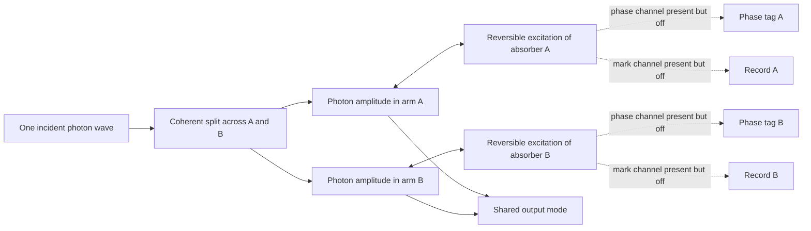

# Plain-English walkthrough of the 576-state no-bath model

## The result in one paragraph

This code is a calibrated starting point, not yet a selection model. One photon begins as a coherent wave across paths A and B. Each path can exchange that photon reversibly with its own absorber. The code follows the complete wave continuously, preserves its norm and energy under fixed controls, returns the photon with its original A/B phase, and can undo an arbitrary test history by reversing the complete Hamiltonian. It contains no collapse, no sampled winner, no Born-weighted random choice, and no one-world registry. That clean separation is the main value of this first implementation.

The code is in `~/Projects/Physics/DiracKuramotoFramework/first_mark_two_absorber/`. The underlying design is recorded in the [continuous-generator specification](epics/c443d91e-b0d5-43ff-a31b-805574ab7771/artifacts/debates/born-selection-roundtable/two-absorber-first-mark-model/reversal-protocol/minimal-finite-bath/continuous-generator/index.md).

## The physical picture



The solid arrows are active in the headline no-bath run. The dotted channels exist in the 576-state bookkeeping but are switched off. They are retained now so later phase-history and record tests can extend the same verified model instead of changing its state space.

## Why there are 576 states

The model keeps seven subsystems in one fixed order:

| Subsystem | Choices | Plain-English meaning |
| --- | --- | --- |
| Photon field | 4 | vacuum, photon in A, photon in B, or photon in the collected output |
| Absorber A | 3 | ground, reversible excitation, or candidate mark |
| Absorber B | 3 | the same three choices |
| Phase tag A | 2 | the two states of a small phase-history qubit |
| Record A | 2 | blank or locally excited record |
| Phase tag B | 2 | the second phase-history qubit |
| Record B | 2 | the second local record |

Multiplying the choices gives `4 x 3 x 3 x 2 x 2 x 2 x 2 = 576`.

This does **not** mean only 576 physical situations exist in nature. It means this first finite model uses 576 bookkeeping slots. It is deliberately small enough that every operator can be built and audited explicitly.

## What each code file does

Review the files in this order:

1. **`README.md` — the promise and the limits.** Start here. It explains the physical model, how to run it, and the claims that are forbidden.
2. **`model.py` — the 576-state world.** This fixes the subsystem order, builds the transition operators, assigns energies, constructs the seven Hamiltonian pieces, and prepares the initial photon wave.
3. **`controls.py` — what changes with time.** This represents an experiment as a sequence of time intervals. It builds capture, return, routing, and deliberately busy test schedules. It also constructs the exact global inverse.
4. **`simulate.py` — continuous evolution.** For each time interval it calculates the unitary evolution generated by the Hamiltonian and applies it to the complete state.
5. **`observables.py` — what is read from the wave.** This reports field and absorber populations, phase visibility, record excitation, energy, and excitation-number bookkeeping. It never selects an outcome.
6. **`verify.py` — the audit.** This contains the 18 checks described below and exits with an error if any one fails.

`__init__.py` merely makes the public pieces convenient to import. `.gitignore` prevents temporary Python cache files from being treated as research results.

## The seven interactions in plain English

| Hamiltonian piece | What it means |
| --- | --- |
| Photon-field energy | A photon has the same energy while travelling in A, travelling in B, or occupying the collected output mode. |
| Absorber energy | Each absorber has a ground state, a reversible excited state, and a lower candidate-mark state. A controllable detuning can shift the reversible excitation during a test. |
| Bath energy | A record qubit can hold the energy difference between the reversible excitation and candidate mark. The phase qubits have zero free energy in this first rung. |
| Capture coupling | Photon amplitude in A can become excitation amplitude in absorber A and return. B behaves identically. Forward and reverse transitions are both present. |
| Phase-history coupling | When enabled later, an excited absorber can become correlated with its local phase qubit without moving population between absorber states. It is off in the no-bath run. |
| Mark/record coupling | When enabled for construction tests, reversible excitation can become candidate-mark amplitude while the local record qubit receives the energy difference. The reverse exchange remains possible. |
| Recombiner routing | Photon amplitudes returned to A and B can drive the same output mode. Their relative phases determine whether they add constructively or destructively. |

The Hamiltonian is Hermitian: every allowed forward transfer has a matching reverse transfer. That is why the baseline evolution is unitary.

## How one no-bath capture-and-return run proceeds

1. Prepare one photon coherently divided between A and B. The example gives B a relative phase of `0.7` radians.
2. Start both absorbers in their ground states. Start the phase qubits in equal superpositions and the record qubits blank.
3. Turn on equal capture coupling in A and B. Photon amplitude leaves the two arm modes and becomes reversible absorber-excitation amplitude.
4. At the full-capture time, all photon probability has moved into the two absorber alternatives. No outcome has been chosen; the complete state contains the coherent A-correlated and B-correlated amplitudes.
5. Reverse the sign of the capture coupling for the same duration. The absorber excitation returns to photon amplitude in its original arm.
6. Compare the returned state with the starting state after ignoring a physically irrelevant overall phase. The complete state, A/B relative phase, photon population, and visibility return.

The example returns photon population `1.000000000000` and restores the prepared relative phase as `0.70000000000000`.

## Exact global inversion versus operational reversal

The code currently implements **exact global inversion**:

- take the forward time intervals in reverse order;
- reverse the sign of the complete Hamiltonian in each interval; and
- independently calculate each reverse propagator.

This reverses everything, including field energy, absorber energy, phase history, record energy, capture, marking, and routing. It is a mathematical Loschmidt reversal—a demanding numerical control—not an experimentally accessible detector operation.

The code does **not** yet implement operational reversal. Operational reversal will be allowed to manipulate only declared controls and will not be allowed to reverse the record interaction or hidden bath history. The difference between these two reversals is where the later Heisenberg-cut and recoverability questions become physically interesting.

## How to understand a numerical residual

Each check compares two quantities that should agree. The residual is the largest disagreement it found. A residual of about `1e-13` means the mismatch is around one part in ten trillion. These tiny nonzero values are ordinary floating-point roundoff. A check passes only when its residual is below a declared tolerance.

## The 18 verification checks

### Group A — Is the mathematical machine assembled correctly?

| # | Check | Plain-English question | Result | What it does not prove |
| --- | --- | --- | --- | --- |
| 1 | Operator shapes and tensor order | Is every operator a 576-by-576 matrix, and does it act on the subsystem named in the code? | Exact agreement in the tested placements. | It does not show the chosen physical interactions are complete descriptions of a real detector. |
| 2 | Resonance relations | Does photon energy equal reversible-excitation energy, and does mark plus record energy equal that same amount? | Both energy identities close exactly. | It does not derive the chosen record gap from silicon or another material. |
| 3 | Hermiticity of every generator term | Does every forward transition have the required reverse partner, including the complete sign-reversed Hamiltonian? | Residual zero for all tested terms and schedules. | Hermiticity alone does not prove that a proposed Hamiltonian is the correct microscopic one. |
| 4 | Propagator unitarity and independent exponential cross-check | Does the evolution preserve inner products, and does the eigenvalue method agree with a separate matrix-exponential method? | Worst mismatch about `1.7e-13`. | It does not test an open-system approximation or irreversible dynamics. |

### Group B — Are the closed-system conservation laws respected?

| # | Check | Plain-English question | Result | What it does not prove |
| --- | --- | --- | --- | --- |
| 5 | Norm conservation | Does total probability remain one through complicated time-dependent schedules? | Worst drift about `1.7e-13`. | It does not choose which alternative is actual. |
| 6 | Fixed-Hamiltonian energy conservation | When the controls are held fixed, does total Hamiltonian energy remain constant? | Worst drift about `4.3e-13`. | A time-dependent control can do work; this check does not pretend control energy is free. |
| 7 | Excitation number and existence of higher sectors | Does the Hamiltonian preserve excitation number, while the full space genuinely contains two-excitation states? | Both two-excitation examples remain at two; the prepared run remains at one. Worst mismatch about `9.1e-14`. | Remaining in the one-excitation sector is bookkeeping, not evidence of one-world exclusivity. |

### Group C — Does the model reproduce known two-level and interference behavior?

| # | Check | Plain-English question | Result | What it does not prove |
| --- | --- | --- | --- | --- |
| 8 | Resonant capture versus the known Rabi curve | Does each absorber exchange its half of the photon with the expected sinusoidal timing? | Agreement about `4.7e-14` over two cycles. | It does not derive Born selection; the initial half-share was prepared in the wave. |
| 9 | Detuned capture versus the generalized Rabi curve | When the absorber is off resonance, are the reduced transfer and altered oscillation rate correct? | Agreement about `1.7e-15`. | It does not mean the simple sign-flip return works while detuning remains active. It does not. |
| 10 | Single-arm routing | Does photon amplitude in A move into the output at the expected rate when only A drives it? | Agreement about `4.6e-14`. | A single arm cannot test relative recombination phase. That is why Check 11 was added. |
| 11 | Two-arm bright/dark recombination | Do A and B add fully for the bright phase, cancel for the dark phase, and drive the output at the enhanced bright-mode rate? | Bright output `1.000000000000`; dark leakage about `9e-28`; full phase law agrees about `2.7e-14`. | Interference validates the routing operator, not detector selection. |

### Group D — Can a helper silently promise a return that it cannot deliver?

| # | Check | Plain-English question | Result | What it does not prove |
| --- | --- | --- | --- | --- |
| 12 | Resonant return helper refuses non-resonant use | Does the helper reject detuning or active phase history rather than quietly returning an incorrect schedule? | All guards fire. The deliberately reconstructed bad detuned sequence returns only `0.8226530516` of the photon. | The guard does not implement a true detuned operational reversal. |
| 13 | No-bath return contract cannot be bypassed | Must the caller supply the physical model so a hidden nonzero mark coupling is detected? | Eight misuse probes pass. Nonzero mark coupling is rejected before evolution. | A caller could always violate a software contract deliberately by validating against one model and evolving with another; the documented API cannot make two unrelated objects identical. |

These two checks were added because independent review found that merely flipping the capture coupling does not reverse every other interaction. They protect the meaning of the phrase “capture and return.”

### Group E — Do the dormant record operators at least perform their declared exchange?

| # | Check | Plain-English question | Result | What it does not prove |
| --- | --- | --- | --- | --- |
| 14 | Mark/record exchange frequency | When temporarily enabled for an operator check, does reversible excitation exchange with candidate-mark plus record excitation at the expected rate? | Agreement about `5e-14`. | A single record qubit oscillates back. This is not durable commitment, amplification, or irreversible registration. |

### Group F — Do the complete calibration and reversal behaviors work?

| # | Check | Plain-English question | Result | What it does not prove |
| --- | --- | --- | --- | --- |
| 15 | No-bath capture and coherent return | Is the photon fully captured and returned with its whole state and relative phase intact? | Complete capture and return; state error about `5e-16`; visibility returns to one. | No absorber has been selected as the actual winner. |
| 16 | A/B symmetry | With equal hardware and input weights, does the code avoid accidentally favoring A or B? | Full swap error about `1.2e-13`. | When both arms drive the shared output, phase-dependent arm populations can differ through ordinary interference; that is not hardware bias. |
| 17 | Exact global inverse with the bath off | After a complicated forward schedule, does the reverse-ordered, sign-flipped Hamiltonian restore all 576 amplitudes? | State error about `6.1e-15`; the forward state had moved substantially. | This is a mathematical global inverse, not an available laboratory protocol. |
| 18 | Exact global inverse with all couplings on | Does the same construction also reverse phase and record operators when they are enabled? | Worst state/energy-ledger mismatch about `3.9e-14`. | It does not show operational recoverability, decoherence, or permanent irreversibility. It only verifies complete global reversal. |

## Four review discoveries that improved the implementation

The first version passed 15 checks, but independent review still found important weaknesses. The review-and-fix cycle produced four useful lessons:

1. **A sign flip of capture is not a universal inverse.** With detuning still active, the photon returned only about 82 percent. The return helper is now explicitly resonant and refuses detuned use.
2. **A single-arm routing test cannot verify phase.** Output probability from one arm is unchanged if the route phase is accidentally ignored or conjugated. The new two-arm test exercises constructive and destructive interference and fails under four deliberately introduced phase/sign errors.
3. **The full state space does contain two-excitation vectors.** The first wording incorrectly credited the state-space truncation for single-excitation behavior. The corrected statement is that the prepared state begins at one excitation and the Hamiltonian conserves that number.
4. **A safety check cannot depend on volunteered information.** The first mark-coupling guard was optional because callers could omit the model parameters. The helper now requires the physical context, and Check 13 tests the omission path.

These discoveries did not overturn the generator. They sharpened what its helpers promise and made the verification harder to fool.

## Important design decisions

- **The full 576-space is kept visible.** It is not yet reduced to a smaller conserved block. This costs computation but makes tensor placement and energy bookkeeping easier to audit.
- **Physical constants and experimental controls are separate.** The mark coupling `G` belongs to the physical model, while capture, detuning, phase schedule, and routing are controls. This prevents operational reversal from silently treating a material interaction as a freely reversible knob.
- **Global inversion negates the assembled Hamiltonian.** It does not attempt to remember which individual parameters should change sign. This makes “reverse everything” structural.
- **The reverse propagator is recalculated.** It is not obtained by simply taking the stored adjoint of the forward propagator, which would make the test nearly tautological.
- **Visibility is undefined while no photon occupies either arm.** The code reports `NaN`, not zero, while the photon is inside the absorbers. Zero would falsely suggest lost coherence.
- **Random schedules use pinned seeds.** The busy inversion tests can be reproduced exactly.

## Boundaries that must remain visible before extension

- The photon field has four discrete states, not a continuous spatial or frequency spectrum.
- The bath contains only four qubits and therefore cannot represent a thermodynamic continuum.
- The headline capture-and-return run has the phase and record couplings off.
- The record gap `Omega_r = 0.35 omega` is a calibration choice, not a material derivation.
- The unequal input-weight option exists but is not yet part of the verification suite.
- Exact global reversal is implemented; operational reversal is not.
- No result here derives the Born rule, selects the first mark, drains a losing branch, establishes one-world exclusivity, or distinguishes this framework from Many Worlds.

## How to run and read the result

From `~/Projects/Physics/DiracKuramotoFramework`:

```text
python3 -m first_mark_two_absorber.verify --verbose
python3 -m first_mark_two_absorber.verify --demo
```

The first command should finish with `18/18 checks passed.` The second adds a time table showing photon probability moving into the two absorbers and returning. During full capture, field visibility is printed as `nan` because there is no arm photon to interfere. At the end it should report whole-state overlap one, a state error near machine precision, and the original A/B phase restored.

## Safe extension point

The next model should preserve all 18 checks unchanged, then add phase-only operational reversal and common-reference echo tests. That extension should be treated as a new layer over this baseline. If any original check changes, the extension must explain why the baseline behavior was altered rather than silently accepting a regression.
