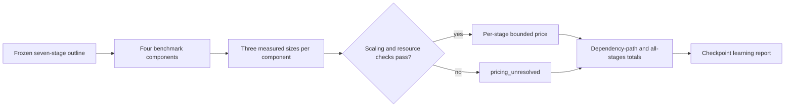

# Intended-configuration validation campaign pricing plan

## Decision and boundary

John selected **price the validation campaign** with the **conservative bounded** standard. This artifact settles how that price will be measured. It does not authorize a validation stage, pilot, production run, sensitivity, fit, or Ticket 08.

The present scientific disposition remains unchanged:

- the moving-band result is `numerical_no_result`;
- none of the twelve searched configurations satisfies the frozen budget;
- the probability budget admits at most 35 trials per cell against 2,406 planned for the full arm;
- the time-unit bounds fail at every trial count;
- no post-range production proposal exists.

Pricing may produce a bounded estimate or an explicit `pricing_unresolved`. It cannot turn any scientific gate green.

## Why the existing measurements cannot be priced

The current code times only two pieces:

1. `killed_diffusion.solve_survival`, normalized by PDE space-time cells; and
2. `killed_diffusion.compare_refinement` over observations that were generated before the timer started.

That omits stationary endpoint/sample construction and the moving-band replay/paired-leaf generation. Consequently the current `ValidationCampaign` correctly has no numeric cost path. Generic raw-writer timing is not a substitute for these kernels.

## Pricing architecture

Authority flows one way: frozen stage shape → measured component series → stage price. Callers may not provide a rate, contingency, verdict, or total.

## The four benchmark components

| Component | Timed boundary | Work unit | Required input provenance |
| --- | --- | --- | --- |
| Stationary solve | Full `killed_diffusion.solve_survival` call | space-time cell, with starts and horizon fixed in the case record | geometry, starts, horizon, grid, source/environment digest |
| Stationary endpoint and sample construction | From solved ladder outputs through exit-time/censoring arrays and `ValidationDataset` construction | walker-position-level observation | ladder shapes, walker identities, observable set, source/environment digest |
| Moving-band replay and paired-leaf generation | Full `moving_band_audit.replay_pulse`/ladder generation, including the physical walk and audit replicas | physical interval plus audited interval evaluation, reported separately | train, criterion, stream, trial/clock/replicate identities, timestep, source/environment digest |
| Refinement comparison | Full `killed_diffusion.compare_refinement` call over an already constructed dataset | resample-cluster-sample-level observation | dataset, budgets, resample count, declared digest, source/environment digest |

The moving replay uses two operation counters because shared physical work and replicated audit work scale differently. Collapsing them to one scalar is allowed only if the three measured cases establish the same normalized rate within the acceptance band.

## Measurement protocol

Each component receives exactly three deterministic size cases. The cases must span at least 4× in declared work; the preferred span is approximately 1×, 4×, and 16× while retaining the intended algorithm, data layout, and numerical path.

For every case:

1. verify the source fingerprint, environment fingerprint, input digest, and empty `results/` state;
2. run one untimed warmup;
3. run three timed repeats serially;
4. record all repeats, the slowest wall time, `tracemalloc` peak, process peak RSS, operation counters, output digest, warnings, and exit state;
5. require byte/digest-identical outputs across repeats where the kernel is deterministic;
6. remove fixtures in `finally` and prove the tree returned to its pre-case snapshot.

The pricing session has a **one-hour cumulative wall ceiling** and a **2 GiB per-process peak-RSS ceiling**. A case is not launched if its conservative preflight would exceed the remaining wall allowance. Crossing either ceiling stops that component and yields `pricing_unresolved`; it does not license a smaller extrapolation.

No benchmark runs concurrently with the verifier or another benchmark because the package shares fixture directories.

## Scaling acceptance and price rule

A component is priceable only when all three cases are valid and:

- normalized seconds per declared work unit vary by no more than 1.5×;
- total time is monotone with work;
- no warning, non-finite result, output drift, fallback path, or resource-ceiling event occurred;
- the planned stage lies within 16× of the largest measured work point; and
- memory behavior is either flat or linear over the three cases with no unexplained reversal above 20%.

The time price uses the **slowest observed normalized rate** and then applies a frozen **1.5× contingency**. No regression mean, fastest repeat, or favorable machine result may lower it. If a component has two work counters, the price is the sum of the independently conservative terms unless the scalar-collapse condition above passes.

Memory uses the maximum observed RSS. It may be extrapolated linearly only when all three cases support that model and the planned point is within the same 16× span; otherwise memory is unresolved.

## Mapping to the seven frozen stages

| Frozen stage | Required components | Price outcome |
| --- | --- | --- |
| Stationary probability, dt/16 at doubled space | stationary solve + endpoint/sample construction + refinement comparison | individual and cumulative |
| Stationary probability, dt/64 at quadrupled space | same three | individual and cumulative after dt/16 |
| Stationary probability, dt/256 at eightfold space | same three | individual and cumulative after dt/64 |
| Stationary time quantile, dt/256 at eightfold space | same three with time observable | separate from probability price |
| Moving-band probability, 64× master trials | replay/paired-leaf generation + refinement comparison | individual |
| Moving-band probability, dt/16 replay | same two, with timestep work recomputed | cumulative after 64× stage |
| Moving-band time quantile, 1024× master trials | same two, with time observable | cumulative after 64× stage |

Every stage retains its predeclared success, `numerical_no_result`, dependency, and stop rules. The report gives:

- a price for each stage;
- each reachable dependency-path total;
- the worst-case sum if every declared stage runs;
- the benchmark-only cost separately; and
- `pricing_unresolved` for any path containing an unresolved component.

It must not present the worst-case sum as an approval estimate or a sufficiency promise.

## Implementation shape

The pricing layer belongs outside the raw import graph, beside `experiments.py`:

- add a factory-only `KernelBenchmarkSeries` containing the three cases and their complete provenance;
- add `StagePrice` and `CampaignPrice` records with verdicts limited to `priced` and `pricing_unresolved`;
- derive component and campaign digests from canonical complete preimages;
- leave the existing unpriced `ValidationCampaign` unchanged until all four component series validate;
- make the authoritative campaign-price factory accept the frozen campaign plus benchmark series, never caller-provided rates or totals;
- add mutation checks for missing sizes, substituted units, favorable-repeat selection, contingency changes, extrapolation beyond the measured span, output drift, ceiling hits, and omitted components.

The verifier must preserve every Ticket 01–07 line and run its benchmark checks serially. Independent review receives raw repeat records, environment/source digests, formulas, stop events, and the exact unresolved reasons—not only the aggregate hours.

## Completion criteria

Pricing is complete only when:

- all four components have three valid cases under the protocol;
- all seven stages are either conservatively priced or explicitly unresolved;
- benchmark overhead, stage prices, dependency totals, memory, and machine/environment identity are visible;
- rerunning the derivation from the serialized observations reproduces every price and digest;
- no validation stage, pilot, production, fit, sensitivity, or Ticket 08 path was entered; and
- independent review has no unresolved correctness finding.

If any condition fails, the durable outcome is a useful `pricing_unresolved` report identifying the additional measurement needed.

## Next authorization boundary

This plan authorizes neither implementation nor measurement. The next explicit choice is whether to implement this pricing layer and run its bounded one-hour benchmark session. Only after a reviewed price exists can John decide whether the intended-configuration validation campaign is worth authorizing.
