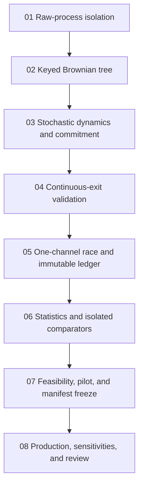

# Implementation tickets: single-channel stochastic commitment

These tickets implement the closed [single-channel stochastic commitment plan](..) in `/Users/john-bramble/Projects/Physics/DiracKuramotoFramework/adler_born_two_channel/`.

Current baseline: the package contains deterministic Adler, raised-cosine pulse, and analytic flat-spectrum controls only. The canonical verifier passes 26/26 checks. The package is currently untracked in Git; tickets must not stage, commit, or modify unrelated repository files unless John separately asks.

| Ticket | Deliverable | Gate before the next ticket |
| --- | --- | --- |
| [01](01-raw-process-isolation) | Raw process cannot load the analytic answer | Existing 26 checks pass; transitive import isolation passes |
| [02](02-keyed-brownian-tree) | Reproducible streamed white noise and exact-crossing Brownian tree | Distribution, nesting, pairing, and zero-noise checks pass |
| [03](03-stochastic-dynamics-and-commitment) | One-clock full and width-control dynamics plus fixed-dwell state machine | Deterministic limit, boundary phase, lift, dwell, and control checks pass |
| [04](04-continuous-exit-validation) | Stationary killed-diffusion oracle and moving-band bridge audit | Algorithms pass independent/synthetic checks and expose measured refinement error |
| [05](05-one-channel-race-ledger) | Finite competing-clock race and immutable raw ledger | Every trial/exposure is accounted for; raw isolation remains intact |
| [06](06-statistics-and-comparators) | Survival, hazard, cloglog, causal controls, and isolated comparison process | Synthetic estimators pass; invalid power law returns no valid exponent |
| [07](07-feasibility-pilot-and-freeze) | Resource benchmark, power calculation, production-specific numerical budgets, range-only pilot, frozen manifest | John reviews the finite production matrix and authorizes the run |
| [08](08-production-sensitivities-and-review) | Frozen production execution, staged falsifications, and reviewed scientific report | Positive, negative, or numerical-no-result verdict is reproducible |

All tickets preserve these boundaries: no microscopic origin is claimed for white noise; no amplitude square or prescribed hazard enters event generation; physical clock count is a sensitivity rather than numerical convergence; unresolved trials remain visible; no result is called a Born-rule derivation; and no manuscript is edited.
