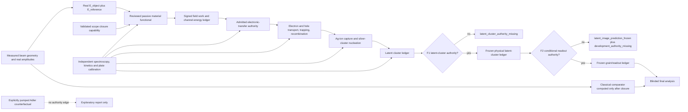

# Revision decision

The conclusion-bearing material model is now **passive**. The previous
self-sustained Adler oscillator is removed from the PFG-01 authority path
because the evidence audit found no independently documented pump, free-running
phase, or injection-locking behavior in sensitized silver-halide material. See
the [material-oscillator evidence audit](material-oscillator-evidence) and the
[critique of the superseded active design](independent-critique).

Adler dynamics may survive only in a separately labelled counterfactual that
cannot generate physical PFG-01 records or support a material conclusion.

# Readiness after independent review

The plan is **feasibility-only**. A conclusion-bearing PFG-01 implementation is
prohibited until the [preimplementation authority gates](preimplementation-authority-gates)
close for the exact requested scope and mint an immutable closure capability.
Those gates require the exact material functional, a justified
electronic-transfer model, retained-batch evidence and identifiability,
full-exposure numerical feasibility, thermodynamic/noise contracts, independent
latent-image/readout evidence, capability-enforced closure and quantitative
decision rules.

Capability authority is rooted in a compiled non-negotiable bootstrap profile,
including a pinned authority-log ID/genesis, an offline signed trust manifest,
distinct owner/reviewer/issuer/checkpoint/
witness roles and a witnessed append-only content-addressed store. At every
authority boundary, a two-of-three witness quorum must issue a nonce-bound,
single-boundary latest-head lease resolving the unique active trust manifest and
complete revocation set. Consumption succeeds only through an expected-head
transaction: after the lease itself is logged, any intervening append produces
no receipt or result and forces a fresh lease for the same immutable subject.
Every physical run additionally requires a signed,
single-use commitment to its exact preregistered Stage-11 field and processing
bytes. The claim service atomically assigns that commitment to one `raw_start`
subject, consumes its lease and fixes its durable claim receipt. A final
physical presentation completes only when the `final_analysis` boundary has
durably committed both its fixed report and the separately signed, unrevoked
analysis-release record. Its template and authorized key are frozen before the
atomic receipt transaction, which durably stores the exact report bytes and
receipt-bound release payload. Later normal retirement preserves only the
payload-specific completion grant fixed at that receipt sequence;
correcting analysis never changes the immutable raw dataset. Exceptional
revocation repairs accumulate independently per revoked
digest, so repairing an unrelated record cannot reactivate an earlier repaired
revocation.

Failure to obtain any one of those authorities is a valid terminal no-result.
It may not be replaced by a convenient effective parameter.

# Purpose

Determine whether it is possible to build a falsifiable microscopic
**film-recording** model in which measured beam
geometry generates real time-domain electric fields, those fields drive passive
sensitizer polarization coordinates, an independently admitted electronic-
transfer formalism may inject charge into silver halide, and admitted charge,
ion, cluster and readout dynamics may predict a recording response. None of
those downstream mechanisms is presently assumed to exist or be identified for
PFG-01.

The implementation may compare its final grain-density prediction with the
classical `|E_object + E_reference|^2` comparator only after raw simulation has
finished and its inputs and outputs have been frozen. It must not assume photon
arrival probabilities or claim a derivation of single-photon Born selection.

The target material is a GEOLA PFG-01-class red-sensitive silver-halide plate,
nominally used near 640 nm and approximately 100 microjoule/cm2 with the
manufacturer's specified processing. Those plate-level numbers establish an
experimental scale; they do not supply dye, exciton, transfer, trap, ion, cluster
or development parameters. See the [manufacturer's PFG-01](https://www.geola.com/product/pfg-01-plates/)
[data](https://www.geola.com/product/pfg-01-plates/).

# Settled decisions

| Decision | Choice | Why |
| --- | --- | --- |
| Scientific scope | Many-grain film-recording mechanism | A plate can test spatial recording without pretending to explain individual quantum measurement outcomes. |
| Raw field authority | Real time-domain electric field | Beam geometry supplies `E(x,t)` but no complex norm, intensity array or target response. |
| Material authority | Exact reviewed Hamiltonian/free-energy and field coupling required before physical code | A generic `V(q,z,r)` is too flexible and can install the desired law one layer later. |
| Electron transfer | No physical formalism selected yet | A kinetic surrogate is exploratory; a microscopic candidate requires explicit electronic states, reverse dynamics, detailed balance and exact charge/energy handoff. |
| Charge and latent image | Carrier transport, traps, Ag-ion capture and silver-cluster growth | Mirrors the independently documented mechanistic chain. |
| Latent-cluster authority | Physical cluster output withheld until a pre-development assay and its forward operator identify the upstream model | Developed density cannot substitute for evidence that the predicted latent clusters exist. |
| Development | Physical readout withheld until response conditional on independently known cluster state is measured | A threshold fitted only to developed density can absorb the upstream response. |
| Numerical reference | Direct optical-cycle, multirate solver | It is authoritative for trajectories, energy flows and threshold-boundary fixtures. |
| Acceleration | Exact analytic elimination for the linear passive network first; other multiscale solvers only after a costed probabilistic full-horizon certificate | A hidden envelope norm or unbounded rare-event bias cannot enter the physical path. |
| Randomness | Subsystem-complete thermodynamic contracts and physical-time-addressed keys | FDT, detailed balance, charge/atom conservation and divergent event graphs must all close. |
| Material calibration | Retained-batch availability audit plus structural and practical identifiability | Broad data categories and a numerical Jacobian alone do not identify the mechanism. |
| Role of Adler | Isolated counterfactual only | No material evidence supports an autonomous Adler-lockable degree of freedom in PFG-01. |
| Comparator boundary | Final analysis only | Raw generation cannot see `\|E\|^2`, `psi`, a target exponent, or a desired exposure window. |
| Authority identity | Every authority object separates canonical unsigned payload bytes and stable `payload_id` from its signed-envelope bytes and `object_digest`; self-identifiers are excluded from their own hash preimages, revocations target payload IDs, and completed/Merkle objects carry both IDs | A payload can be revoked after logical issuance but before signature completion without a hash cycle or confusion with its final stored envelope. |
| Authority trust | Fixed bootstrap pins encoding/algorithms, root, log genesis and threshold recovery; every authority boundary freezes a canonical subject, obtains a nonce-bound two-of-three latest-head lease, freezes its next receipt, result-template payload ID, signer key and completion-grant template, and atomically appends the use-receipt envelope only if the current head and authority digests still equal that lease's exact inclusion view; that transaction derives the receipt-bound result payload ID and its payload-specific completion grant, whose later restricted signature only completes issuance at the receipt sequence; a compiled schema registry fixes all revocation and parent-invalidation routes | A content hash, young checkpoint, old valid signature or unregistered schema alone proves neither legitimate approval nor current revocation state, and a lease cannot bridge an intervening authority-log append. |
| Boundary lifecycle | Durable states are `unleased`, `leased(attempt)`, immutable `abandoned(attempt)` with a fresh-attempt loop, `consumed`, `completed` and terminal `consumed_failed`; abandonment and consumption CAS the same active attempt ID | Expiry, abandonment, delayed replies, ambiguous commits and signer failure have one queryable outcome rather than an implicit retry path. |
| Run authorization | Separate signed, single-use commitment to the exhaustive field/exposure/control/processing manifest and domain proof; one commitment-keyed transaction assigns the sole winning raw-start subject, consumes its lease and fixes its claim receipt; one raw manifest binds every block before close | A broad scope capability cannot silently authorize a changed, concurrent, replayed, incomplete or out-of-domain experiment, and a losing subject cannot leave behind an authoritative receipt. |
| Analysis release | Before consuming the final-analysis lease, freeze the exact report bytes/ID, next receipt, release-template payload ID, release key and completion-grant template; one authority-store/WAL transaction appends the receipt and stores the consumed row, exact report bytes, unique receipt-bound release payload/ID, resulting payload-specific grant and every recovery locator; only that fixed grant may later sign, and completion stores the release payload ID plus signed-envelope object digest | A valid report is not yet a current physical presentation, and release signing cannot escape the boundary's currentness, retirement/revocation or crash-recovery rules. |
| Exceptional repair | Evaluate the controlling recovery transition independently for each exact retroactive revocation digest and subtract all valid repaired digests cumulatively | A later repair of an unrelated revocation cannot silently reactivate an earlier repaired one. |

# Authority chain

The raw path never passes through intensity, an assumed photon-event rate, a
locked fraction, a fitted exponent, or a Born comparator. Classical quadratic
absorption is allowed to **emerge** from the bilinear field work `E*qdot` of the
passive dynamics. It may not be inserted as a response law.

# User-visible scientific outcomes

The system reports which boundary failed rather than manufacturing a favorable
pattern. The two `classical_recording_*` outcomes require a validated
`developed_film_physical` capability. A physical
`latent_image_prediction_frozen` outcome requires the narrower
`latent_cluster_physical` capability and cannot be emitted by exploratory
cluster dynamics:

- `insufficient_material_calibration`;
- `material_authority_missing`;
- `transfer_authority_missing`;
- `evidence_unavailable`;
- `thermodynamic_authority_missing`;
- `latent_cluster_authority_missing`;
- `development_authority_missing`;
- `authority_capability_invalid`;
- `run_commitment_invalid`;
- `no_resolved_test`;
- `passive_model_inconsistent`;
- `numerically_unresolved`;
- `envelope_equivalence_failed`;
- `latent_image_prediction_frozen`;
- `classical_recording_consistent`;
- `classical_recording_inconsistent`;
- `adler_counterfactual_only`.

No outcome may say or imply that the Born rule, photon selection, or a real
PFG-01 Adler oscillator has been derived.

# Plan documents

- [Microscopic architecture and equations](model-architecture)
- [Calibration, analysis firewall, and falsification](calibration-and-analysis)
- [Implementation and verification sequence](implementation-sequence)
- [Preimplementation authority gates](preimplementation-authority-gates)
- [Evidence audit for an Adler-lockable material oscillator](material-oscillator-evidence)

# Existing-code fit

Feasibility work should live in a new standalone package, provisionally
`passive_silver_halide/`, beside `hologram_phase_test/`. Physical raw-generation
modules remain disabled until a scope-specific authority capability validates.
Nothing may
modify the reviewed `adler_born_two_channel` authority chain.

Reusable references are limited to patterns and controls:

- `adler_born_two_channel/stochastic.py` provides a keyed-noise design pattern,
but the new physical bath keys and fluctuation-dissipation laws are distinct.
- `hologram_phase_test/phase_sweep.py` supplies field-geometry fixtures and a
classical consistency control. Its complex norm, `K * locked_fraction`,
Poisson mean, threshold scan and target-selected exposure windows are not
reused in raw generation.
- `adler_born_two_channel/model.py` may be used only by the isolated Adler
counterfactual verifier, never by the passive raw package.

# Explicit nonclaims

Even if the final grain pattern follows classical interference intensity, the
result would establish only that the independently calibrated passive material
model is consistent with film recording. It would not establish:

- a universal Born rule;
- a single-photon selection mechanism;
- that PFG-01 contains an autonomous Adler oscillator;
- that one effective parameterization identifies a unique microscopic process;
- that development chemistry has been derived from first principles;
- that agreement at one exposure validates untested temperatures, batches or
processing conditions.

Those boundaries are acceptance criteria, not caveats added after a favorable
result.
