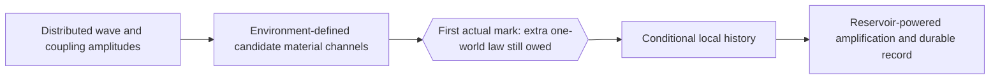

# Cloud chamber and SPAD cascade: a first-mark audit

## Executive verdict

The Claude Opus cloud-chamber mechanism and the later Sol–Fable SPAD cascade illuminate the same architecture from opposite ends. The cloud chamber is strongest **after a first material mark exists**: Mott's unitary analysis explains why multi-atom ionization amplitudes are concentrated on straight, radial configurations, and the later toy model makes repeated conditional recording vivid. The SPAD review is strongest **before and around the first seed**: it separates distributed optical capture, bath formation of candidate carrier channels, the still-missing one-world selection law, seed commitment, avalanche commitment, registration, and reset.

The decisive conclusion is negative but productive: **neither mechanism derives why one particular candidate becomes the first actual mark with Born frequency, and neither derives global exclusivity from a microscopic detector Hamiltonian.** The Opus toy model assumes both at the point where they matter: it samples each event using a Born-weighted kernel and imposes a first-closure-wins budget. The SPAD collaboration improves the science by exposing those assumptions as four separate debts—stake ontology/Born map, fair kernel, absorbing dropout/return, and finite one-winner exclusivity—and by showing that avalanche physics cannot pay any of them.

Mott explains the **shape and persistence of a track in configuration space**, not the actuality, probability, or uniqueness of its first dot. In plain English: it explains why, once a track is found, its dots line up; it does not explain why nature writes this first dot rather than another, or why only one initial history becomes actual.

The best surviving common mechanism is therefore conditional:

1. a distributed wave couples to many material possibilities;
2. detector–environment dynamics forms stable candidate channels;
3. an additional one-world rule must supply the first actual mark;
4. ordinary conditional dynamics then makes later records consistent with that mark; and
5. detector-specific reservoirs amplify those records.

That is a useful cross-paper architecture. It is not yet a Born-selection derivation.

Source basis: the [July 4 Opus discussion](~/Projects/Physics/DiracKuramotoFramework/discussions/2026-07-04-three-stage-measurement.md), [Paper 2 draft](~/Projects/Physics/DiracKuramotoFramework/drafts/PAPER2_DRAFT_heisenberg_cut.md), [Paper 3 revision](~/Projects/Physics/DiracKuramotoFramework/current_revision_DK_paper.md), [SPAD round synthesis](../../spad-event-cascade/round-01/synthesis), its four participant records, and the [author–AI candidate ledger](../author-ai-update-candidates).

## Priority findings

### Critical — the first-mark problem is merely relocated in the cloud-chamber story

Mott's result is often narrated as though a spherical wave “chooses a ray.” The calculation does not produce that event. It shows that joint ionization amplitude is strongly supported when successive atoms and the source are approximately collinear. The full state still contains the allowed track configurations. Turning one of those configurations into the single actual first ionization requires a measurement rule, a beable/registry, or a reduction law.

The Opus recoil/track toy makes the relocation visible. Its first event is drawn from an input angular distribution using a **Born-weighted overlap**, and the state is then updated with a Kraus-style conditioning rule. Its uniform first-angle histogram follows from spherical symmetry plus that input sampling. The simulation successfully contrasts conditioning with a memoryless random walk, but it does not derive the sampling law or the actuality of the sampled event.

### Critical — the Opus exclusivity result is enforced, not derived

The companion complex-rotation toy obtains zero double registrations because it contains a nonlocal **first-closure-wins budget** that force-reverts other provisional loans. The track extension generalizes this to one energy–momentum record per elementary interaction while allowing many sequential recoils. These are coherent bookkeeping rules, but they are postulates of the simulation. Energy conservation constrains admissible histories; it does not by itself specify which candidate closes first, how remote alternatives are stopped in finite time, or why the resulting mark distribution is Born.

### Critical — the SPAD martingale theorem is conditional, not microscopic

Optional stopping proves a valuable statement: if nonnegative shares are physically real, conserved path by path, drift-free, absorbing at zero, guaranteed to reach exactly one winner, and initially equal to the relevant quadratic weights, then each winner's frequency equals its initial share. The mathematics is sound. The SPAD review correctly refuses to identify this with a silicon derivation. The detector Hamiltonian has not yet produced the shares, their zero-drift kernel, absorbing faces, finite fixation, or global stopping across separated absorbers.

### High — “selection,” “commitment,” and “registration” must not be used as one boundary

The earlier three-stage vocabulary was a major advance, but the SPAD cascade shows that “commitment” needs at least two microscopic meanings plus an engineering record:

- **first actual mark / ontic selection:** the unresolved one-world choice among candidate channels;
- **seed commitment:** a channel-specific material configuration becomes able to seed later transport or a local record;
- **click commitment:** a SPAD avalanche crosses a survival committor and is very unlikely to die;
- **registration:** a comparator or visible droplet writes a readable record.

In a cloud chamber, a local ionization and droplet seed play the seed/record role at every vertex. In a SPAD, field-separated carriers, avalanche survival, and the comparator are temporally distinct. Calling the avalanche threshold “selection” would hide the Born problem downstream of where it already had to be solved.

### High — local track registry is not the nonlocal entanglement registry

A cloud-chamber registry is an ordered material history: ionization, droplet nucleation, and later nearby marks provide a durable local chain. Mott supplies correlations among the possible multi-atom configurations, and an actual earlier mark can condition the practical state used to predict later ones.

The entangled-sector registry proposed elsewhere is stronger. It must coordinate actual outcomes across separated wings, specify an update/order rule, recover Bell correlations, preserve no-signaling, and enforce global exclusivity. A local track is a good physical example of **record persistence**; it is not evidence that the nonlocal registry exists or that its dynamics works. The word “registry” should therefore always be qualified as **local track registry** or **nonlocal shared-entanglement registry**.

### Medium — the cloud-chamber toy contributes a conditional dynamics result, not merely an illustration

The toy's strongest genuine result is the plateau-versus-diffusion comparison: repeated state conditioning keeps angular spread bounded by the measurement resolution, while memoryless scattering diffuses roughly with the square root of the number of events. That cleanly teaches why repeated conditional records can form a straight classical-looking trajectory. Its click-to-track interpolation also usefully separates a destructive capture from a weak recoil that leaves enough particle energy for later marks.

The toy's Bragg-like deposition profile is a consistency demonstration after importing an energy-dependent event-spacing law. It does not add evidence about first-mark selection.

### Medium — some earlier language overstates what the evidence measures

“The collinearity of the track measures per-event partiality” is too strong. Collinearity demonstrates angular correlation and persistence; per-event energy transfer is learned from ionization/recoil physics and stopping power. Likewise, “the spherical wave chooses once, then keeps its choice” is acceptable teaching shorthand only if immediately translated as: the first actual mark is assumed or conditioned upon, and Mott-style amplitudes favor later collinear records.

## Stage comparison table

Legend: **S** = standard/established physics; **F** = framework hypothesis or interpretation; **O** = open derivation; **I** = imported by the toy model.

| Stage | Cloud chamber / Opus mechanism | SPAD / Sol–Fable cascade | First-mark audit and status |
| --- | --- | --- | --- |
| **Incoming wave** | An emitted charged-particle state can be approximately spherical while carrying enough energy for many weak later interactions. | A one-photon packet is distributed across incident, reflected, transmitted, scattered, and absorber-coupled modes. | Wave propagation and unitary mode evolution are **S**. Neither description contains an actual outcome yet. |
| **First coupling** | Weak Coulomb scattering/ionization transfers a small amount of energy and momentum to chamber matter; the particle usually survives to interact again. | Current–field coupling creates unabsorbed amplitude plus extended interband electron–hole excitation; silicon absorption is phonon-assisted and becomes practically irreversible on a fs–100 fs scale. | Interaction amplitudes and energy–momentum transfer are **S**. A coupling amplitude is not an actual mark. |
| **Candidate-channel formation** | Mott treats joint atom–particle configurations; chamber microphysics supplies possible ionization/nucleation sites. The Opus toy represents these with angular acceptance kernels. | Multiphonon, disorder, and bath coupling form roughly 10 nm phonon-dressed carrier packets over about 10 fs–1 ps. | Mott/configuration amplitudes and SPAD pointer-basis formation are **S**. The toy's chosen kernels are **I**. Decoherence selects a useful basis, not one member. |
| **First actual mark** | The first committed ionization/droplet seed begins the visible local history. Mott does not select it. The toy samples it from a Born-weighted distribution. | A one-world law must choose one carrier packet no later than field-driven electron–hole separation near 1 ps. Standard unitary dynamics does not supply the unique packet. | Actuality is **O** in both. Born-weighted toy sampling is **I**, not a derivation. |
| **Subsequent conditioning / registry** | Mott amplitudes favor collinear multi-ionization configurations. In operational language, conditioning on an earlier mark narrows later angular stakes. The material marks form a local registry. | After a unique seed is supplied, carrier transport and later avalanche dynamics are seed-conditioned. No multi-mark spatial track is formed for one absorbed photon. | Mott correlation and standard conditional predictions are **S**. Treating one conditioned trajectory as ontic requires an interpretation or added law **F/O**. |
| **Repeated records** | Many weak capture–commit–register triplets are permitted because each recoil uses only a small fraction of the particle's energy. The particle stops, is captured, decays, or exits after many marks. | One absorbed photon supplies at most one optical seed; a SPAD normally makes one saturated click, then dead time/reset. Later counts require new photons, dark seeds, crosstalk, or afterpulses. | Repetition is ordinary detector architecture **S**. “One winner” applies per elementary quantum event, not to the whole cloud-chamber track. |
| **Energy transfer** | Each ionization/recoil receives real local energy and momentum from the passing particle; droplet growth uses the metastable chamber medium. The projectile's remaining energy supports later vertices. | Absorption converts the whole photon in an absorbed component into carrier excitation and phonons. The macroscopic avalanche energy comes overwhelmingly from the junction field and bias supply. | Named energy ledgers are **S**. Ontic fractional stakes at losing sites and winner-routing currents remain **O**. |
| **Amplification** | Ionization seeds condensation or bubble growth; many local droplets make the track visible. | Impact ionization branches from the carrier seed, may go extinct, then crosses a bias-dependent committor and grows to a pJ-scale avalanche. | Reservoir-powered amplification is **S** and downstream of first-mark selection in both. It cannot derive which initial channel was actual. |
| **Exclusivity** | The chamber must yield one actual first history, but it may legitimately produce many sequential marks. The toy enforces a per-event budget and first-closure rule. | One delocalized photon must not create two actual seeds/clicks in separated absorbers. Local avalanche physics cannot enforce this because each avalanche is seed-origin-blind. | Observed anticorrelation is **S**; the one-world finite stop/drain or beable law is **O**. The toy budget is **I/F**. |
| **Reset / end condition** | A local droplet is not reset between particle vertices. The event ends when the particle loses usable energy, is captured/decays, or leaves; the chamber is later cleared or recycled. | The avalanche is quenched below breakdown, the junction recharges, and traps can cause afterpulse memory. | Detector end/reset physics is **S**. It contributes efficiency and dead-time statistics, not upstream Born selection. |

## Common mechanism

Both detector stories support a disciplined three-layer picture:

The first two transitions explain **what alternatives are physically available**. The open central transition asks **which alternative becomes actual**. The last two explain **why the chosen history persists and becomes visible**.

This shared architecture is the most valuable cross-detector result. It localizes the foundational debt rather than pretending every stage is mysterious. It also rules out amplification-based Born derivations as a class: by the time a droplet grows or a SPAD avalanche branches, the candidate seed has already been specified in any one-world account.

## Decisive differences

| Difference | Cloud chamber | SPAD | Why it matters |
| --- | --- | --- | --- |
| **Quantum budget** | A massive charged particle survives many small recoils. | An absorbed photon is annihilated as a whole excitation. | Cloud-chamber “exclusivity” cannot mean one record total; it is per interaction/branch history. |
| **Record topology** | A spatially ordered chain of many marks. | One localized seed followed by temporal carrier multiplication and one digital edge. | The track tests conditional persistence; the SPAD cleanly exposes the first-seed boundary. |
| **Candidate basis** | Joint particle–atom configurations and chamber response; the earlier toy coarse-grains them into angular kernels. | Device review identifies a concrete bath-generated pointer scale: phonon-dressed carrier packets, not optical-vertex atomic sites. | The SPAD collaboration corrects overly schematic “site” language. |
| **Downstream reservoir** | Projectile energy creates ionization; chamber metastability grows visible droplets. | Bias supply provides about seven orders of magnitude more energy than the photon. | Neither reservoir knows the upstream Born weight. |
| **End condition** | Many records until the projectile stops or leaves. | One click, quench, recharge, dead time. | A universal “capture–commit–register” vocabulary needs detector-specific repetition and reset clauses. |
| **Best foundational use** | Demonstrates why later records can form one consistent classical trajectory. | Demonstrates exactly where standard device physics stops short of one actual first seed. | The examples are complementary, not competing derivations. |

## First-mark audit

### What Mott actually explains

- Starting from a spherical particle wave and initially un-ionized atoms, unitary multi-particle dynamics gives appreciable joint ionization amplitude primarily for approximately collinear configurations.
- The result removes the naive contradiction between a spherical wave and straight observed tracks.
- It supplies the **conditional geometry** of successive candidate records: after one location is specified, later support is concentrated along a compatible ray.

### What Mott does not explain

- which atom becomes the first actual ionization;
- why only one track history is actual in a one-world ontology;
- why first-mark frequencies follow a quadratic measure without invoking the usual measurement rule;
- a physical collapse, beable, or registry-update law; or
- the stronger nonlocal registry needed for spacelike entangled outcomes.

### What the Opus toy model imports

| Imported element | Where it enters | Consequence |
| --- | --- | --- |
| Born-weighted event kernel | Each recoil angle is sampled from the current state convolved with a detector acceptance kernel. | The toy tests consequences of Born conditioning; it cannot derive Born. |
| Outcome-conditioned update | The angular distribution is multiplied by the acceptance kernel after the sampled mark. | Produces persistent straightness; presupposes that this mark occurred. |
| First-closure-wins budget | The complex-rotation model forbids double registration and force-reverts other provisional loans. | Antibunching is satisfied by construction; finite global exclusivity is not derived. |
| Microscopic pole/closure rates | Detuning, width, reversal, and closure rates are chosen inputs. | Demonstrates internal consistency and timing signatures, not microscopic emergence. |
| Recoil/capture branching and stopping law | The track extension chooses capture probability, recoil cost, angular resolution, and an energy-dependent mean free path. | Click-to-track interpolation and Bragg-like shape are conditional model results. |

### What the SPAD review established

- The optical vertex first populates extended interband modes; candidate position channels emerge later through a detector-specific bath cascade.
- Decoherence and pointer-basis formation do not create one actual carrier packet.
- The selection window must finish by microscopic seed commitment, roughly the field-separated electron–hole configuration near 1 ps in the reference silicon device.
- Carrier collection, avalanche survival, click commitment, comparator registration, quench, and recharge are standard downstream physics.
- Avalanche gain is photon-agnostic: dark carriers traverse the same cascade, proving the avalanche cannot encode the upstream Born choice.
- The martingale and linear first-event results are useful conditional theorems, but the real stake, fair kernel, absorbing return/dropout, and finite exclusivity remain underived.
- Passive-beable and continuous-routing accounts have different loser-wave and energy stories and must not be blended.

### Bottom line on Born selection and exclusivity

| Question | Opus cloud-chamber mechanism | Sol–Fable SPAD cascade |
| --- | --- | --- |
| Derives the first actual mark? | **No.** The simulation samples it. | **No.** It identifies the window and the missing ontic law. |
| Derives first-mark Born weights? | **No.** Born weighting is in the recoil/event kernel. | **Conditional only.** Optional stopping returns initial shares if several physical premises hold; the shares and kernel are not derived from silicon. |
| Derives exclusivity? | **No.** First-closure-wins and the budget are imposed. | **No.** It separates passive beable from routing and specifies the finite-stop debt and observable bounds. |
| Explains later records? | **Yes, conditionally and usefully.** Mott correlations plus repeated conditioning explain track persistence. | **Yes, after a seed exists.** Standard transport, branching, amplification, registration, and reset are detailed. |

## What the earlier work genuinely contributed

1. **The click-to-track axis.** It showed that event detectors and track media can share a capture–commit–record vocabulary while differing in how much energy one interaction removes and whether the quantum survives to make later records.
2. **Track as cascade, not one giant measurement.** A cloud-chamber path is many local material events, not a single extended click.
3. **A concrete local registry.** The durable ordered chain of ionizations and droplets is a strong physical model for how earlier records constrain later observations.
4. **The straightness mechanism.** The conditioning-versus-diffusion comparison isolates why a trajectory remains narrow instead of random-walking across the chamber.
5. **A useful separation of selector and amplifier.** Droplet growth and other visible closure mechanisms do not supply the angular probabilities.
6. **An honest open ledger already present in the July discussion.** The notes explicitly state that per-event Born weighting, the energy-loss law, and the first-closure budget are inputs and that the Born measure remains open. That honesty should be preserved rather than overwritten by stronger later prose.

## What the SPAD collaboration corrected

1. **It replaced schematic optical “sites” with a defensible channel-formation sequence:** extended Bloch/interband excitation first, then bath-defined carrier packets.
2. **It split first actuality from three downstream thresholds:** seed commitment, avalanche committor, and comparator registration.
3. **It proved that amplification cannot reach backward into selection:** the coherence window closes before avalanche transport begins, and dark seeds generate indistinguishable avalanches.
4. **It closed the ordinary energy ledger:** whole-photon exit or absorption; named carrier, phonon, radiative, junction, bias, circuit, trap, quench, and recharge channels; no fractional photon remainder and no unnamed vacuum sink.
5. **It exposed four first-mark burdens hidden by “fair lottery”:** the ontic stake/Born map, the fair kernel, absorbing dropout/return, and finite exclusivity.
6. **It forced the ontology fork:** a passive beable keeps empty waves and owes their efficacy/stress-energy; winner routing removes alternatives and therefore owes objective-reduction-like norm and energy currents, drain time, and no-signaling behavior.
7. **It converted vague tests into calibrated bounds:** upstream/downstream factorization, separated-absorber double-seed bounds, reversible-absorber visibility, and whole-photon no-click accounting.

The collaboration therefore did not refute the cloud-chamber registry idea. It put a hard boundary around its legitimate explanatory range.

## Implications for Papers 1–3

### Paper 1 — Born Selection

- Use the cloud chamber as a **boundary example**: it makes the first-mark debt easy to see because later track structure is unusually well explained.
- Present martingale/linear-hazard Born results as conditional theorems upstream of seed commitment. Do not say a SPAD, Mott, or a track toy microscopically derives the premises.
- Keep local track registry separate from the P5/P6 nonlocal entangled registry. The former motivates durable actuality; it does not validate shared spacelike updating.
- Make exclusivity detector-specific: one photon/one seed across separated absorbers versus one charged particle/many sequential recoil records.

### Paper 2 — Heisenberg Cut

- Retain the insight that a track is a correlated cascade of local events rather than one measurement.
- Narrow “Mott supplies the conditional stakes; locks supply the events” to mark the split in status: Mott supplies standard joint/conditional amplitudes; a one-world lock remains a framework hypothesis whose microscopic law is open.
- Align the anatomy with seed commitment, click commitment where applicable, and registration. “Lock completion” must not simultaneously mean first actuality, whole-quantum absorption, avalanche survival, and macroscopic record.
- Treat the cloud-chamber worked calculation as still owed: the current Opus toy verifies consequences of Born-conditioned kernels but does not compose a Born-free first-mark law with Mott amplitudes.

### Paper 3 — Dirac–Kuramoto Framework

- Keep the cloud chamber as the weak/repeated limit and the emulsion as the many-quanta/one-site limit.
- Replace any implication that track collinearity *measures* per-event partiality with the narrower claim that it displays conditional angular correlation; stopping power and microscopic scattering establish partial energy transfer.
- Preserve the v8 qualification that fairness is proved only conditional on stated premises, with the microscopic stake map and selection dynamics still open.
- Do not let the framework's foliation-synchronized budget appear to be derived merely from conservation. It is a candidate dynamical addition whose separated-absorber finite-stop law and no-signaling proof remain owed.

## Learning concept index

| Concept | Plain-English meaning | What it settles | What remains open |
| --- | --- | --- | --- |
| **Mott correlation** | A spherical quantum wave can have its strongest multi-atom ionization amplitude on straight-line configurations. | Why track-shaped correlations are compatible with unitary wave mechanics. | Which first track is actual and its Born probability. |
| **First mark** | The earliest channel-specific material change treated as actually having occurred. | Locates the outcome problem before visible amplification. | Its one-world dynamical law. |
| **Candidate channel** | A stable material alternative produced by system–detector–environment dynamics. | Defines what could become a record. | Which candidate becomes actual. |
| **Decoherence** | Environmental entanglement makes interference between candidate records inaccessible. | Pointer basis and classical-looking alternatives. | Single actuality. |
| **Conditional state** | The state used to predict later events after an earlier result is specified. | Later track geometry and consistent records. | A physical explanation of why that earlier result occurred. |
| **Local track registry** | A persistent ordered chain of nearby material records. | How one trajectory is extended and remembered. | Nonlocal Bell updating and first-mark selection. |
| **Nonlocal shared registry** | A proposed actual-state bookkeeper spanning separated entangled systems. | Intended to coordinate one-world correlated outcomes. | Dynamics, ordering, no-signaling, Born law, and empirical discriminator. |
| **Seed commitment** | A microscopic material channel has become able to launch later transport/record formation. | Earliest defensible end of the SPAD selection window. | Why this seed rather than another is actual. |
| **Click commitment** | An avalanche has become overwhelmingly likely to survive. | Physical irreversibility of a SPAD click. | Upstream quantum selection. |
| **Martingale theorem** | A fair conserved share game preserves each share's average, so a sole eventual winner wins with its initial share. | A broad conditional route from shares to Born frequencies. | Physical shares, fair dynamics, absorbing boundaries, and one-winner law. |
| **Exclusivity** | One quantum does not create two actual competing first records. | An observed constraint, especially in separated-absorber anticorrelation. | Finite microscopic enforcement in a one-world model. |
| **Equivariance/fair sampling** | Downstream efficiencies thin all upstream channels without changing their relative weights after calibration. | Explains when amplification preserves selection statistics. | The origin of the upstream weights. |

## Recommended candidate update wording

Recommended replacement for the core of JAI-05:

<user_quoted_section>**Particle tracks as a conditional local registry.** A cloud-chamber track is a durable sequence of local ionization and nucleation records. Mott's unitary analysis explains why the joint amplitudes for successive ionizations are concentrated on approximately collinear configurations, so that once an earlier mark is specified, later records are strongly conditioned to extend the same ray. The track therefore provides a concrete model of how an actual material history can persist and constrain later events.

This result stops at the first mark. Mott does not derive which candidate ionization becomes the single actual beginning of the track, why its frequency follows the Born rule, or how competing first histories are made exclusive. The earlier cloud-chamber toy likewise assumes a Born-weighted event kernel and a first-closure budget; it demonstrates the consequences of repeated conditioning, not their microscopic origin. The later SPAD cascade sharpens the missing step by separating candidate-channel formation from ontic selection, seed commitment, amplification, and registration. It shows that the first-mark law must be supplied upstream of amplification and must independently derive or postulate an ontic stake map, a fair selection kernel, absorbing dropout/return, and finite exclusivity.

The cloud chamber should therefore motivate a **local track registry**, not be cited as a solution to Born selection or as evidence for the stronger **nonlocal shared-entanglement registry**. Paper 1 asks why this first mark is actual and Born-distributed; Papers 2 and 3 explain, conditionally on that mark, how repeated records build a classical-looking trajectory.</user_quoted_section>

Recommended status: **Candidate for a Paper 1 bridge; conceptually established in Papers 2/3, but first-mark dynamics remains open.**
