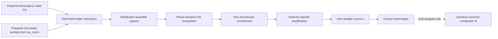

# Born Selection revision — quantum equilibrium and individual Dirac–Kuramoto selection

## Revision decision

Revise Paper 1 around a strict separation between **ensemble measure** and **individual event selection**:

1. **The quantum outcome measure and the microstate preparation measure are explicit, separate inputs.** The paper does not call the latter “quantum equilibrium” until a chosen ontology justifies that identification, and it does not claim that Adler locking, detector noise, or repeated observations derive either measure.
2. **Dirac–Kuramoto dynamics is a candidate individual-selection mechanism, not yet an authorized label.** Given one prepared wave/spinor state and one microstate drawn from the declared preparation law, the physical field–matter dynamics must produce one irreversible material record. The DK name becomes warranted only if Dirac structure and a derived synchronization reduction are load-bearing.
3. **Born statistics are a conditional outcome-compatibility test.** The model succeeds at this level only if pushing one independently specified microstate ensemble through the fixed selection dynamics reproduces the separately specified quantum outcome measure without placing that answer in the coupling, thresholds, noise, sampling, or analysis. This cross-space agreement is not equilibrium preservation.
4. **Nonequilibrium behavior is part of the test.** Deliberately nonequilibrium ensembles must produce model-derived, reproducible deviations rather than being silently resampled back to equilibrium.

This retires the stronger claim that detector-side Adler dynamics derives the Born measure itself. It preserves the narrower and physically substantive question that motivated the paper: how one distributed wave–detector interaction becomes one actual record.

## Central mathematical statement

Two probability spaces must be distinguished:

- `(Lambda, Sigma_Lambda)` is the event-level **microstate space**;
- `(A, Sigma_A)` is the **outcome space** of detector records;
- `mu_micro(d lambda | Psi, M, H)` is a normalized preparation measure on `Lambda`, conditional on prepared state `Psi`, apparatus configuration `M`, and preparation history `H`; and
- `B_Psi^M(da) = <Psi | Pi_M(da) | Psi>` is the standard quantum outcome measure on `A` for the declared measurement `M`.

The structural results that motivate `B_Psi^M` do **not** supply `mu_micro`. The plan may call `mu_micro` a quantum-equilibrium microstate measure only after a chosen ontology independently defines that phrase.

Let additionally:

- `Psi` be the prepared Dirac/spinor state and the externally specified apparatus setting;
- `lambda` be one complete event-level microstate in `Lambda`, including system beables, detector, environment, phase references, noise history when applicable, and registry variables;
- `F_DK(Psi, lambda)` be the complete Dirac–Kuramoto capture, competition, commitment, and registration map; and
- `a` be the single registered outcome.

The event law is

```text
lambda ~ mu_micro(. | Psi, M, H)
a = F_DK(Psi, lambda).
```

The principal test is the pushforward equality

```text
P_DK(da | Psi, M, H)
  = (F_DK(Psi, M, .))# mu_micro(dlambda | Psi, M, H)
  ?= B_Psi^M(da).
```

For a primitive stochastic selector, replace `F_DK` with a normalized transition kernel `K_DK(da | Psi, M, lambda)` and integrate it against `mu_micro`. Alternatively, include the complete noise history in `lambda`, making `F_DK` deterministic conditional on that history. The paper must choose one description and may not switch between them.

The right-hand side is the comparator, not an input to raw selection. Equality establishes co**nditional outcome compatibility** for this frozen preparation measure and selector. It neither proves that `mu_micro` is an equilibrium measure nor shows that a microstate flow preserves it.

Reserve **equivariance** or **equilibrium preservation** for a same-space dynamical statement. If `T_t` is the microstate flow and `Psi_t` the corresponding prepared state evolution, that separate claim has the form

```text
(T_t)# mu_micro(. | Psi_0, M, H)
  = mu_micro(. | Psi_t, M, H_t),
```

with all conditioning and preparation updates defined. No outcome-frequency comparison proves this relation.

## Claim ladder

| Level | Claim | Required evidence | Permitted wording |
| --- | --- | --- | --- |
| **Q0 — Outcome measure** | Standard quantum structure identifies the squared norm as the outcome measure `B_Psi^M` under stated assumptions | Cite the relevant structural result and list its assumptions; do not infer a detector-microstate law from it | “The quantum outcome comparator is adopted from the stated framework.” |
| **Q0.5 — Microstate preparation measure** | A chosen ontology defines `(Lambda, Sigma_Lambda)` and an independently justified `mu_micro(. \| Psi, M, H)` | Complete ontology, factorization/correlation law, preparation provenance, normalization, support, and state-dependence audit | “The following microstate preparation measure is an explicit premise.” |
| **Q1 — Individual selection** | A fixed physical field–matter dynamics maps each complete microstate to one record | Trajectory-level equations, conservation ledger, unique commitment, and no outcome sampling | “The model supplies a candidate event-by-event selection mechanism.” |
| **Q2 — Equilibrium-conditioned outcome compatibility** | The pushforward of the frozen `mu_micro` through the fixed selector agrees with `B_Psi^M` | Blinded, preregistered multi-state equivalence tests with no outcome-dependent retuning | “Conditional on the stated microstate preparation measure, the model is outcome-compatible over the tested domain.” |
| **Q3 — Nonequilibrium response** | Predeclared perturbations of `mu_micro` generate quantitative departures or justified invariances | Frozen perturbation families and response surfaces, with negative controls | “The model predicts these tested responses away from the stated ensemble.” |
| **Q4 — Microstate equilibrium explanation** | The framework justifies typicality, uniqueness, equivariance, or dynamical relaxation of `mu_micro` | A separate same-space theorem or independently validated dynamical argument | “The framework explains or preserves this microstate equilibrium.” |

Paper 1 may aim for Q1–Q3 only after Q0.5 is closed. It must not claim Q4 until that separate burden is met.

## Revised paper thesis

### Recommended title direction

**A Microstate-to-Record Selector Conditioned on Quantum Equilibrium**

Use “Dirac–Kuramoto” in the title only after a microscopic reduction shows that its spinor and synchronization structure is load-bearing. Until then, use the neutral term **field–matter selector**. Avoid “Born Rule as a Derived Fair Game” in the main title.

### One-sentence thesis

<user_quoted_section>Assuming one explicitly declared microstate preparation measure from a chosen ontology, we test whether a fixed field–matter selector transforms each individual wave–detector microstate into one irreversible record and whether its induced outcome law is conditionally compatible with the standard quantum outcome measure over a blinded domain.</user_quoted_section>

### Abstract obligations

The abstract must state, before presenting results:

- that the standard quantum outcome measure and the microstate preparation measure are different objects;
- which ontology defines the microstate space and why its preparation law is called equilibrium, if that term is used;
- that the paper addresses individual outcome production, not the independent derivation of the squared-norm measure;
- what microstate variables are sampled;
- what physical dynamics maps them to one record;
- what was fixed without reference to the Born comparator;
- whether conditional outcome compatibility passed, failed, or remained unresolved; and
- that ensemble agreement is neither an equilibrium-preservation theorem nor a Born derivation.

## Physical architecture



The raw event path must not import or call the comparator.

### State variables that must be explicit

- incident Dirac spinor or justified spin-1/Maxwell representation for photons;
- local real fields or currents that couple to matter;
- detector-site material states and their phase references;
- detunings, couplings, damping, bath variables, and noise keys;
- any actual configuration or registry beable;
- reversible capture variables;
- commitment and amplification variables; and
- a complete energy, charge, and information ledger.

For photon experiments, Paper 1 must not describe a photon as an ordinary spin-1/2 Dirac particle. A Dirac-like Maxwell representation may be used only with the spin-1/helicity caveat already recorded in the framework.

## Microstate ontology and preparation contract

The paper must choose one ontology and define one probability space before outcome simulation. The following are candidate ingredients, not interchangeable alternatives and not a completed contract:

1. **Configuration equilibrium:** a Bohm-like conditional density, meaningful only after configuration beables and their guidance/current law are fixed.
2. **Phase equilibrium:** invariant phase measures, such as Haar-uniform relative phases, for explicitly identified phase variables.
3. **Thermal/material equilibrium:** a detector ensemble derived from a Hamiltonian, temperature, and preparation history.
4. **Joint preparation measure:** a normalized joint measure linking all declared system, detector, environment, noise, and registry variables.

Uniform phase by itself is neither the Born outcome measure nor a complete microstate measure. A thermal detector law likewise does not specify system beables. The completed contract must declare `(Lambda, Sigma_Lambda)`, the ontic status and support of every component, and a normalized factorization such as

```text
mu_micro(dlambda | Psi, M, H)
  = mu_sys(dlambda_sys | Psi)
    nu_ready(dlambda_det, dlambda_bath, dnoise | M, H)
    C(dlambda_corr | Psi, M, H),
```

where `C` denotes every justified cross-correlation rather than a free fitting factor. Each factor needs independent provenance. If this cannot be supplied, the exact result is `microstate_measure_undefined`, and all outcome-frequency simulation stops.

### State dependence

If `mu_micro` depends on `Psi`, that dependence must be justified without using `F_DK`, `Pi_M`, outcome data, or comparator residuals. The detector's ready-state distribution must be shared across all permitted states wherever the physical preparation is unchanged. Dependence on `Psi` should enter through the prepared system factor and subsequent physical interaction, except where a principled joint law independently proves otherwise. The complete law must be frozen before outcome partitions or holdout states are generated.

## Field–matter selection contract

The model must define a deterministic or explicitly stochastic map `F_DK` before outcome comparison. It must answer:

1. What physical degrees of freedom possess phases capable of synchronization?
2. Which coupling is derived from the Dirac/field–matter equations, rather than chosen as a function of target weight?
3. What establishes the detuning distribution and bath noise?
4. What constitutes temporary locking, microscopic commitment, and irreversible registration?
5. How is exactly one winner enforced without sampling a categorical Born outcome?
6. Where do the energy and charge associated with losing alternatives go?
7. Which variables are ontic per event, and which are ensemble descriptors only?

The notation `F_DK` is a contract placeholder, not evidence that actuality has been explained. The paper must choose one ontology and show pathwise how competing physical channels produce exactly one durable record. A returned label, first-threshold stop, dwell rule, primitive draw, or registry initialized as already actual merely relocates selection unless the associated current, quench, exclusivity, and energy routing follow from the physical law.

The familiar Adler equation may be used only after the reduction from the underlying physical dynamics is shown. A passive silver-halide grain, for example, cannot be assigned a self-sustained oscillator merely to obtain an Arnold tongue. Until a material Hamiltonian supplies an autonomous phase, phase reduction, validity range, and commitment current, label the code **phenomenological phase-reduction fixture**, not Dirac–Kuramoto selection.

## Anti-circularity firewall

The following are forbidden in raw generation or event selection:

- drawing the winning outcome from `|Psi|^2` or an equivalent categorical distribution;
- initializing a hidden winner label with the target probabilities;
- setting coupling, event rate, threshold, noise variance, site density, or exposure using the desired outcome weight;
- choosing an exposure window because it makes the fitted exponent equal one;
- rejecting, reweighting, or resampling events based on agreement with the comparator;
- defining an “equilibrium” distribution independently for each test state by fitting its desired outcomes; and
- importing the final Born comparator into the raw simulation package.

Allowed uses of squared quantities must be classified:

- a bilinear current, energy density, or absorbed work derived from the real field/spinor dynamics;
- an equilibrium density adopted explicitly from standard quantum equilibrium; or
- a final comparator calculated only after the raw ledger closes.

These roles must not be conflated.

## Auditable dependency contract

Every raw-model input must appear in a content-addressed dependency manifest with:

- canonical name, units, allowed range, and uncertainty;
- source artifact or independent calibration data;
- whether and how it may depend on `Psi`, `M`, detector material, or preparation history;
- the date and model version at which it was fixed;
- confirmation that it was fixed before comparator access; and
- every downstream raw field it can influence.

The manifest includes `mu_micro`, phase and detuning laws, bath/noise correlations, couplings, thresholds, dwell and exposure windows, hazards, invalid-event handling, state generator, sample size, and numerical tolerances. Raw code, configuration, schemas, and manifest are hashed before an outcome run. Any change creates a new preregistered model version; it may not silently replace the frozen one.

The comparator lives in a separate read-only analysis package. The primary outcome space includes winner labels **plus** no-record, multiple-record, invalid-trajectory, and ledger-failure outcomes. Conditioning them away is prohibited.

## Implementation authorization gates

The gates are ordered and fail closed:

| Gate | Required closure | Failure result |
| --- | --- | --- |
| **G0 — claim boundary** | Result vocabulary and manuscript wording distinguish outcome compatibility, microstate equivariance, individual selection, and Born derivation | `claim_contract_inconsistent` |
| **G1 — ontology** | One `(Lambda, Sigma_Lambda)` and ontic status for every microstate component | `microstate_ontology_undefined` |
| **G2 — preparation measure** | Normalized `mu_micro`, factorization/correlations, support, provenance, and state-dependence audit | `microstate_measure_undefined` |
| **G3 — physical selector** | Deterministic equations or a normalized stochastic kernel; physical noise, commitment current, unique record, quench, and closed ledger | `individual_selection_not_demonstrated` |
| **G4 — material authority** | Every coupling and reduced phase law derived or independently calibrated for the named material; otherwise explicitly fixture-only | `material_authority_missing` |
| **G5 — dependency freeze** | Content-addressed manifest, raw/comparator isolation, code/config hashes, invalid-event policy, and no comparator access | `dependency_freeze_missing` |
| **G6 — numerical adequacy** | Keyed refinement, boundary audit, convergence, resource feasibility, and no numerical no-result | `numerical_no_result` |
| **G7 — blinded test contract** | Holdout generator, equivalence margins, sample size, failure thresholds, negative controls, and nonequilibrium response surfaces sealed | `test_contract_missing` |
| **G8 — conditional analysis** | Frozen raw ledger analyzed without retuning; all outcome categories retained | one of the bounded compatibility results below |

Only labeled nonphysical fixture work may proceed before G1–G4 close, and it must be structurally unable to serialize a physical selector or conclusion. Existing Adler code remains `machinery_only` and `numerical_no_result`; it is not promoted by this revision.

The execution order is not “all gates, then run.” G0–G7 close for one exact version; that closure authorizes an immutable raw run; G8 then analyzes the closed ledger. Any dependency change invalidates the version, reopens G5, and reopens every downstream gate and result affected by that dependency. No prior G8 result transfers automatically to the new version.

## Simulation and analysis program

### Phase I — nonphysical fixture and raw-mechanism feasibility

After fixture-scoped G0 and G5 **close**, implement and validate nonphysical trajectories without computing outcome agreement:

- fixed fixture equations and parameters;
- real-time capture and selection trajectories;
- independent microstate keys shared across refinement runs;
- conservation and closure checks;
- exactly one, zero, or explicitly classified invalid record per event;
- mesh-, solver-, and timestep-refinement tests; and
- complete raw ledgers containing no probability verdict.

No physical conclusion may leave this phase. A physical raw run requires G1–G7.

### Phase II — equilibrium-conditioned outcome compatibility

After G0–G7 close for the exact version, freeze and run the raw model; after the ledger closes immutably, G8 may test:

- multiple two-channel weights, not only 50/50;
- relative phases including `0`, `pi/2`, and `pi`;
- three or more outcome channels;
- different measurement bases and detector orientations;
- detector permutations and physically equivalent spinor representations;
- both Dirac particles and any separately justified photon/Maxwell case; and
- a large blinded/adversarial holdout suite generated after the seal from a preregistered seed or independent generator, including arbitrary states, bases, dimensions, near-zero channels, and equivalent representations.

Report no-click, double-commit, invalid-trajectory, latency, and energy-ledger failures alongside winner frequencies.

Use one detector-ready distribution and one parameter set across the allowed state/basis domain. Material calibration may use spectra, linewidths, response functions, bath correlations, carrier/trap kinetics, and amplifier thresholds—not outcome frequencies. Use equivalence tests against predeclared physical and numerical margins, not failure to reject a difference.

### Phase III — nonequilibrium challenge

Perturb one component at a time:

- biased relative phases;
- narrowed or multimodal detector phase distributions;
- altered detuning populations;
- correlated versus local noise;
- prepared detector microstates; and
- equilibrium-preserving versus non-preserving dynamics.

Predictions and quantitative response surfaces must be sealed before comparing with the outcome measure. “Structured deviation” or “justified robustness” is not a pass condition after the fact. Include controls that preserve the target curve while disabling the claimed phase-locking layer, and controls that preserve synchronization while changing the commitment law. If these controls are observationally indistinguishable, the DK layer is not identified.

### Phase IV — relaxation, kept separate

Only after Phases I–III should the paper ask whether a broad class of nonequilibrium measures approaches `mu_micro`. This requires:

- a specified coarse-graining;
- an `H`-function or other distance to equilibrium;
- convergence rates and recurrence checks;
- counterexamples that do not relax;
- independence from detector event count as a mere statistical averaging operation; and
- proof that relaxation is physical evolution of the ensemble, not replacement by newly sampled equilibrium events.

Many observations estimate a distribution more accurately. They do not cause quantum equilibrium unless an actual mixing dynamics does so.

## Primary falsification tests

| Test | Passing behavior | Failure meaning |
| --- | --- | --- |
| Equilibrium-conditioned holdouts | Frozen pushforward is equivalent to `B_Psi^M` within preregistered margins | Conditional outcome compatibility fails; no statement about same-space equilibrium preservation follows |
| Outcome-label permutation | Relabeling equivalent detector channels relabels outcomes only | Hidden channel preference or coding asymmetry |
| Global phase | Predictions invariant under an unobservable common phase | Gauge artifact in the selector |
| Relative phase | Changes follow physical interference/interaction equations | Phase is ignored or fitted incorrectly |
| Nonequilibrium perturbation | Quantitative preregistered response surface or exact bounded no-result | Comparator may be installed in dynamics or response was not identified |
| Refinement | Same physical outcomes in distribution with controlled boundary ambiguity | Numerical selection masquerading as physics |
| Representation | Complex-spinor, Clifford, or quaternionic rewrites give identical observables | Coordinate representation has become an illicit mechanism |
| Detector substitution | Parameters change only through independently measured material properties | Detector fitting is carrying the Born law |

## Relationship to Bohmian mechanics

The manuscript should compare carefully:

- Conventional nonrelativistic Bohmian mechanics uses Schrödinger evolution plus a guidance law.
- Relativistic Bohmian extensions already use the Dirac current; DK therefore cannot claim exclusive use of Dirac's equation.
- DK's proposed distinction is that Dirac spinor phase structure and open-system synchronization are intended to participate in microscopic commitment, rather than the spinor supplying only a guidance velocity.
- Bohmian quantum equilibrium offers a useful comparison for the measure problem, but importing `rho = |Psi|^2` must be acknowledged as an equilibrium premise unless DK independently proves equivariance, typicality, or relaxation.

Quaternions may appear as an optional representation of `SU(2)`/spinor rotations. They are not an additional probability derivation. All selection and equilibrium statements must be representation-independent.

## Revised manuscript structure

1. **Problem split:** measure versus one-event actuality.
2. **Separate probability spaces:** quantum outcome measure versus microstate ontology and preparation law.
3. **Event ontology:** `Psi`, `lambda`, material channels, and registry; identify separately whether Dirac and synchronization structure are load-bearing.
4. **Microscopic equations:** field–matter interaction and justified reduced locking dynamics.
5. **Commitment and registration:** unique record and conservation ledger.
6. **Conditional outcome-compatibility proposition:** pushforward of the frozen microstate measure through the event map.
7. **Raw simulation protocol:** no comparator access.
8. **Blinded conditional-compatibility results.**
9. **Nonequilibrium challenges and possible relaxation.**
10. **Relationship to Bohmian, collapse, decoherence, and structural Born programs.**
11. **Scope, falsifiers, and unresolved equilibrium derivation.**

Move multi-quantum Glauber statistics, Bell correlations, above-Tsirelson predictions, and production experiments out of the central proof until the one-event conditional-compatibility model is independently validated.

## Result vocabulary

Use only these conclusion levels:

- `individual_selection_not_demonstrated`
- `individual_selection_demonstrated_nonphysical_fixture`
- `microstate_ontology_undefined`
- `microstate_measure_undefined`
- `conditional_outcome_compatibility_not_testable`
- `conditional_outcome_compatibility_refused`
- `conditional_outcome_compatibility_failed_for_frozen_domain`
- `conditional_outcome_compatibility_supported_for_frozen_domain`
- `nonequilibrium_response_not_testable`
- `nonequilibrium_response_failed_for_frozen_domain`
- `nonequilibrium_response_supported`
- `equivariance_not_tested`
- `equivariance_refused`
- `equivariance_supported_for_stated_flow`
- `relaxation_not_demonstrated`
- `relaxation_supported_for_tested_ensemble`

No result may be labeled `born_rule_derived` unless a later, separate equilibrium derivation closes Q4 under independent review.

The compatibility states are disjoint: `refused` means authority or contract failure prevented G8 from running; `not_testable` means an authorized analysis lacks estimability or adequate data; `failed_for_frozen_domain` means the completed preregistered equivalence test rejected compatibility; and `supported_for_frozen_domain` means that completed test met its predeclared equivalence margins. The nonequilibrium states use the same distinction between an untestable campaign, a completed failure to meet the preregistered response contract, and support.

Each version also freezes one exact `selector_semantics` value. A deterministic version uses `F` and places the complete noise history in `lambda`. A primitive stochastic version uses `K` and keeps the random transition outside `lambda`. Their schemas, ledgers, refinement rules, and analyses are distinct; a version may not expose both or convert between them after freeze.

## Effect on existing work

| Existing element | Revised role |
| --- | --- |
| Martingale fair-game theorem | Mathematical comparator or special effective limit; not the source of equilibrium |
| Adler/Arnold-tongue simulations | Mechanism feasibility and phase-sensitivity evidence only |
| Initial-phase sweeps | Useful robustness/nonequilibrium tests; not proof of the equilibrium measure |
| Passive silver-halide plan | Candidate detector implementation once its material authority gates close |
| Hologram phase tests | Classical interference and material-response checks; not event-selection evidence |
| Quaternion/spinor geometry | Representation and invariant-structure clarification only |
| Structural Born arguments | Authority for the quantum outcome comparator under their stated premises; not authority for `mu_micro` |
| Detector microstate distribution | Must be independently specified, frozen, and challenged away from equilibrium |

## Editorial changes required before manuscript revision

- Replace claims that the measurement postulate is redundant with the narrower conditional claim.
- Remove or qualify “Born weight is nowhere inserted by hand”: the equilibrium measure is now an explicit input.
- Replace “derives the fairness” and “preserves equilibrium” with “tests conditional outcome compatibility for one frozen microstate preparation measure.”
- Distinguish Robert Adler's injection-locking equation from Stephen Adler's trace-dynamics/collapse work.
- Mark the existing deposited-energy and hazard assumptions as prior model components, not established microscopic facts.
- State that Paper 1 supplies, at most, the selector half of a larger theory; the equilibrium half remains imported or separately open.

## Readiness and stop conditions

The paper is ready for a revised draft only after:

1. one microstate ontology and probability space are selected and written without ambiguity;
2. the quantum outcome measure and microstate preparation measure are explicitly separate;
3. the normalized preparation kernel, correlations, support, and state dependence have independent provenance;
4. the raw selector has no comparator dependency;
5. the physical route to any reduced Adler equation is derived or the model is labeled a nonphysical phenomenological fixture;
6. the one-record, exclusivity, quench, and conservation laws are specified pathwise;
7. the dependency manifest and invalid-event outcome space are frozen;
8. blinded compatibility, negative-control, and nonequilibrium tests are preregistered; and
9. independent review agrees that the gates and vocabulary prevent cross-space compatibility from being presented as equilibrium preservation or a Born-rule derivation.

Until then, the scientifically correct status is: **promising revised program; microstate contract open; individual selector not demonstrated; conditional outcome compatibility not yet testable; no equilibrium-preservation theorem; no Born derivation**.

## Independent-review disposition

This revision incorporates the bounded corrections from the [independent pressure-test](independent-review): the outcome/microstate measure split, corrected compatibility terminology, explicit ontology and preparation gates, auditable dependency freeze, blinded equivalence testing, negative controls, and fixture-only status for the current Adler implementation. The review remains the provenance record for why these gates exist; it is not overwritten by this repair.
