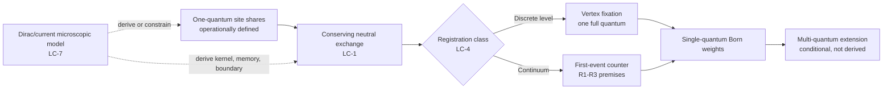

# GPT correction architect — Round 2 cross-review

I read the learning index and all four frozen Round-1 reports. I then exchanged focused questions with Claude Critical and Claude Corrections. The shared result is a staged repair, not a model verdict.

## Common repair architecture

### LC-1 — canonical conserving exchange

On normalized shares `s_i=e_i/E0`, use independent Brownian motions for unordered pairs and antisymmetric increments

$$ds_i=\sqrt{\kappa}\sum_{j>i}\sqrt{s_i s_j} dB_{ij}-\sqrt{\kappa}\sum_{j<i}\sqrt{s_i s_j} dB_{ji}.$$

Then `Σs_i=1` pathwise and

$$d[s_i,s_j]=\kappa\big(s_i\delta_{ij}-s_is_j\big)dt,$$

the neutral multi-allele Wright–Fisher covariance. With absorbing faces, finite `N` fixes at a vertex almost surely; bounded-martingale stopping gives `P(i wins)=s_i(0)`, and the vertex holds exactly `E0=ℏω`. This is the agreed effective repair.

**Claim correction.** Conservation makes interior share fairness generic for any zero-mean antisymmetric exchange; it removes the manuscript’s “unique fair `√e` knife-edge” claim. The amplitude-product kernel remains a motivated ansatz that supplies accessible boundaries and a useful canonical model. The old uniqueness result survives only inside its nonconserving independent-bath-noise class.

**Open physical point, resolved as a premise.** The absorbing boundary is load-bearing for class-(i) fixation but not derived. Ordinary linear hopping repopulates an empty site (`da_i∝a_j`; quantum hopping has an `n_i+1` factor). Both Claude agents accepted the correction: P2 does not guarantee dropout. The repair must add, pending a spectral/bath derivation, “a depleted site irreversibly detunes, dephases, or otherwise decouples on the game timescale.” Class-(ii) rate registration stops before fixation and does not need this boundary premise.

### LC-4 — split single- and multi-quantum registration

The narrow publishable result is:

*Let a one-quantum state follow a conserving martingale-share process. For discrete absorbers, assume dropout and register at vertex fixation. For a continuum detector, let the first-event intensities be `λ_i(t)=Λ(t)s_i(t)`. Then the first-event winner obeys `P_i=s_i(0)` for every commit speed. Exactly-one-click delivery additionally requires a fast global routing/gating mechanism.*

The agreed continuum repair makes three detector premises explicit:

- **R1 — shot structure:** a classically metastable readout has first-escape events (for example, a Kramers process), rather than continuous calorimetric leakage.
- **R2 — linear counter window:** `λ_i=Γe_i/E0`; passive dissipation derives only the mean flux `Γe_i`, while proportional event hazard is an operating-regime premise.
- **R3 — winner routing:** after first escape, the open channel at the winning site drains the remaining excitation and gates competitors.

For finite drain time `τ_drain`, second hazards remain briefly active, so exactly-one-click behavior is accurate only up to a dimensionless rate–time correction `O(Λτ_drain)`; the first-event winner law remains exact. An ideal instantaneous global commit recovers exact exclusivity by construction. If `e_i` is only an expectation rather than an ontic stake, the Golden-rule/Born-rule concern also returns.

For `k≥2`, `G^(k)`-linearity, Glauber counting, and `ρ`-affinity become standard-QM consistency conditions conditional on ontic joint stakes and a Born-independent multi-quantum rate law. They are not current derivations.

### LC-7 — honest Dirac bridge and one keystone calculation

The existing framework already says in `current_revision_DK_paper.md` §§3.7–3.8 that ordinary electromagnetic detectors select charge/position through the vector current and that the chiral mass clock is a passenger, not the measurement engine. Round 2 therefore should not manufacture a chiral registration role that contradicts that clarification.

**Immediate repair.** Present Paper 1 as a generic effective detector mechanism compatible with Dirac wave realism, while stating that U2/U3 are not load-bearing in its current derivation.

**Research bridge.** Analyze two localized detector sites plus a common field and bath, starting from a Dirac matter field with binding potentials and minimal electromagnetic coupling. Project onto localized charge/current modes, integrate out the common mode and bath, and derive the effective share drift, covariance, memory kernel, conservation law, and boundary classification. This one calculation directly tests LC-1 and, with two-site conditional drift, the strengthened passivity repair for LC-3.

To make spinors specifically load-bearing, the output must contain a mass/chirality/helicity dependence absent from a scalar oscillator with the same spectrum. Compare `m≠0` with the massless/scalar limit. If the kernel is identical, the honest conclusion is that Dirac structure supplies ontology and the closed-system clock/no-go, not Born selection. A scalar/gravitational channel may be the cleaner future place to seek a genuinely chiral signature.

## Exchange record

| Issue | Questions asked | Substantive answer and evidence | View change |
| --- | --- | --- | --- |
| LC-1 | To both Claude agents: specify the SDE, covariance, fixation, boundary physics, and surviving uniqueness. Follow-up: does P2 really make zero absorbing? | Both converged on antisymmetric amplitude-product exchange and neutral Wright–Fisher fixation. Direct Itô covariance gives conservation and Born-weighted vertex probabilities. Both then accepted that linear hopping repopulates zero, so dropout is a separate class-(i) premise. | I moved from “some conservative simplex diffusion” to the WF canonical repair, while strengthening the boundary burden. |
| LC-4 | To both: is `Γe` Born-free, what makes it a click hazard, how is exclusivity enforced, and what survives for `k≥2`? | Agreement on R1 metastable shot structure, R2 linear hazard window, and R3 winner routing. The first-event Born law is exact; physical exclusivity has a finite drain-time correction. Multi-quantum claims are conditional consistency results. | I preserve a narrower one-quantum theorem, split from its approximate hardware realization. |
| LC-7 | To both: which calculation makes mass-coupled spinors causal rather than decorative? | Proposed two-site Dirac+field+bath reduction would output exactly the LC-1 generator. Repository evidence, however, says EM measurement uses the vector-current charge basis and the chiral clock is not the pointer. | I reject forcing the chiral clock into ordinary registration; Dirac specificity is now an open discriminating calculation, not an existing bridge. |
| LC-3 (peer-initiated) | Claude Corrections asked whether passivity alone can replace `κ_ret`. | We agreed passivity alone is insufficient because phase–energy correlations, common-field memory, and collective modes can bias time-integrated flux. Fairness survives conditionally if the reduced two-site generator has non-amplifying flux and zero/bounded conditional share drift. | Changed from `abandons subclaim` to conditional preservation; Claude Corrections weakened “passivity suffices” to conditioned passivity. |

## Evidence ladder

1. Prove fixation, exclusivity, and stopping for the neutral-WF effective generator.
2. Simulate three sites directly as a numerical/boundary check; this verifies the model, not its detector origin.
3. Derive the generator with an influence-functional/Keldysh or equivalent microscopic reduction. A Lindblad trajectory alone is insufficient evidence for ontic stakes because its unraveling can import the standard measurement rule.
4. Use the derived kernel to choose a detector experiment; do not infer a signature before the boundary and registration maps are fixed.

## Synthesis-changing points

1. A concrete conserving repair now exists: neutral Wright–Fisher exchange gives exact conservation and Born-weighted winners. Fairness is generic; class-(i) exclusivity additionally requires a dropout premise that P2 does not supply.
2. The strongest defensible result is single-quantum and conditional. Class-(ii) first-event weights are exact under R1–R2, but full-energy exclusivity needs R3 and has a finite drain-time correction; multi-quantum/Glauber claims move to a later derivation.
3. The framework’s own current text supports separating Dirac-clock ontology from ordinary electromagnetic selection. The keystone next calculation is a two-site field+bath reduction; only a spinor-specific mass/chirality signature would promote U2/U3 from compatible background to mechanism.
