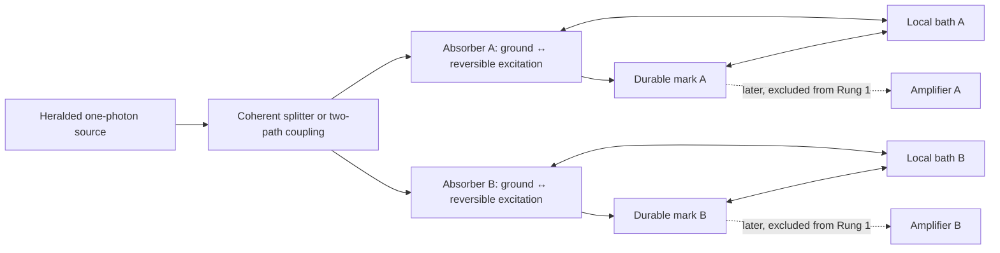

# Two-absorber first-mark model

## Outcome

The smallest useful investigation is **one heralded photon, two identical three-state absorbers, and one local environment for each absorber**. It is intentionally smaller than two complete SPADs. Its purpose is to locate exactly what ordinary unitary dynamics can explain and what additional physics would be required to produce one unique first material mark with Born-weighted frequencies.

The work should proceed in two rungs:

1. **Rung 1 — minimal theorem/no-go model:** solve the two three-state absorbers and their environments without an outcome-conditioned trajectory.
2. **Rung 2 — silicon bridge:** map the abstract reversible excitation, bath record, and committed mark onto extended silicon interband excitation, phonon-dressed carrier packets, and field-separated electron–hole seeds.

This model investigates the first mark. It does not initially model avalanche gain, comparator electronics, detector reset, a large pixel array, multiphoton input, Bell experiments, or the full Dirac–Kuramoto framework.

## Research question

Can a microscopic, energy-conserving field–matter–environment model produce all four of the following without silently inserting the Born rule or an outcome-conditioned collapse?

1. **One actual mark:** exactly one absorber becomes the first durable material record.
2. **Correct weighting:** repeated trials select A and B according to the incident photon's calibrated path weights.
3. **Exclusivity:** a single photon never produces two first marks, apart from a quantitatively predicted finite-time correction.
4. **Closed accounting:** energy, norm, and causal influence have named destinations throughout the event.

A finding that strict unitary dynamics cannot produce item 1 is a useful no-go result, not a failed project.

## Minimal architecture

### Degrees of freedom

| Element | Minimum representation | Why it is needed |
| --- | --- | --- |
| Incident field | One photon coherently distributed between paths A and B, plus an outgoing/unabsorbed mode | Creates controlled unequal or equal candidate weights and preserves the no-click channel |
| Absorber A | Three states: ground, reversible optical excitation, durable material mark | Separates capture from commitment |
| Absorber B | The same three states and parameters as A | Provides a symmetry check and the smallest exclusivity problem |
| Local bath A | A finite set or continuum of environmental modes coupled only to A | Carries dephasing, relaxation, and a channel-specific record |
| Local bath B | An independent copy coupled only to B | Prevents a shared bath from hiding nonlocal coordination in the baseline |
| Optional common mode | Absent initially; added only as a stress test | Tests whether correlations or apparent coordination arise from a common environment |

The three absorber states are best read in plain language:

- **Ground:** ready to interact.
- **Reversible excitation:** the photon has coupled to the absorber, but the excitation could still return to the field.
- **Durable mark:** a channel-specific material change and environmental record can seed later amplification.

Two-state absorbers are too small because they force reversible capture and durable commitment to be the same event. That would assume the boundary the model is meant to investigate.

## Exact event boundaries

| Boundary | Definition in Rung 1 | What it is not |
| --- | --- | --- |
| **Capture** | Coherent transfer from the incident field into the reversible excitation of A or B | Not yet one actual outcome |
| **Candidate-channel formation** | Local bath correlations make the A and B alternatives distinguishable and suppress accessible interference | Not selection by itself |
| **First-mark selection** | The still-open step by which one candidate, if any, becomes the single actual material history | Not supplied merely by decoherence |
| **Seed commitment** | A durable mark state is formed and paired with a local environmental record that is not practically rephasable | Not avalanche commitment |
| **Amplification** | Later reservoir-powered multiplication of the committed seed | Excluded from Rung 1 |
| **Registration** | Later readable electronic or material record | Excluded from Rung 1 |

Operationally, the **first mark** is the earliest durable, channel-specific material state that can seed later amplification. It is not the first reversible excitation and not a comparator click.

## Rung 1 calculation

### 1. Write the closed microscopic model

Use a time-independent or explicitly pulsed interaction containing:

- free evolution of the photon modes;
- identical ground-to-excitation optical couplings for A and B;
- excitation-to-mark coupling assisted by each local bath;
- the energy difference between excitation and mark deposited in named bath modes; and
- an outgoing field mode for reflection, transmission, or re-emission.

All field, absorber, and bath degrees of freedom evolve together. The first calculation should conserve the total energy of this complete state.

### 2. Solve the unconditional unitary baseline

Start with the photon divided coherently between A and B. Evolve the entire state without sampling an outcome. The expected late-time structure contains some combination of:

- an unabsorbed whole-photon component;
- a reversible excitation at A;
- a reversible excitation at B;
- a durable A mark correlated with bath A; and
- a durable B mark correlated with bath B.

Tracing out the baths may turn the two mark alternatives into an apparent statistical mixture. That mathematical operation does not say which mark is the one actual event. The baseline therefore tests, rather than assumes, the expected unitary stopping point: **stable alternatives can form while unique actuality remains absent**.

### 3. Derive the effective candidate dynamics

From the unconditional microscopic result, ask whether any physically defined quantities behave like competing shares. A valid derivation must determine, rather than assume:

- what the shares physically represent;
- why their initial values correspond to the calibrated input weights;
- whether they are conserved on each individual physical history or only on average;
- whether they have zero systematic drift;
- whether a channel that reaches zero can return; and
- whether the dynamics reaches one and only one winner in finite time.

Only if those properties emerge does the existing martingale result apply: a fair, conserved, terminating competition gives a winner frequency equal to the initial share. The theorem cannot be used to supply its own physical premises.

### 4. Add one explicit one-world candidate at a time

The unitary baseline should be followed by two sharply separated alternatives, not a hybrid.

| Candidate | Minimal added object | Main debts to calculate |
| --- | --- | --- |
| **Passive beable / registry** | A variable whose value is none, A, or B while the full wave remains unitary | Derive its initial distribution and evolution without inserting Born sampling; explain the physical efficacy and stress-energy of unselected wave components; enforce one winner |
| **Continuous winner routing** | A physical flow that transfers norm/energy away from losing alternatives and into the winner | State explicitly that the effective evolution is no longer strictly unitary; give local currents, drain time, energy destination, exclusivity, and no-signaling checks |

A third exploratory option may use deterministic but unknown bath microstates or phases. It is admissible only if the ensemble measure over those microstates is specified independently of the desired Born result.

## Circularity firewall

The model must not claim a Born derivation if it uses any of these as an input:

- drawing A or B with squared-amplitude probabilities;
- an outcome-conditioned quantum jump or sampled Lindblad trajectory;
- a POVM outcome sampler;
- a Kraus update conditioned on the selected mark;
- a Fermi-golden-rule rate interpreted as the probability that one result becomes actual; or
- an initial hidden-variable distribution chosen because it reproduces the desired frequencies.

Unconditional master equations may be useful approximations to reduced density matrices, but their ensemble decomposition into individual trajectories is not unique. The proposed actuality law must therefore be stated separately.

## Energy and information ledger

| Channel | Required accounting |
| --- | --- |
| Unabsorbed event | A whole photon exits in a named field mode; neither absorber carries a photon fraction as deposited energy |
| Reversible capture | Energy is temporarily stored in the absorber excitation and can return to the field |
| Durable mark | Photon energy is transferred into material excitation plus the local bath record; the partition is explicit |
| Losing alternative under strict unitarity | It remains part of the state; it is not said to disappear or dump energy into an unnamed vacuum |
| Losing alternative under routing | The model supplies the actual norm and energy currents and their destinations |
| Later amplification | Energy comes mainly from the detector's prepared reservoir or bias supply, not from multiplication of the photon energy |

The environment can hide phase relations from local access. It cannot serve as an unspecified sink for energy, norm, or unwanted branches.

## Required tests

### Baseline and calibration

1. **Exchange symmetry:** with equal input paths and identical absorbers, A and B remain symmetric.
2. **Asymmetric input:** change only the input splitter and verify that candidate weights respond in the calibrated proportion.
3. **Coupling asymmetry:** change one absorber's coupling and separate absorption efficiency from any proposed selection weight.
4. **Energy closure:** verify conservation for the complete field–absorber–bath state at every time.
5. **Return test:** determine whether a depleted or apparently empty candidate can be repopulated by coherent dynamics.

### Selection-law stress tests

6. **Actuality audit:** state whether the calculation produces one actual mark or only decohered alternatives.
7. **Drift audit:** measure any systematic bias in proposed share variables.
8. **Exclusivity audit:** calculate the probability of two committed marks and its dependence on absorber separation and any proposed drain/stop time.
9. **Bath-correlation audit:** add a weak common bath only after the independent-bath result; determine whether it biases or coordinates the marks.
10. **No-signaling audit:** in a later spatially separated version, confirm that a remote coupling choice cannot alter the local unconditional statistics.

## Result classes

| Result | Meaning |
| --- | --- |
| **Unitary no-go** | The model produces decohered A/B alternatives but no unique first mark. This precisely locates the additional-law requirement. |
| **Conditional martingale success** | A microscopic reduction produces fair, conserved, terminating shares, but their ontic status or exclusivity remains an explicit premise. |
| **Biased competition** | Bath or detector asymmetry causes drift; the proposed fair-game law is not generic and must be calibrated or revised. |
| **Return/dropout failure** | A nominally eliminated candidate can reappear; an absorbing boundary cannot be inferred from decoherence alone. |
| **Exclusivity failure** | Both marks can form in the proposed ontology; the model does not yet describe one photon producing one actual first mark. |
| **Complete candidate mechanism** | A stated ontic law passes weighting, conservation, exclusivity, circularity, and no-signaling checks. This would justify proceeding to the silicon bridge; it would still require experimental testing. |

## Rung 2 — map to two silicon absorbers

Do not enlarge the abstract model until its logical result is understood. Then make the following device mapping:

| Rung 1 element | Silicon interpretation to test |
| --- | --- |
| Coherent two-path photon | A heralded single-photon wave packet divided across two spatially separated active regions |
| Reversible excitation | Extended interband electron–hole excitation weighted by the optical envelope |
| Local bath | Phonons, disorder, and other material modes that form distinguishable carrier packets |
| Candidate channel | A bath-defined, approximately 10-nanometre phonon-dressed carrier packet, subject to device-specific calculation |
| Durable mark | Field-separated electron–hole seed, expected on roughly the picosecond scale in the reference room-temperature silicon picture |
| Outgoing mode | Reflection, transmission, scattering, or re-emission/no-absorption channel |
| Later amplifier | Carrier transport and avalanche multiplication, added only after the seed problem |

The silicon calculation should use an unconditional open-system reduction—such as an influence-functional, nonequilibrium Green-function, or equivalent controlled method—before anyone introduces individual detection trajectories. Its first task is to test whether the abstract mark basis and timescale actually emerge from silicon physics.

## Smallest deliverable set

1. A labeled state and coupling diagram.
2. The closed microscopic generator and a plain-English energy ledger.
3. An analytic solution in the single-excitation sector where possible.
4. A finite-bath exact numerical check of energy, symmetry, return, and decoherence.
5. The unconditional reduced state of the two absorbers.
6. A one-page actuality audit identifying what the baseline does and does not select.
7. Separate implementations or proofs for any passive-beable and routing candidates.
8. A silicon mapping table with every approximation and unknown marked.

Plots should prioritize readable quantities: energy in each named subsystem, coherence between A and B, durable-mark populations, return from an apparently empty channel, and double-mark probability. Equations should always be accompanied by a sentence explaining their physical meaning.

## Decisions settled and questions left open

### Settled for this plan

- Use two identical absorbers before an array.
- Give each absorber separate reversible-excitation and durable-mark states.
- Use independent local baths in the baseline.
- Keep avalanche and registration outside Rung 1.
- Solve the unconditional unitary problem before adding an actuality law.
- Treat passive-beable and continuous-routing accounts as different physical theories.
- Count a rigorous no-go as a valuable result.

### Open research questions

- What microscopic variable, if any, can serve as an ontic competing share?
- Can a fair, pathwise-conserving kernel emerge without outcome-conditioned dynamics?
- What makes zero absorbing rather than temporarily depleted?
- How could separated absorbers enforce one actual mark in finite time without signaling?
- Under strict unitarity, what physical status and efficacy do the unselected components retain?
- Under routing, where do their norm, energy, and information go?
- Does the silicon bath create the needed mark basis, or only decohere an ensemble of alternatives?

## Relationship to the three papers

| Paper | Use of this model |
| --- | --- |
| **Born Selection** | Supplies the smallest honest test of the first-mark law and distinguishes a theorem from its microscopic premises |
| **Heisenberg Cut** | Clarifies the transition from reversible capture to a durable material seed and later record, without making amplification the selector |
| **Dirac–Kuramoto Framework** | Provides a concrete place to test whether its phase and registry ontology adds a physical law beyond standard unitary decoherence |

This plan follows the conclusions of the [cloud-chamber/SPAD first-mark audit](../cloud-chamber-spad-first-mark-comparison), the [SPAD cascade synthesis](../../spad-event-cascade/round-01/synthesis), and the [author–AI candidate ledger](../author-ai-update-candidates). The cloud chamber remains the model of conditional track persistence after a first mark; the two-absorber experiment isolates why that first mark is actual.

The variable-level translation from Papers 2 and 3 into this model is recorded in the [Papers 2–3 to two-absorber mapping](paper3-mapping), including Paper 2's reversible-return rate, locking-layer ratio, reference-history structure, and recoverability tests.

The full recovery experiment is specified in the [two-absorber reversal protocol](reversal-protocol): common-reference direct reversal, known-reference echo/rephasing, and random recorded/unrecorded comparisons under separate global and operational recovery tests.
