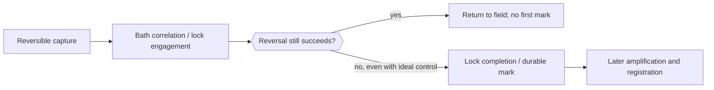
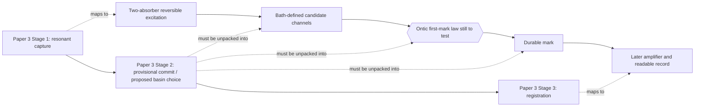

# Papers 2–3 to two-absorber variable mapping

## Purpose

This crosswalk translates the selection-related concepts in [Paper 3](~/Projects/Physics/DiracKuramotoFramework/current_revision_DK_paper.md) and the reversibility/cut concepts in [Paper 2](~/Projects/Physics/DiracKuramotoFramework/drafts/PAPER2_DRAFT_heisenberg_cut.md) into variables for the [minimal two-absorber first-mark model](..). It makes three statuses explicit:

- **Defined:** Papers 2–3 supply a mathematical variable or established physical quantity that can be carried into the model.
- **Interpretive:** Papers 2–3 supply a physical reading, but not yet a microscopic evolution law for it.
- **New/open:** the two-absorber investigation must introduce, derive, or reject the variable.

The mapping deliberately distinguishes a quantity calculated from the full unitary state from an ontically possessed per-run value. They may have the same numerical symbol in a proposed completion, but that identification cannot be assumed.

## One-screen crosswalk

| Requested concept | Paper 3 object | Two-absorber variable | Status and decisive question |
| --- | --- | --- | --- |
| **Background field** | Coherent local bulk reference phase `Φ_bulk`; separately, a per-run background configuration proposed to complete the meter noise | `Φ_A`, `Φ_B` for the local reference phases; `λ_A`, `λ_B` for complete local bath microstates; optional `λ_common` only in a later shared-background test | `Φ_bulk` is **defined at an effective level**. The selecting microstate `λ` is **interpretive/open**: what is it, how is it distributed, and how does it influence a mark? |
| **Basin** | Stable regions of the dissipative Adler/Kuramoto phase flow; a basin is not by itself a registered outcome | Phase mismatches `δ_A` and `δ_B`, effective basin labels `b_A`, `b_B`, and mark-state populations `P_mA`, `P_mB` | The phase flow is **defined effectively**; the identification of a basin with one actual mark is **not derived**. Does unconditional evolution choose a basin or only form stable alternatives? |
| **Energy share** | Deposited energy proportional to local squared amplitude; Paper 3 imports the companion paper's fair-game shares | Calculated subsystem energies `E_A`, `E_B`, `E_out`, and bath energies; candidate ontic shares `s_A`, `s_B` only if a physical reduction derives them | The energy expectations are **defined**. Pathwise ontic shares are **new/open**. Are they real per-run stakes, conserved, drift-free, nonnegative, and terminating? |
| **Bath noise** | Thermal or vacuum forcing `η(t)` in the phase equation; monitored-trajectory noise `dW`; uncontrolled surface-field interference in the companion account | Local microscopic bath coordinates `B_A`, `B_B`; effective noises `η_A`, `η_B`; conditional-record noises `dW_A`, `dW_B` used only as a comparison | Bath fluctuations are **defined statistically**, but `η`, `dW`, and a hidden background configuration are not automatically the same object. Can the local bath generate the effective noise without outcome conditioning? |
| **Commitment** | Stage-2 provisional surface commit followed by Stage-3 irreversible registration; Paper 3 sometimes uses basin entry for the earlier boundary | Reversible excitation populations `P_eA`, `P_eB`; durable mark populations `P_mA`, `P_mB`; mark times `T_A`, `T_B` only after an event ontology is supplied | The material stages are **physically motivated**. A unique per-run commitment is **open**. The first mark is entry into a durable channel-specific mark, not merely phase locking or excitation. |
| **Registry** | Local material record; for separated or entangled sectors, a proposed nonlocal shared registry and preferred-frame update | Diagnostic registry `R = none, A, B, or both`; later restrict to `none, A, B` only if exclusivity is derived | The record concept is **interpretive**; its dynamical variable is **new/open**. What changes `R`, what prevents `both`, and how is no-signaling preserved? |

## Paper 2 reversibility crosswalk

| Paper 2 concept | Paper 2 meaning | Two-absorber variable | Required test and status |
| --- | --- | --- | --- |
| **Reversible-return rate** | `κ_ret` is the proposed rate at which a sub-threshold excitation gives energy back to the common field. Paper 2 uses `κ_ret = energy deficit divided by ħ` but explicitly labels that relation an ansatz. | `κ_ret,A(t)` and `κ_ret,B(t)`, derived from the actual return dynamics of the two absorbers | Prepare a partial/reversible excitation, stop the drive, and measure the field-energy return curve. Determine whether one rate exists and whether it follows the proposed deficit law. **Open derivation.** |
| **Coherent coupling** | `K` is the site–field coupling that competes with reversible restoration and is proposed to set the layer width. It is not the same as a measured decoherence rate. | `K_A` and `K_B`, obtained from the microscopic optical coupling terms | Calibrate from coherent exchange or level splitting before adding bath loss. Verify equality for identical absorbers and keep it separate from dephasing. **Defined microscopic parameter.** |
| **Locking-layer ratio** | The ratio `κ_ret / K` locates the proposed crossover: large return relative to coupling means a slaved, reversible excitation; comparable rates define the layer; small return relative to coupling permits an autonomous phase/lock candidate. | `r_cut,A = κ_ret,A / K_A` and `r_cut,B = κ_ret,B / K_B` | Sweep detuning, coupling, or absorber parameters through the ratio near one while recording return, coherence, phase freedom, and mark formation. **Framework hypothesis to test.** |
| **Layer width** | `w = K / ω` is the proposed fractional width of the locking layer around the transition frequency. | `w_A`, `w_B`, with `ω_A`, `ω_B` the absorber transition frequencies | Compare the observed crossover width with the value predicted from independently calibrated `K` and `ω`. **Conditional prediction.** |
| **Reference-history structure** | A common reference preserves an invertible history; different but known references permit echo/rephasing; random unrecorded references make the incident history non-invertible. | `C_ref,A`, `C_ref,B`, each taking `common`, `known`, or `random-unrecorded`; the full microscopic bath preparations remain explicit | Repeat the same capture under all three preparations and apply the best allowed reversal operation. **Interpretive classification with an operational test.** |
| **Recoverability** | The cut is proposed to occur when no operation, even ideally, can restore the pre-event configuration. Practical difficulty alone is not the criterion. | `F_rev,A(t)` and `F_rev,B(t)`: the best achievable reconstruction quality of the incident field after reversing or rephasing the controlled dynamics | Optimize a reversal protocol over allowed field and absorber controls. A low value caused only by deliberately hidden bath coordinates is not automatically fundamental irreversibility; the full closed state must also be audited. **New operational observable.** |
| **Lock engagement** | Selection has begun, but exchange and dissolution remain possible; Paper 2 calls this reversible in principle. | Engagement times `T_eng,A`, `T_eng,B`; increased bath correlation or basin tendency without an irreversible mark | Reverse the interaction after engagement. Successful recovery proves this is not yet the first durable mark. **Candidate intermediate boundary.** |
| **Lock completion** | One site has assembled the full quantum and in-principle recovery is proposed to end. Paper 2 places the physical cut here, before macroscopic amplification. | Completion times `T_comp,A`, `T_comp,B`; transition into durable mark states `m_A`, `m_B` if the microscopic calculation supports that identification | Attempt the strongest reversal before and after completion; close the energy ledger and test return/dropout. **Proposed definition of the first durable mark.** |
| **Registration** | Later amplification writes a macroscopic record but is not supposed to decide the selection statistics. | `T_reg,A`, `T_reg,B`, added only in the later amplifier model | Vary amplification speed and gain while holding upstream dynamics fixed. Relative first-mark weights should not change. **Downstream control.** |

The ordering to test is therefore:

This diagram is a proposed experimental and computational classification. It does not assume in advance that the Paper 2 ratio causes the loss of recoverability.

## Full mapping table

| ID | Source concept or symbol | Meaning in Papers 2–3 | Two-absorber counterpart | Ontological status in the model | Calculation or test |
| --- | --- | --- | --- | --- | --- |
| **M01** | Incoming `ψ` | A real, complex wave configuration; local intensity controls electromagnetic capture | One-photon state with path amplitudes `c_A` and `c_B`, plus an outgoing mode | **Defined quantum state**; not itself an outcome | Prepare equal and unequal path weights while keeping absorber properties fixed |
| **M02** | Local squared amplitude | Capture/intensity or deposited-power weight | Input calibration weights `w_A` and `w_B`, obtained from the incident state before detector losses | **Defined ensemble/state quantity** | Verify symmetry at equal weights and proportional response when only the splitter is changed |
| **M03** | `Φ_bulk` | Coherent, oriented phase of the local bulk reference; it supplies an axis, not random zero-point noise | `Φ_A` and `Φ_B`, one reference phase for each absorber | **Effective reference variable** | Vary common versus independent reference phases; determine whether this changes capture, decoherence, or a proposed winner law |
| **M04** | Per-run background configuration | Speculative hidden-variable completion that might determine which basin is entered | `λ_A`, `λ_B`: complete initial microstates of the two local baths and absorber environments | **Candidate beables, not derived** | Specify their preparation measure independently of Born outcomes; evolve identical microscopic laws and test resulting mark frequencies |
| **M05** | Extended non-separable field configuration | Ontological locus proposed for correlations across separated wings | Optional `λ_common` or a nonseparable field state spanning A and B | **Excluded from the independent-bath baseline; later stress test** | Add only after the local model is solved; distinguish a genuinely common mode from an assumed global stop command |
| **M06** | System phase `φ` | Phase variable in the reduced Adler/Kuramoto flow | Local effective phases `φ_A`, `φ_B` for the reversible excitation or pointer coordinate | **Derived effective variables if the reduction succeeds** | Extract them from the microscopic reduced states; do not assign a phase when the local state is too mixed for one to be meaningful |
| **M07** | Phase mismatch `δ = φ − Φ_bulk` | Displacement from the bulk reference; relaxes under restoring force plus noise | `δ_A = φ_A − Φ_A` and `δ_B = φ_B − Φ_B` | **Defined after M03 and M06** | Test whether phase relaxation predicts only decoherence/locking or also any mark statistics |
| **M08** | `K_eff` or `K` | Effective dissipative locking or relaxation rate | `K_A`, `K_B`, derived from each absorber–bath coupling | **Effective rate, not a selection probability** | Derive from the closed microscopic model or fit the unconditional decay; check equality for identical absorbers |
| **M09** | Adler/Kuramoto basins | Stable regions of the reduced phase flow; Paper 3 warns that a fixed point is not an outcome | Effective labels `b_A`, `b_B` for regions of the reduced state space | **Mathematical coarse-graining** | Determine whether basin membership remains meaningful after tracing the bath and whether it predicts a durable material mark |
| **M10** | `η(t)` | Thermal or vacuum stochastic forcing in an effective phase equation | `η_A(t)`, `η_B(t)` derived, if possible, from local bath correlation functions | **Effective classical noise after reduction** | Calculate mean, variance, cross-correlation, spectrum, and drift; do not assume white, independent noise without derivation |
| **M11** | `dW` | Innovation noise in a monitored conditional trajectory | `dW_A`, `dW_B` retained only as standard-theory comparison trajectories | **Conditioned-record variable, prohibited as a Born derivation input** | Confirm that averaging trajectories returns the unconditional state; never identify a sampled trajectory with the new ontic law by declaration |
| **M12** | Uncontrolled surface-field interference | Companion-paper proposal for a physical carrier of the effective noise | Microscopic interaction between `c_A` or `c_B` and the corresponding bath field coordinates | **Candidate microscopic source** | Derive its statistics from an explicit initial bath state; test whether the resulting effective drift is actually zero |
| **M13** | Deposited energy | Energy assigned to candidate sites in proportion to local squared amplitude | `E_A(t)`, `E_B(t)`: expectation values of named absorber Hamiltonians; `E_bath,A(t)`, `E_bath,B(t)`; `E_out(t)` | **Defined observables of the full state** | Verify that their sum equals the incident photon energy at every time, including return and no-absorption channels |
| **M14** | Energy share | Companion fair-game stake that becomes a winner probability under martingale premises | Candidate `s_A(t)`, `s_B(t)` | **New ontic hypothesis unless microscopically derived** | Identify the physical operator or beable; test nonnegativity, pathwise conservation, zero drift, absorbing zero, and finite termination |
| **M15** | One-quantum budget | A completed absorption uses the full quantum and is proposed to exclude a second closure | Constant total excitation budget `E_0`, with named partitions among field, absorbers, and baths | **Defined conservation constraint** | Show whether conservation alone forbids two durable mark components or merely keeps the total state in the single-excitation sector |
| **M16** | Nonlocal depletion | Proposed preferred-frame removal of remote losing amplitude after a winner closes | Routing currents `J_A←B`, `J_B←A`, or currents between each candidate and named sink/source; drain time `τ_drain` | **New dynamics; incompatible with strict unitarity unless embedded in a larger unitary account** | State the evolution law, conserve energy/norm, calculate double-mark probability versus separation, and prove no-signaling |
| **M17** | Stage-1 capture | Reversible resonant interaction with a bound detector partner | Populations or amplitudes of reversible excitation states `e_A` and `e_B` | **Defined microscopic state sector** | Demonstrate coherent capture and re-emission/return before durable marking |
| **M18** | Stage-2 provisional commit | Surface interaction begins dissipation and is said to tip the run toward one basin while still reversible in principle | Transition from reversible excitation `e_i` toward durable mark `m_i`, with bath correlation forming | **Candidate-channel/commitment process; not automatically unique** | Separate distinguishability, practical irreversibility, and ontic first-mark selection in time |
| **M19** | Stage-3 registration | Reservoir-powered closure and readable amplification | Excluded amplifier attached later to `m_A` or `m_B` | **Standard downstream detector physics** | Add only after first-mark law; verify it copies rather than creates the upstream relative weights |
| **M20** | Conditional pole selection | A monitored trajectory reaches one pure pointer pole with Born frequencies already contained in the unraveling | Comparison trajectory of the reduced two-absorber state | **Standard conditional description, not a microscopic selection derivation** | Use as a numerical benchmark only; label every conditioned quantity and compare it to the unconditional state |
| **M21** | Local material registry | Persistent physical record after commitment | Local bath record states `B_A^m`, `B_B^m` and durable mark projectors | **Defined as correlations in the unitary state; actuality remains open** | Measure record orthogonality, recurrence, and ability to seed amplification |
| **M22** | Shared registry | Proposed global object enforcing consistent separated outcomes | `R = none, A, B, both` during investigation | **New diagnostic/ontic variable** | Allow `both` as a failure state until dynamics excludes it; calculate transition rules and finite-time exclusivity |
| **M23** | Reversible-return rate `κ_ret` | Proposed deficit-induced return of a sub-threshold excitation to the field | `κ_ret,A(t)`, `κ_ret,B(t)` extracted from microscopic return curves | **Paper 2 ansatz to derive or falsify** | Turn off the incident drive after controlled partial capture; fit and compare the return across several energy deficits |
| **M24** | Coherent coupling `K` | Site–field coupling competing with reversible restoration | `K_A`, `K_B` in the microscopic interaction generator | **Defined Hamiltonian coefficient** | Calibrate using coherent exchange before adding the irreversible bath limit; do not substitute a measured linewidth without justification |
| **M25** | Cut ratio `κ_ret / K` | Proposed universal coordinate locating the locking layer | `r_cut,A`, `r_cut,B` | **Framework crossover variable** | Sweep across one and look for co-located changes in phase freedom, return, mark probability, and commitment time |
| **M26** | Layer width `w = K / ω` | Proposed fractional energy/frequency width of the cut | `w_A`, `w_B` | **Conditional prediction** | Compare the measured crossover profile to an independently predicted width; report absence of a special feature as a null result |
| **M27** | Reference trichotomy | Common; different but known; or random unrecorded phase history | `C_ref,A`, `C_ref,B` plus explicit bath states | **Preparation/control variable** | Run direct reversal, echo/rephasing, and random-reference cases with otherwise identical dynamics |
| **M28** | In-principle recoverability | Operational definition proposed for the physical cut | Best reconstruction scores `F_rev,A(t)`, `F_rev,B(t)` and a global full-state recovery audit | **New observable requiring a stated control set** | Define which degrees of freedom may be controlled; distinguish inaccessible-in-practice from destroyed-in-principle information |
| **M29** | Lock engagement | Reversible beginning of the selection/locking interaction | `T_eng,A`, `T_eng,B` | **Intermediate event, not first mark** | Interrupt and reverse at several delays; map the last time at which reconstruction succeeds |
| **M30** | Lock completion | Proposed point where one site holds the full quantum and recovery ends | `T_comp,A`, `T_comp,B`; provisional identification with entry into `m_A` or `m_B` | **Candidate first-mark boundary** | Require energy closure, non-return, and durability before assigning the mark; test whether unique actuality follows or remains extra |
| **M31** | One continuous cut model | Paper 2's stated open problem: one field–absorber–bath generator valid on both sides of the layer | The complete Rung-1 generator and its controlled reduction | **Primary research deliverable** | Show whether a marginal/free phase and saturation emerge near the proposed ratio without inserting a classical nonlinear oscillator by hand |

## Variable groups for the first calculation

### Variables present in the strict unitary baseline

These may be calculated without choosing an interpretation:

| Group | Variables |
| --- | --- |
| Field | `c_A`, `c_B`, outgoing-mode amplitude and energy |
| Absorbers | ground, reversible-excitation, and durable-mark amplitudes or populations for A and B |
| Baths | microscopic mode coordinates or bath states `B_A`, `B_B` |
| Energies | `E_A`, `E_B`, `E_bath,A`, `E_bath,B`, `E_out`, and constant total `E_0` |
| Reduced dynamics | coherence between A and B; effective `φ_i`, `δ_i`, `K_i`, and `η_i` only where a controlled reduction defines them |
| Material records | correlations between `m_A` and `B_A^m`, and between `m_B` and `B_B^m` |
| Reversibility | microscopic return curves, `κ_ret,i`; reference class; optimized reconstruction score `F_rev,i`; engagement and completion times |

None of these quantities by itself states which mark is actual.

### Variables added only by a passive-beable account

| Variable | Meaning | Debt |
| --- | --- | --- |
| `λ_A`, `λ_B` | Complete per-run background microstates | Specify an independently justified preparation measure |
| `R` | The one actual history: none, A, B, or diagnostic failure state both | Derive the update rule and Born-weighted typicality |
| `s_A`, `s_B` if used | Ontically possessed stakes rather than energy expectations | Derive their relation to the unitary wave and conservation |

In this account, losing wave components remain in the global state. The model must say whether they retain physical efficacy and stress-energy.

### Variables added only by a continuous-routing account

| Variable | Meaning | Debt |
| --- | --- | --- |
| Routing currents `J` | Physical transfer of norm and energy between alternatives or into named modes | Give a local or preferred-frame evolution law and close the ledger |
| `τ_drain` | Finite time required to suppress a losing candidate | Predict the double-mark floor and its separation dependence |
| `R` | Result of the routing process | Show that `both` is dynamically excluded without inserting a stop rule |

This account is not strictly unitary at the effective two-absorber level. If the global theory remains unitary, the additional degrees of freedom that receive the routed norm and energy must be included.

## Stage translation

The main refinement is that Paper 3's Stage 2 currently carries three different jobs: candidate-channel formation, ontic selection, and microscopic seed commitment. The two-absorber model separates them so that bath-induced decoherence cannot be mistaken for selection and basin entry cannot be mistaken for a durable material mark.
Two guardrails follow from the independent [cold comparison](../../paper3-two-absorber-comparison):

1. A one-excitation calculation may make a simultaneous energy-bearing A-and-B mark impossible while the full state still contains an A-mark alternative and a B-mark alternative. That establishes **branchwise energy exclusivity**, not one actual registry value.
2. Paper 3 defines final statistics at Stage-3 **first closure**, whereas Rung 1 excludes amplification. The durable mark must therefore be declared either the microscopic closure event or only a pre-closure seed. If it is only a seed, Rung 1 can test capture, shares, drift, return, and decoherence but not yet validate first-closure statistics.

Paper 2 sharpens the second guardrail: it places the cut at **lock completion**, before later macroscopic amplification, and defines that completion by the end of in-principle recoverability. Accordingly, the Rung-1 mark state `m_i` should provisionally represent completed microscopic closure. In the silicon bridge, a field-separated electron–hole seed should not automatically be identified with `m_i`; the reversal calculation must decide whether it is already irrecoverable or remains an intermediate committed-looking seed that can still fail to register.

## Minimum state record

Every simulation or analytic calculation should produce a row with these fields:

| Field | Required content |
| --- | --- |
| Trial preparation | `c_A`, `c_B`; absorber parameters; complete bath preparation rule |
| Unconditional state | Field, excitation, mark, and bath correlations without outcome sampling |
| Energies | Every named subsystem plus total error in conservation |
| Coherence | A–B off-diagonal coherence or an equivalent interference observable |
| Candidate dynamics | `φ_i`, `δ_i`, `K_i`, `η_i` only if actually derived |
| Mark diagnostics | `P_mA`, `P_mB`, joint/double-mark support, recurrence |
| Reversal diagnostics | Reference preparation; control operations attempted; reconstruction score versus delay; extracted `κ_ret`; proposed cut ratio |
| Ontic addition | None, passive `R`, or routing law—never an unlabeled mixture of them |
| Circularity audit | Whether a conditional trajectory, Born sampler, or assumed equilibrium measure entered |

## What this mapping says about Paper 3

Paper 3 already supplies the qualitative event ordering, effective phase-reference variables, the distinction between coherent bulk phase and random bath noise, and the recognition that conditional trajectories do not derive selection. Its strongest microscopic contribution to this model is the closed/open distinction: closed dynamics has no attractor, while bath coupling can create stable reduced-state structure.

The variables still missing are exactly the load-bearing ones for first-mark selection:

1. a microscopic definition of a per-run selecting background configuration;
2. a derived relationship between calculated energy expectations and ontic stakes;
3. an unconditional law producing one actual registry value;
4. a finite exclusivity mechanism across A and B; and
5. an energy-, norm-, and no-signaling-consistent account of any loser routing.

The two-absorber model should therefore use Paper 3 as its conceptual and variable source, while treating the selection law as the calculation's target rather than as an input.

## What this mapping says about Paper 2

Paper 2 supplies the missing operational axis: **recoverability**. Its reversible-return rate, locking-layer ratio, and reference-history trichotomy convert the words “capture,” “engagement,” and “completion” into a calculational program. It also states the exact open problem the two-absorber model can address: derive one field–absorber–bath dynamics that covers reversible return and the proposed locking side without inserting a classical nonlinear oscillator or an outcome rule by hand.

The mapping does not promote Paper 2's threshold into an established fact. The relation between energy deficit and `κ_ret` is explicitly an ansatz; the continuous crossover model does not yet exist; and loss of local recoverability after tracing out a bath is not necessarily loss of global recoverability. The full-state and reduced-state tests must therefore be reported separately.

The corresponding operational design is the [two-absorber reversal protocol](../reversal-protocol).

## Source anchors

- Paper 2's reversible/irreversible/committed distinction: [§2](~/Projects/Physics/DiracKuramotoFramework/drafts/PAPER2_DRAFT_heisenberg_cut.md:27)
- Reversible-return rate and proposed locking layer: [§3.1](~/Projects/Physics/DiracKuramotoFramework/drafts/PAPER2_DRAFT_heisenberg_cut.md:43)
- Recoverability ordering and reference-history trichotomy: [§4.1](~/Projects/Physics/DiracKuramotoFramework/drafts/PAPER2_DRAFT_heisenberg_cut.md:81)
- Paper 2's requested continuous microscopic model: [§9](~/Projects/Physics/DiracKuramotoFramework/drafts/PAPER2_DRAFT_heisenberg_cut.md:183)
- Paper 3's capture–selection–registration stages: [§3.1](~/Projects/Physics/DiracKuramotoFramework/current_revision_DK_paper.md:496)
- Background configuration, basins, and winner-take-all proposal: [§3.3](~/Projects/Physics/DiracKuramotoFramework/current_revision_DK_paper.md:620)
- Bulk reference, phase mismatch, and bath noise: [§§2.3 and 4.3](~/Projects/Physics/DiracKuramotoFramework/current_revision_DK_paper.md:385)
- Local versus non-separable registry/nonlocality: [§7.5](~/Projects/Physics/DiracKuramotoFramework/current_revision_DK_paper.md:1585)
- Explicitly open Born and selection dynamics: [§8](~/Projects/Physics/DiracKuramotoFramework/current_revision_DK_paper.md:1718)
- Conditional versus unconditional measurement: [Appendix D](~/Projects/Physics/DiracKuramotoFramework/current_revision_DK_paper.md:1941)
- Independent pressure test of this translation: [Paper 3 and the two-absorber first-mark test](../../paper3-two-absorber-comparison)
