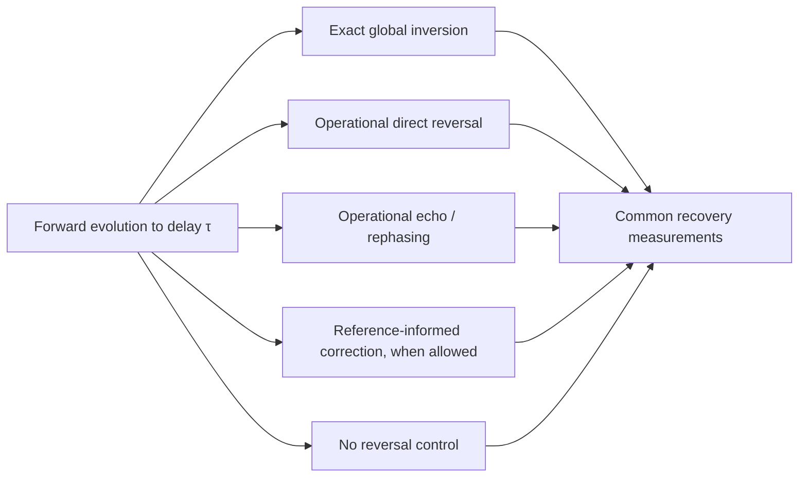

# Two-absorber reversal protocol

## Outcome

The protocol uses the same photon, absorbers, interruption times, and energy ledger in three reference preparations:

1. **Direct reversal with a common recorded reference.**
2. **Echo/rephasing with different but known references.**
3. **Random, unrecorded references**, paired with a random-but-recorded control.

Every run receives two different reversal tests:

- **Global inversion:** reverse the complete field–absorber–bath evolution. This is the control required by the framework's global unitarity.
- **Operational reversal:** use only the incident/outgoing field, absorber controls, and reference information deliberately recorded by the preparation. This is the physical recoverability test.

The proposed Heisenberg cut is not defined as failure of global mathematical inversion. It is provisionally identified as the earliest durable loss of **operational** recovery while global inversion still succeeds. That definition describes effective, information-theoretic irreversibility and preserves the framework's no-collapse commitment.

## Questions the protocol answers

1. Can a captured photon be reconstructed with its amplitude **and phase**, rather than merely recovering the correct amount of energy?
2. Does a sub-threshold absorber return excitation to the field at a well-defined rate?
3. Does that rate follow Paper 2's proposed energy-deficit relation?
4. Does recoverability change specially when the proposed return-to-coupling ratio passes through one?
5. Which losses are direct-reversal failures, which are echo-recoverable dephasing, and which follow from unrecorded bath history?
6. Is a proposed durable mark genuinely non-returning under the allowed controls?
7. Does any of this produce one actual A/B mark, or only stabilize two alternatives? Reversibility and actuality remain separate tests.

## Fixed system

The chosen minimum is specified in [Minimal finite bath and reversal controls](minimal-finite-bath): one phase-history qubit and one record/energy qubit per absorber, with four bath qubits total.

Its exact continuous Hamiltonian is specified in the [576-state field–absorber–bath generator](minimal-finite-bath/continuous-generator).

| Component | Rung-1 representation | Required control or record |
| --- | --- | --- |
| Photon | One heralded photon coherently divided between paths A and B, with an explicit outgoing mode | Prepare and characterize the initial complex wave packet; collect returned/outgoing field |
| Absorber A | Ground, reversible excitation, and candidate durable-mark state | Switch or reverse the optical coupling where the protocol calls for it; apply phase/detuning control |
| Absorber B | Identical copy | Apply the same controls as A unless a calibration step explicitly tests asymmetry |
| Bath A | Local environmental modes | Full microstate available only to global inversion; reference information available operationally according to the case |
| Bath B | Independent copy | Same rule as bath A |
| Clock/reference record | Common, known-distinct, or random | Stored before the run only in the cases where the protocol says it is recorded |

The baseline photon uses equal path weights. Unequal weights are repeated only after the reversal controls pass, so a recovery defect cannot be mistaken for a selection-weight effect.

## Two control boundaries

### 1. Global inversion

At interruption time `τ`, take the complete field–absorber–bath state and evolve it with the exact inverse of the forward generator for the same duration.

This test includes every bath degree of freedom. It should reconstruct:

- the original photon wave packet;
- both absorbers in their initial ground states;
- both baths in their initial microscopic states; and
- the original phase coherence between paths A and B.

Failure means one of three things: the numerical inverse is inadequate, the modeled generator is explicitly nonunitary, or the state space omitted a destination of energy/information. It does **not** by itself locate a detector cut.

### 2. Operational reversal

At the same interruption time, make a separate copy of the unconditioned state and apply only:

- switchable field–absorber coupling;
- controlled detuning or coupling-sign reversal;
- symmetric pulses on A and B;
- phase conjugation or time-reversed incident-field shaping;
- echo/rephasing pulses; and
- corrections computed from reference phases that were recorded before or during preparation without learning which outcome occurred.

Operational reversal may not read a registry value, select the apparently winning absorber, or condition the control on an outcome. Such feedback would assume the first mark that the model is supposed to investigate.

## Common preparation and timing

### Preparation

1. Put both absorbers in their ground states.
2. Prepare the two local baths with identical spectra, temperatures, and coupling strengths.
3. Choose one of the three reference structures below.
4. Prepare a heralded photon with equal coherent amplitudes in paths A and B.
5. Verify the empty-apparatus interferometer and no-bath absorber reversal before beginning the full run.

### Interruption-time grid

Use the same delay grid for every reference case. It must cover:

| Delay region | Physical purpose |
| --- | --- |
| Before appreciable capture | Baseline control; reversal should be trivial |
| Rising reversible excitation | Tests direct return and coherent exchange |
| Maximum reversible excitation | Best point for estimating return dynamics |
| Early absorber–bath correlation | Tests lock engagement and echo recoverability |
| Candidate locking layer | Dense sweep around the proposed return-to-coupling ratio near one |
| Candidate durable-mark formation | Tests non-return, recurrence, and reference-history loss |
| Long after apparent commitment | Tests whether the mark is stable or merely long-lived in a finite bath |

The “completion time” is not supplied in advance. It is inferred only after the recovery curves and recurrence checks are known.

### Per-delay branching

At every interruption time, evolve identical copies into these analysis branches:

All branches are unconditional. Conditional quantum trajectories may be run separately as a standard-theory benchmark but cannot supply the selection or recovery result.

## Case 1 — direct reversal with a common recorded reference

### Preparation

- Initialize both phase qubits in the same `plus-x` state.
- Give A and B the same known phase-history schedule `u(t)` and record it independently of the photon outcome.
- Use identical static detunings, or zero detuning, for both absorbers.
- Begin with the simplest bath spectrum for which recurrence and numerical convergence can be checked.

### Forward step

Let the photon couple coherently to both absorbers and begin correlating with their baths until the chosen interruption time.

### Operational reversal

1. Stop the forward drive.
2. Reverse the sign of the controllable field–absorber interaction, or apply the equivalent time-reversed pulse sequence.
3. Reverse known static detuning phases.
4. Replay the common recorded phase-history schedule in reverse order with the opposite controlled sign, thereby unwinding the phase-qubit correlation.
5. Inject or collect the time-reversed outgoing field mode so that the returning amplitudes recombine into the original photon packet.
6. Apply the same operation to both absorbers; do not identify a winner.

### Expected use

This is the upper bound on operational recovery. Before strong bath history dispersal, it should recover the photon and reset both absorbers. Its errors define the control envelope against which the other cases are judged.

If this case cannot recover the no-bath or weak-bath system, the protocol or generator is not calibrated well enough to interpret later failures.

## Case 2 — echo/rephasing with different but known references

### Preparation

- Initialize both phase qubits in the same `plus-x` state.
- Give A and B different static or time-dependent phase-history schedules `u_A(t)`, `u_B(t)`.
- Record both schedules without measuring any later outcome. Their evolution must be deterministic and known.

### Forward step

Allow the reversible excitation to dephase across the known references. A simple direct reversal should now be incomplete even though the history remains reconstructable.

### Echo/rephasing sequence

1. Evolve forward for delay `τ`.
2. Apply a symmetric echo operation that inverts the known phase accumulation—for example, a phase flip, detuning inversion, or equivalent absorber pulse.
3. Evolve for the matching rephasing interval.
4. Apply the time-reversed collection pulse so the refocused amplitudes reconstruct the incident photon.
5. Compare the recovered field with the direct-reversal result from the same interrupted state.

### Expected use

The separation between direct-reversal recovery and echo recovery identifies **known dephasing**, not commitment. If the echo reconstructs the photon inside the common-reference control envelope, the interaction at that delay remains reversible even if the unrephased reduced state looks decohered.

Failure of a particular echo pulse does not establish irreversibility. The best allowed rephasing protocol must be optimized and calibrated on known reversible controls.

## Case 3 — random, unrecorded references

### Preparation

- Initialize both phase qubits in the same `plus-x` state.
- Draw independent local phase-history schedules from a declared distribution fixed before examining results.
- Do not expose the realized schedules to the operational controller in the main random-unrecorded branch.
- Keep bath spectrum, temperature, coupling strength, and average energy identical to the recorded-reference controls.
- Repeat with several phase distributions, including nonuniform and temporally correlated cases; a uniform distribution must not be treated as self-justifying quantum equilibrium.

### Operational attempts

Apply the same direct reversal and best ensemble-wide echo used in the other cases. Because the phase history is unavailable, the control cannot be tailored to each run.

### Mandatory recorded twin

For every nominally random preparation, run a twin ensemble in which the identical random phase-history schedule **is recorded** but does not affect forward evolution. After interruption, use that record to construct the time-reversed schedule and best phase correction.

The comparison has four interpretations:

| Unrecorded branch | Recorded twin | Meaning |
| --- | --- | --- |
| Fails | Recovers | Apparent irreversibility is caused by unavailable reference history; supports effective information dispersal |
| Fails | Also fails, while global inversion succeeds | Operational controls are incomplete or information has entered bath variables beyond the recorded phase history |
| Both recover | Random reference history is not sufficient to create the proposed cut in this model |  |
| Global inversion also fails | The generator, numerical inversion, or claimed global unitarity must be re-examined before interpreting the cut |  |

This recorded twin is essential. Without it, failure in a random bath cannot distinguish physical history dispersal from an inadequate control pulse.

## What counts as recovery

Recovering the photon energy is necessary but insufficient. A successful reversal must satisfy all of the following within a tolerance calibrated from the common-reference control:

| Recovery channel | Required observation |
| --- | --- |
| Wave-packet shape | The returned photon has the original temporal and spatial envelope |
| Relative phase | A and B amplitudes recombine with the original interference visibility and phase |
| Photon energy | The expected whole-photon energy returns to the named output mode |
| Absorber reset | Both absorbers return to their initial ground states |
| Material record | No distinguishable durable A or B bath record remains under the allowed operational controls |
| No spurious event | No double mark, unexplained bath heating, or hidden energy deficit appears |

The recovery tolerance is not selected to make a cut appear. Determine it before the full bath sweep from numerical convergence, pulse error, and the worst recovery in the reversible calibration cases.

## Quantities to record

| Quantity | Plain-English meaning |
| --- | --- |
| Global reconstruction score | How closely exact inversion restores the complete initial state |
| Operational photon reconstruction | How closely accessible controls restore the original photon amplitude and phase |
| Absorber reset | Probability that A and B both return to ground |
| Interference recovery | Restored A–B visibility and fringe phase |
| Residual bath record | How distinguishable the A-mark and B-mark environmental states remain after attempted reversal |
| Returned energy | Energy recovered into the designated field mode, separated from bath heating and other outgoing modes |
| Reversible-return curve | Time dependence of excitation leaving each absorber and reappearing in the field |
| Extracted `κ_ret` | Best effective return rate, with residuals showing whether one-rate behavior is adequate |
| Calibrated `K` | Coherent coupling measured independently of the return fit |
| Cut ratio | The proposed return-to-coupling coordinate evaluated from separately measured quantities |
| Recurrence | Whether an apparently lost field or mark returns at later times in a finite bath |

## Defining engagement, completion, and the durable mark

### Lock engagement

Lock engagement is the earliest delay at which absorber–bath correlation or basin-directed dynamics is measurably present. It remains engagement—not commitment—if direct reversal, echo, or recorded-reference correction restores the initial wave packet.

### Lock completion

Within this globally unitary protocol, lock completion is provisionally the earliest delay after which:

1. operational reconstruction leaves the reversible control envelope for every allowed protocol;
2. the failure persists across the declared recurrence window and bath-size convergence study;
3. a channel-specific material record is stable enough to seed later amplification;
4. energy and information have named locations in the complete state; and
5. exact global inversion still reconstructs the initial state.

This is effective microscopic closure, not fundamental destruction of the wavefunction.

### Durable mark

The mark state `m_A` or `m_B` is assigned only at lock completion. If a field-separated carrier seed, bath correlation, or excited state can still be operationally reversed, it remains an intermediate state and must not be labeled the first durable mark.

The existence of a durable A-correlated component and a durable B-correlated component in the global state still does not choose one actual history. The registry/selection audit remains separate.

## Testing Paper 2's return and layer claims

### Return-rate test

1. Prepare several controlled excitation deficits without sampling an outcome.
2. Measure the absorber-to-field return curve with the irreversible bath coupling minimized.
3. Fit a single-rate return only if its residuals justify that reduction.
4. Compare the fitted rate with Paper 2's proposed deficit relation.
5. Repeat after changing detuning and coherent coupling so their effects are not conflated.

A different functional form, multiple rates, oscillatory return, or strong bath dependence counts as a physical result and may falsify the simple return ansatz.

### Locking-layer test

Independently calibrate `κ_ret` and `K`, then sweep their ratio through the proposed layer. Look for co-located changes in:

- recoverability;
- emergence of a meaningful autonomous phase;
- basin stability;
- durable-mark formation;
- return/dropout behavior; and
- completion latency.

Support requires a reproducible crossover that follows the ratio when `κ_ret` and `K` are changed by different controls. A smooth response with no privileged ratio, or different boundaries for the listed observables, rejects the claim that one universal layer organizes them.

## Circularity and ontology controls

- Do not sample A or B using squared-amplitude probabilities.
- Do not use an outcome-conditioned quantum jump to decide which reversal pulse to apply.
- Do not define commitment merely as a conditional trajectory reaching a pole.
- Do not call the random-phase ensemble “equilibrium” without an independent preparation argument.
- Do not infer one-world actuality from a zero double-excitation term.
- Do not treat operational loss of phase information as literal loss of global norm or energy.
- Report passive-registry and continuous-routing additions separately if either is later introduced.

## Pass, fail, and interpretation matrix

| Observation | Interpretation |
| --- | --- |
| Global inversion succeeds in every case | Confirms global unitary bookkeeping within numerical accuracy |
| Common-reference direct reversal succeeds | Validates the capture/reversal control and upper recovery envelope |
| Known-reference echo succeeds where direct reversal fails | Demonstrates reversible dephasing and prevents a false cut assignment |
| Random-unrecorded fails but recorded twin succeeds | Supports Paper 2's reference-history account of effective irreversibility |
| Random-unrecorded and recorded twin both fail, global inverse succeeds | Recorded phase is an incomplete description of the dispersed history; expand the operational control model |
| Recovery boundary tracks the independently calibrated cut ratio | Supports the proposed locking-layer organization |
| No special behavior occurs near the proposed ratio | Falsifies or narrows Paper 2's threshold claim |
| Fitted return disagrees with the proposed deficit law | Falsifies or narrows the `κ_ret` ansatz without invalidating reversible capture itself |
| Durable A and B alternatives form but no unique registry value emerges | Confirms the unitary first-mark no-go; does not derive Born selection |
| Global inversion fails only after adding winner routing | Confirms that the added law changes strict unitary dynamics and must be labeled objective reduction or embedded in a larger unitary model |

## Implementation order

1. **Closed numerical control:** photon plus two absorbers, no bath; verify coherent exchange and exact inversion.
2. **Finite recorded bath:** add a small bath with known modes; verify global inversion and map recurrences.
3. **Common-reference direct reversal:** establish the operational recovery envelope.
4. **Known-reference echo:** introduce controlled detuning/phase dispersion and recover it.
5. **Random recorded/unrecorded twins:** isolate the effect of missing reference history.
6. **Continuum convergence:** increase bath size and observation window; distinguish durable dispersal from finite recurrence.
7. **Return/layer sweep:** vary deficit and coupling independently; test the Paper 2 ansatz and crossover.
8. **Only then add an actuality candidate:** passive registry or continuous routing, with the circularity and energy audits already in place.

## Experimental bridge

The first laboratory analogue should be a rephasable absorber—an atomic ensemble, rare-earth quantum memory, or controlled circuit-QED system—because the protocol requires direct and echo recovery controls. A room-temperature silicon SPAD is a useful later **practical-irreversibility anchor**, but its femtosecond-to-picosecond bath cascade offers too little control to establish which microscopic information was fundamentally unrecoverable.

For the silicon bridge, the protocol should ask whether a field-separated electron–hole seed is:

- echo/recombination recoverable;
- recoverable only with recorded microscopic history;
- operationally nonrecoverable but globally present in bath correlations; or
- already the completed microscopic closure proposed by Paper 2.

That classification must be calculated rather than assigned by terminology.

## Settled decisions

- Use both global inversion and operational reversal.
- Use two bath qubits per absorber: one phase-history qubit and one independent record/energy qubit.
- Permit operational control of capture sign/switch, detuning inversion, absorber echo pulses, recorded-phase correction, and field time reversal; reserve record-qubit control for global inversion.
- Require recovery of the complex wave packet, absorber reset, and the energy ledger—not energy alone.
- Use identical interruption times and controls across reference cases.
- Include a random-but-recorded twin for every random-unrecorded preparation.
- Apply symmetric controls without learning which absorber appears to win.
- Define the durable mark provisionally through persistent operational nonrecoverability, not through amplification.
- Preserve global unitarity unless a later candidate law explicitly changes it.

## Open implementation questions

- At what bath size do the recovery curves become stable over the declared physical time window?
- Which concrete absorber pulse implements the chosen phase-coupling echo with the lowest control error?
- How should the operational control set expand when a recorded random phase is insufficient for recovery?
- What convergence window is long enough to label a material record durable without confusing it with a very long recurrence?
- Does any autonomous phase or locking nonlinearity actually emerge from the microscopic model, rather than being inserted through a classical effective oscillator?

This protocol implements the reversibility variables in the [Papers 2–3 mapping](../paper3-mapping) and is subordinate to the [two-absorber technical plan](..).
