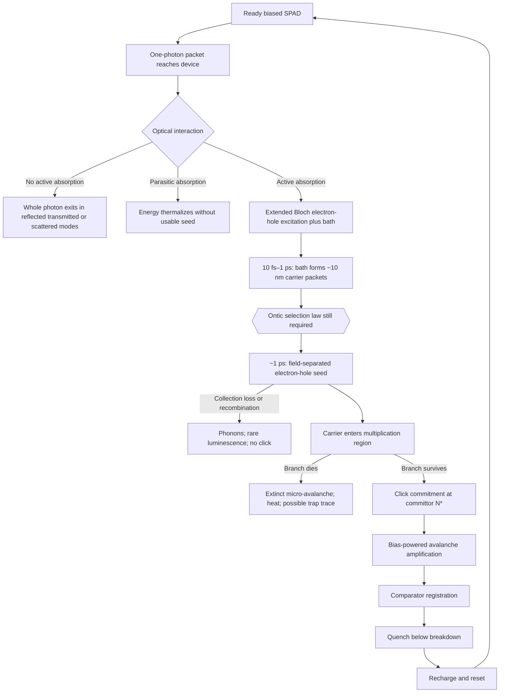

# Round 1 synthesis — the SPAD cascade and its unresolved selection law

## Short concept index

| Concept | Short meaning |
| --- | --- |
| **Capture** | Transfer of the one-photon excitation into electron–hole and bath degrees of freedom. In an absorbed component, the photon is annihilated at the interaction vertex. |
| **Pointer packet** | A roughly 10 nm phonon-dressed carrier packet formed by the silicon environment; it is a physically defensible candidate channel, unlike an atomic “site” chosen at the optical vertex. |
| **Selection** | The still-unproved one-world rule that makes one material channel actual. Decoherence identifies stable alternatives but does not select one. |
| **Seed commitment** | Field-driven electron–hole separation at roughly 1 ps, after which geminate recombination is effectively unavailable and one channel can seed transport. |
| **Click commitment** | The avalanche reaches a position- and bias-dependent carrier population at which extinction is negligibly likely. |
| **Amplification** | Bias-powered impact-ionization growth. The photon supplies the seed, not the macroscopic click energy. |
| **Registration** | A comparator converts the avalanche current into a digital edge; this is an engineering convention, not the Born-selection event. |
| **Reset** | Quench below breakdown followed by recharge; traps can create afterpulses and memory. |
| **Martingale lemma** | If conserved nonnegative shares fluctuate fairly until one reaches one, the chance that share `i` wins equals its initial value. This is a conditional theorem, not yet a microscopic SPAD mechanism. |
| **Committor** | The probability that a partly developed avalanche will ultimately become a registered click rather than go extinct. |

## Current best answer

The SPAD contains **three different thresholds**, and combining them causes most of the conceptual confusion:

1. **Foundational selection boundary:** a proposed absorbing boundary in an ontic share or registry space. Standard device physics does not supply this one-world law.
2. **Avalanche survival boundary:** a real, bias-dependent branching threshold in carrier number. This occurs only after a localized seed exists.
3. **Comparator threshold:** an electronic convention that turns current into a recorded bit.

The author's platform intuition is therefore useful only after it is split across these three meanings. A literal optical crest-clipping mechanism—remove the part above the platform and let a fractional remainder continue—is inconsistent with the agreed whole-photon ledger and is rejected.

## Unified event cascade

### Exact stage map

Legend: **S** = established/standard detector physics; **F** = framework hypothesis; **O** = open derivation.

| Stage | Approximate scale | State and mechanism | Reversibility and stochasticity | Energy and bias | Boundary/status |
| --- | --- | --- | --- | --- | --- |
| **0. Armed detector** | Before arrival | Junction is biased above breakdown; capacitance and bias supply store usable free energy. | Metastable device state. Dark carriers and trapped charge create background histories. | Energy is in the junction field and external supply. | Initial condition **S**. |
| **1. Optical arrival and scattering** | Optical transit | The packet is transformed among incident, reflected, transmitted, scattered, and absorber-coupled modes. | Unitary and reversible in ideal linear optics. | Photon energy remains in named electromagnetic modes until absorption. Bias can slightly modify the optical response. | Arrival, not capture **S**. |
| **2. Capture amplitude** | fs | Current–field coupling creates an unabsorbed whole-photon component plus extended interband electron–hole components. In indirect silicon, a momentum-conserving phonon participates. | The full closed state evolves unitarily. Escape into the room-temperature continuum makes photon-annihilation practically irreversible within roughly fs–100 fs. | In each absorbed component, the photon is annihilated. Its energy becomes band-gap excitation, carrier excess energy, and phonons. | **Capture** occurs here **S**; a unique captured channel is not supplied. |
| **3. Bath-defined localization** | 10 fs–1 ps | Multiphonon, disorder, and carrier-environment scattering turn extended Bloch modes into approximately 10 nm phonon-dressed carrier packets. The vertex phonon carries momentum information, not a unique position. | Reduced-state coherence decays rapidly; exact closed-system reversibility is not practical. Decoherence defines alternatives but no actual winner. | Excess carrier energy flows mainly to phonons. The field can displace or shape packets by roughly a cell width without thereby changing Born weights. | Candidate channel basis **S**; unique actuality **O**. |
| **4. Ontic selection window** | Bounded by capture and ~1 ps seed separation | A beable/registry or continuous winner-routing law would have to make one channel actual while preserving exclusivity across separated absorbers. | Fundamental stochasticity, deterministic hidden microstates, or a new nonlinear law are all possible; ordinary environmental noise does not choose among them. | Any routing version owes explicit field–matter–bath currents. “The vacuum” is not an energy sink. | **Selection F/O**. This is the framework's main unresolved step. |
| **5. Microscopic seed commitment** | ~1 ps | The junction field separates the electron and hole after channel distinguishability has developed. Geminate recombination becomes effectively unavailable. | Practically irreversible material configuration, although bare unitary theory still contains all amplitudes. | Photon-scale energy is now distributed among the separated carriers and phonons. Bias controls separation and collection. | **Seed commitment S**, conditional on an ontic winner law. |
| **6. Transport or loss** | ps–100 ps, device dependent | Carrier drifts/diffuses toward the multiplication region or recombines/is lost. | Open-system dissipative transport with ordinary microscopic variability. | Bias supplies carrier kinetic energy; phonons receive most dissipation. Rare recombination luminescence is a named radiative channel. | Collection efficiency **S**. Selection has already occurred in beable/routing accounts. |
| **7. Incipient avalanche** | ps–100 ps | Impact-ionization branching begins from the seed. It can still go extinct. Dark carriers enter the identical process. | Branching survival is effectively stochastic and seed-origin-blind. Individual ionizations are dissipative even before a click is assured. | Bias/junction capacitance powers every new carrier pair. The photon is only the trigger. | Start of **amplification S**; not foundational selection. |
| **8. Click commitment** | During buildup | Carrier population crosses a committor surface `N*(x,V;epsilon)` where extinction probability is below the chosen tolerance. | Practically irreversible at the selected confidence level. | Continued growth draws energy from the junction and supply. | **Click commitment S**. Typical illustrative range is about 10–130 carriers, not a universal number. |
| **9. Saturated amplification** | Tens–hundreds of ps | Space charge, circuit impedance, and device geometry limit avalanche growth. Secondary photons can cause crosstalk. | Strongly dissipative. Avalanche backaction is too late to select the original absorption channel. | A representative event dissipates about 5 pJ, roughly `10^7` times a 2 eV photon, overwhelmingly from bias energy. | **Amplification S**. |
| **10. Registration** | Sub-ns–ns | Comparator/discriminator converts analog avalanche current into a digital edge. | An irreversible engineering record at the chosen threshold; electronic noise shifts timestamps and false counts. | Avalanche and readout-rail energy become circuit and lattice heat. | **Registration S**; not a new physical selection. |
| **11. Quench** | ns–tens of ns | Passive or active circuitry lowers the diode below breakdown and terminates the avalanche. | Dissipative; traps can retain memory. | Junction energy is dissipated in the diode and quench network. | First half of **reset S**. |
| **12. Recharge/reset** | ns–microseconds | Supply restores the overbias. During recharge, twilight events have reduced or distorted trigger/registration probability. | Detector becomes ready again; afterpulsing reveals incomplete trap reset. | Supply replenishes the junction; trap release and circuit heat are named outputs. | **Reset complete S**. |

## Why “commitment” needs three names

| Boundary | What has become effectively irreversible? | What it does **not** mean |
| --- | --- | --- |
| **Seed commitment** | A channel-specific electron–hole configuration can enter transport. | It does not guarantee a click. Many absorbed photons are lost or launch extinct avalanches. |
| **Click commitment** | The avalanche has crossed a survival committor and is overwhelmingly likely to become macroscopic. | It did not choose which quantum absorption channel became actual. |
| **Registration** | Electronics have written a digital record. | It is a threshold convention, not a fundamental quantum boundary. |

For an approximate independent-carrier branching model with extinction probability `q(x,V)` per carrier,

$$
N_*(x,V;\varepsilon)=\frac{\ln\varepsilon}{\ln q(x,V)}.
$$

At a target residual extinction probability of `10^-6`, illustrative values run from about 12 carriers at high trigger probability to about 130 at low overbias, with about 20 carriers when the single-pair trigger probability is near one half. Device correlations and space charge refine these numbers.

## Complete click/no-click probability partition

Let `a_act(x)` be the active-region absorption density, `A_par` parasitic absorption, `eta_col(x)` collection probability, and `P_trig^reg(x)` the probability that a collected carrier produces a **registered** click, including the stated twilight/discriminator convention. Then

$$
\begin{aligned}
P_{\rm out} &= 1-A_{\rm par}-\int a_{\rm act}(x),dx,\
P_{\rm abs,loss} &= A_{\rm par}+\int a_{\rm act}(x)[1-\eta_{\rm col}(x)],dx,\
P_{\rm abs,ext} &= \int a_{\rm act}(x)\eta_{\rm col}(x)[1-P_{\rm trig}^{\rm reg}(x)],dx,\
P_{\rm click} &= \int a_{\rm act}(x)\eta_{\rm col}(x)P_{\rm trig}^{\rm reg}(x),dx.
\end{aligned}
$$

These sum to one. The position integral matters because absorption depth, carrier collection, and electron- versus hole-initiated avalanche probability are correlated. Bias also changes depletion width and electroabsorption, so a raw bias sweep is not a clean selection test until these ordinary response changes are calibrated.

## Energy ledger

### Absorbed event without a click

The photon does not leave a fractional remainder. Its energy becomes electron–hole excitation and then primarily phonons. Possible named secondary channels are recombination luminescence, trap storage, or another emitted photon. In room-temperature silicon the radiative fraction is extremely small, so this channel is ordinarily dark, but it is still part of the ledger.

### Registered event

The photon contributes roughly eV-scale seed energy. The avalanche contributes pJ-scale energy drawn from the junction capacitance and bias supply. Avoid double counting the capacitance: it is an intermediate store, while recharge work comes from the supply. Named receivers include

- junction and lattice heat;
- quench-resistor and readout-circuit heat;
- secondary hot-carrier photons, important for crosstalk despite their tiny energy fraction;
- temporarily trapped carrier energy, important for afterpulsing; and
- rare recombination radiation.

No term is assigned to an unspecified “ocean of the quantum vacuum.” Vacuum correlations may participate in transition rates in quantum electrodynamics, but an emitted quantum occupies a named electromagnetic mode, and energy conservation still applies to the enlarged field–matter–circuit system.

## The remaining one-world fork

| Account | What becomes actual? | Fate of other amplitudes | Main unpaid debt |
| --- | --- | --- | --- |
| **Standard unitary evolution plus Born conditioning** | An operational outcome is sampled/conditioned using the ordinary measurement rule. | All components persist in the unconditioned state. | Does not independently explain the requested one-world selection. |
| **Passive beable/registry plus unitary wave** | One carrier/material configuration is actual while the guiding wave remains unitary. | “Empty” components persist. They cannot each be booked as possessed fractional energy in addition to a full quantum at the actual site. | Derive the beable distribution, global exclusivity, empty-wave efficacy and stress-energy, and why an empty absorbed component cannot seed another record. |
| **Continuous winner-routing** | A stochastic or nonlinear law transfers weight toward one channel and drives alternatives to zero. | Losing components are suppressed or rerouted. | This is continuous objective reduction in ordinary terminology. It needs explicit norm dynamics, energy currents, drain time, no-signaling behavior, and a double-commit prediction. |

The collaboration does **not** choose between the latter two. The passive-beable option is closer to the author's wish to retain a real, uncollapsed wave; continuous routing gives more literal “winner takes all” dynamics but is collapse-like under standard taxonomy.

## What the martingale result really establishes

Suppose proposed ontic shares `s_i(t)` satisfy:

- `s_i >= 0` and `sum_i s_i = 1` on every realization;
- each `s_i` has zero drift, so it is a martingale;
- zero is absorbing, fixation occurs in finite time, and exactly one share reaches one; and
- `s_i(0)` has been derived as a real physical stake rather than merely renamed from a Born probability.

Optional stopping then gives

$$
\Pr(K=i)=\mathbb E[s_i(T)]=s_i(0).
$$

If `s_i(0)=|beta_i|^2`, the winner frequencies equal Born weights. This is mathematically useful because it shows that many fair conserving dynamics—not a unique square-root noise law—share the desired result. The difficult physics remains deriving the ontic shares, fair kernel, absorbing dropout, and global exclusivity from a detector Hamiltonian without using Born-weighted quantum jumps or outcome-conditioned trajectories.

## Repaired platform analogy

The jointly accepted teaching picture is a **dam with many inlets and one spillway**:

| Analogy element | Physical mapping | Status |
| --- | --- | --- |
| Incoming ripple | The one-photon wave amplitude over possible absorber couplings | Standard amplitude description |
| Many inlets | Approximately 10 nm bath-defined carrier packets | Standard candidate channel basis |
| Ripple weight at inlet `i` | `\|beta_i\|^2` or a proposed ontic share `s_i` | **Born map/stake ontology still owed** |
| Fair inlet lottery | Conserving martingale or linear first-event law | **Kernel still owed** |
| One inlet only | Absorbing dropout and global exclusivity | **Finite one-winner law still owed** |
| Soak-away channel | Parasitic absorption, collection loss, or recombination | Standard loss physics |
| Spillway lip | Avalanche committor `N*(x,V;epsilon)` | Standard branching survival |
| Pumped reservoir | Junction field and bias supply | Standard energy source |
| Flood | Macroscopic avalanche | Standard amplification |
| Gauge | Comparator/discriminator | Standard registration convention |
| Drains | Phonons, circuit heat, radiation, and traps | Closed named ledger |
| Seepage | Thermal and tunneling dark-count seeds | Standard noise/background |

Two versions must not be blended:

- **Passive-beable dam:** the wave reaches all inlets, while one inlet contains the actual carrier configuration. Empty-wave components persist; the picture does not solve their energy ontology.
- **Routing dam:** one inlet wins while explicit dynamics drains or reroutes the alternatives. That dynamics is the missing continuous-reduction theory.

The analogy is a diagram of the theorem that is needed, not evidence that the theorem is realized in silicon.

## Claims rejected unanimously

- A local optical-amplitude threshold clips the top of a photon wave.
- Part of one photon is absorbed while a sub-quantum remainder propagates onward.
- Avalanche gain energy comes primarily from the photon.
- Energy or losing norm may be disposed of by saying it “dissipates into the vacuum.”
- Decoherence alone produces one actual channel.
- The avalanche or comparator threshold derives upstream Born selection.
- Raw bias dependence or raw click curvature is a foundational signature before ordinary detector response is calibrated.

## Prioritized calculation and experiments

### Priority zero: microscopic reduction

Derive a two-site absorber + electromagnetic field + phonon/bath model without outcome-conditioned quantum jumps. Ask whether the reduced dynamics supplies any of the following: ontic nonnegative shares, pathwise conservation, negligible drift, absorbing dropout, finite exclusivity, and a no-signaling registry. Extend next to two separated absorbers and then to three sites/two quanta. This calculation determines whether the proposed Stage-A law can exist rather than merely bounding its parameters.

### Experimental order

| Rank | Test | What it teaches |
| --- | --- | --- |
| **1** | **Twilight factorization sweep:** vary recharge phase to sweep registered trigger probability at fixed optics, with discriminator convention and dark counts tracked. | Cheapest strong null. A residual failure of calibrated upstream-weight × downstream-response factorization would be anomalous. |
| **2** | **Heralded separated-absorber two-seed bound:** measure excess coincidences per herald versus separation and delay after subtracting multiphoton input, accidentals, dark histories, and crosstalk. | Cleanest bound on finite registry/drain time and global exclusivity. A model may generically give `O(Lambda tau_drain)`, but no universal coefficient exists yet. |
| **3** | **Weak reversible-absorber visibility:** use a rephasable quantum-memory absorber, with silicon as an irreversible control. | Bounds active pre-commit routing or beable backreaction. A passive unitary guiding wave predicts the standard which-path-corrected visibility. |
| **4** | **Four-channel no-click ledger:** combine heralded exit-photon collection, wavelength/depth variation, and trigger sweeps. | Confirms that a no-click is either whole-photon escape or an absorbed loss/extinction history—not fractional skimming. Internal loss and extinction separate statistically, not event by event. |
| **5** | **Dark-count/temperature correlation bound:** compare calibrated selection statistics as thermal dark-count rate moves by orders of magnitude. | Tests whether changing detector microstate noise changes Born weights rather than only adding background seeds. |

Fast SPAD gating remains useful for avalanche timing and backaction, but it cannot resolve a fs–1 ps foundational-selection window.

## Implication for the three-paper progression

- **Born Selection:** present the martingale/linear-hazard result as a conditional theorem attached upstream of seed commitment. The SPAD cascade makes the missing premises visible rather than claiming the avalanche derives Born.
- **Heisenberg Cut:** distinguish seed commitment, click commitment, and registration. A detector contains several physically meaningful irreversibility boundaries rather than one mysterious macroscopic cut.
- **Dirac–Kuramoto Framework:** use ordinary electromagnetic SPAD detection as the baseline. The avalanche does not require coupled Weyl-spinor dynamics; a specifically Dirac/chiral contribution needs a separate mass-, scalar-, Yukawa-, gravitational-, or controlled massless-limit discriminator.

## Stop recommendation

Round 1 has converged. The cascade boundaries, energy ledger, analogy disposition, and experimental program are agreed. The remaining ontology fork is deliberate and cannot be resolved by another verbal review round; it requires the priority-zero microscopic calculation and model-specific predictions.

## Participant records

- [SPAD device physics](../device-physics)
- [Foundational selection mechanism](../foundational-selection)
- [Energy and conservation audit](../energy-conservation)
- [Analogy and experimental design](../analogy-experiment)
